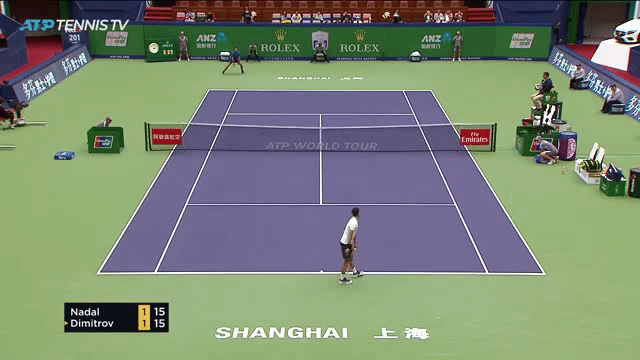
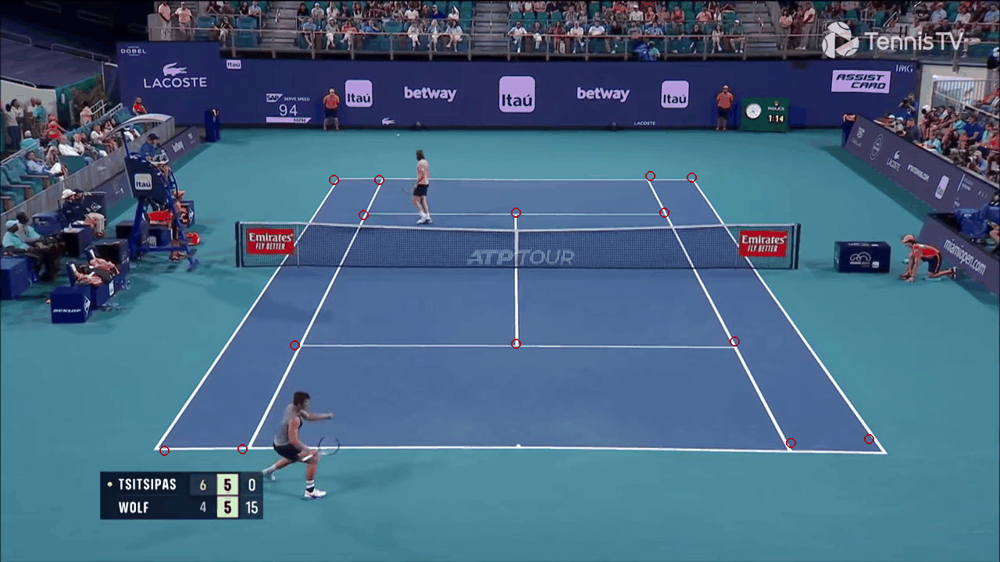
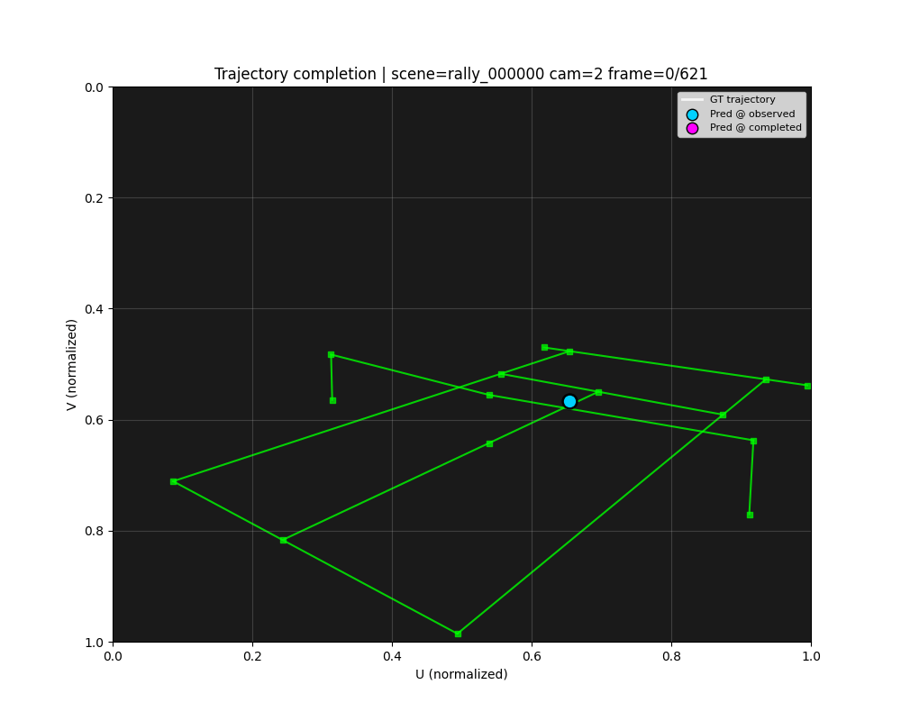
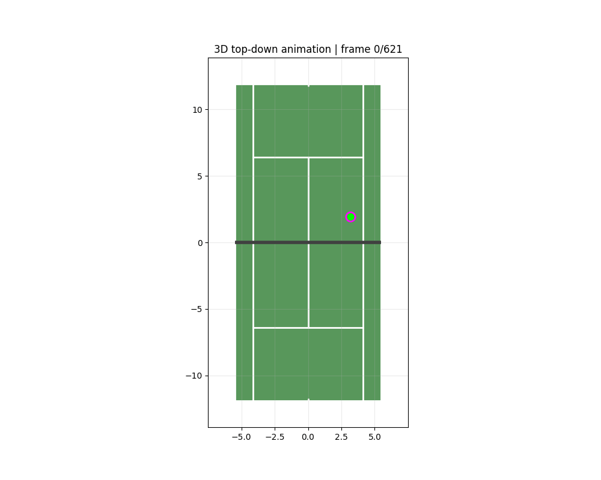

# Tennis-Lab 🎾

単眼テニス動画から、プレーヤー/ボール/コートを推定して「コート座標系の3Dシーン」に統合するための研究用モジュラーパイプライン。

## 成果（GT vs Pred）

> `assets/` 配下にタスク別の比較GIFを置く想定です（GTとPredを同一画面で比較）。

### WASB（2Dボール検出）

<p align="center">
  
</p>

- 実装: [src/wasb/README.md](src/wasb/README.md) / 実行: [docs/scripts/wasb/README.md](docs/scripts/wasb/README.md)

### Court Detection（CourtKP20）

<p align="center">
  
</p>

- 実装: [src/court_detection/README.md](src/court_detection/README.md)

### PLCS（プレーヤー3D位置・yaw推定）

<p align="center">
  
</p>

- 実装: [src/plcs/README.md](src/plcs/README.md) / 実行: [docs/scripts/plcs/README.md](docs/scripts/plcs/README.md)

### BLCS（ボール3D軌道推定）

<p align="center">
  
</p>

- 実装: [src/blcs/README.md](src/blcs/README.md) / 実行: [docs/scripts/blcs/README.md](docs/scripts/blcs/README.md)

### Trajectory Completion（UV軌道補完）

<p align="center">
  
</p>

- 実装: [src/trajectory_completion/README.md](src/trajectory_completion/README.md)

### Event Detection（ショット/バウンス時刻推定）

<p align="center">
  
</p>

- 実装: [src/event_detection/README.md](src/event_detection/README.md)

## クイックスタート

### 1) セットアップ

```bash
uv sync
```

### 2) スクリプト実行（共通形）

すべてのタスクは Hydra を使って設定を管理しています。

```bash
uv run python -m src.<task>.scripts.<entrypoint> key=value
```

### 3) まずは可視化

コマンド例はタスクごとのドキュメントに集約しています。

- [docs/scripts/README.md](docs/scripts/README.md)（BLCS/PLCS/WASB）
- [src/court_detection/README.md](src/court_detection/README.md)
- [src/trajectory_completion/README.md](src/trajectory_completion/README.md)
- [src/event_detection/README.md](src/event_detection/README.md)

### 4) テスト（E2E）

```bash
uv run pytest tests/e2e -v

# CUDAなし環境:
uv run pytest tests/e2e -v -m "not cuda"
```

### Docker

GPU環境をまとめて立ち上げたい場合は [docs/docker/README.md](docs/docker/README.md) を参照。

## ライセンス / 引用

TBD（必要に応じて追記）

## 構造（成果の裏側）

### どこに何があるか（タスク）

- WASB: 画像上の2Dボール位置（`src/wasb`）
- Court Detection: 20点コートキーポイント（`src/court_detection`）
- PLCS: 2Dスケルトン → コート上3Dプレーヤー位置/yaw（`src/plcs`）
- BLCS: 2Dボール位置 → コート上3Dボール軌道（`src/blcs`）
- Trajectory Completion: 欠損した2Dボール軌道を補完（`src/trajectory_completion`）
- Event Detection: ショット/バウンスのタイミング推定（`src/event_detection`）
- 統合: 上記をまとめて1本のパイプラインとして回す（[src/tennis_scene/README.md](src/tennis_scene/README.md)）

※ 外部モジュール（例: GVHMR）は `third_party/` に隔離しています。

### 典型データフロー

```
Video
  ├─ Court Detection  → court_kp (2D)
  ├─ WASB             → ball_uv (2D)
  ├─ (optional) GVHMR → human_kp (2D) + SMPL (local)
  ├─ PLCS             → player_pos/yaw (3D on court)
  ├─ BLCS             → ball_pos_world (3D on court)
  ├─ Traj Completion  → completed ball_uv (2D)
  └─ Event Detection  → shot/bounce peaks
```

### ディレクトリの役割

- `src/`: タスク実装（各タスクは `configs/` + `scripts/` + `training/` などを持つ）
- `third_party/`: 外部モジュール（例: GVHMR）。vendor codeは隔離
- `data/`: データセット/入力（大きなデータやモデルはコミットしない）
- `outputs/`: 学習ログ・チェックポイント・生成物（大きなartifactはコミットしない）
- `assets/`: README用の軽量デモ素材（GIF/PNGなど）
- `docs/`: 使い方/テスト/Dockerなどの補助ドキュメント
