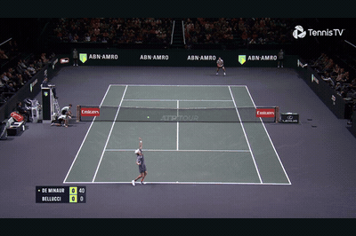
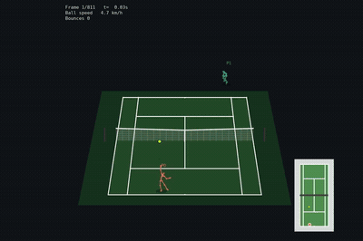
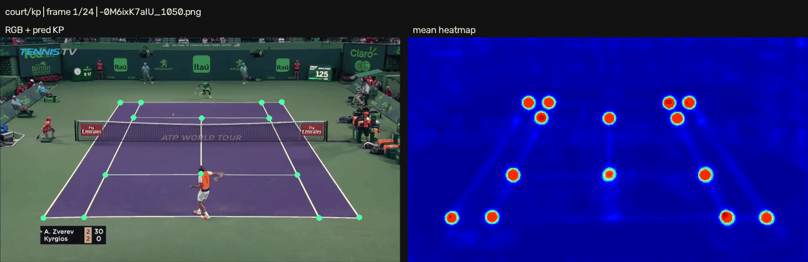
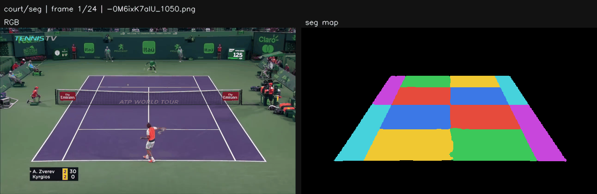
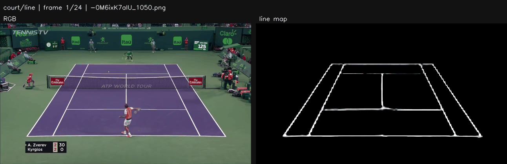
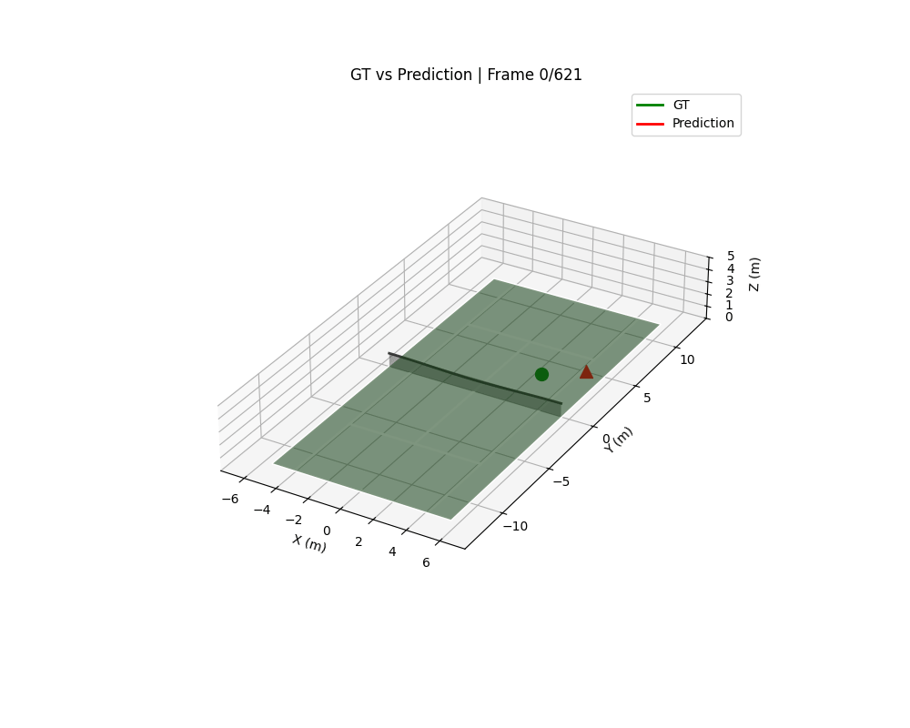
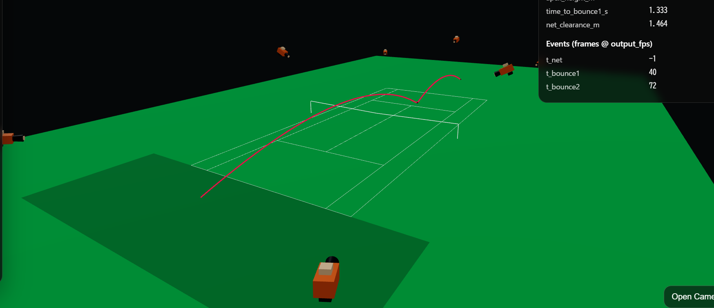
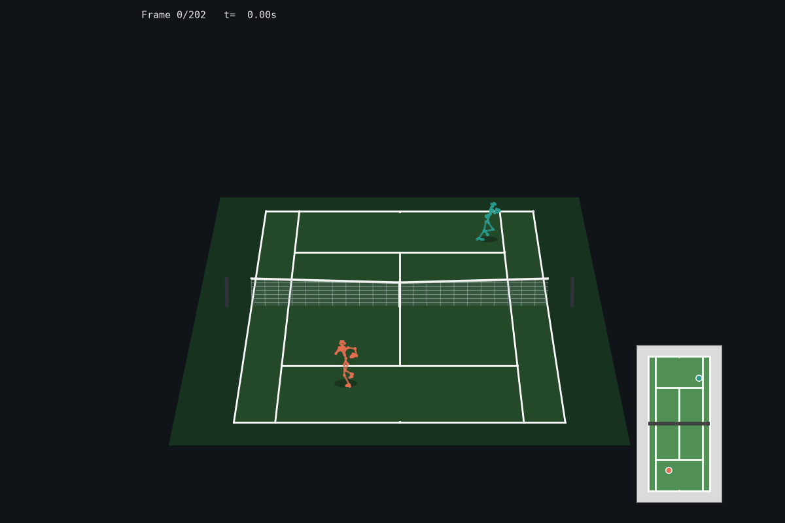
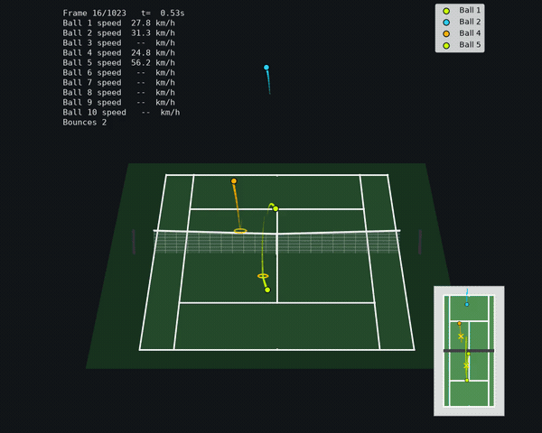

# Tennis-Lab 🎾

単眼テニス動画から、プレーヤー/ボール/コートを推定して「コート座標系の3Dシーン」に統合するための研究用モジュラーパイプライン。

## 成果

### Tennis Scene（統合3D再構成）

| 入力映像（`data/samples/tennis_clip.mp4`） | コート座標系の3Dシーン |
| :---: | :---: |
|  |  |

- 実装/実行: [src/tennis_scene/README.md](src/tennis_scene/README.md)

### Ball Detection（2Dボール検出）

<p align="center">
  
</p>

- 実装/実行: [src/tasks/ball_detection/README.md](src/tasks/ball_detection/README.md)

### Court Detection（KP / SEG / LINE）

<p align="center">
  <br/>
  <em>Keypoint：RGB + 予測キーポイント ｜ 平均ヒートマップ</em>
</p>

<p align="center">
  <br/>
  <em>Segmentation：RGB ｜ セグメンテーションマップ</em>
</p>

<p align="center">
  <br/>
  <em>Line：RGB ｜ ラインマップ</em>
</p>

- 実装: [src/tasks/court_detection/README.md](src/tasks/court_detection/README.md)

### PLCS（プレーヤー3D位置・yaw推定）

<p align="center">
  <br/>
  <em>GT（緑）｜ Prediction（赤）</em>
</p>

- 実装/実行: [src/tasks/plcs/README.md](src/tasks/plcs/README.md)

### BLCS（ボール3D軌道推定）

<p align="center">
  <br/>
  <em>GT（緑）｜ Prediction（赤）</em>
</p>

- 実装/実行: [src/tasks/blcs/README.md](src/tasks/blcs/README.md)

### BLCSデータ生成（物理シミュレーション）

<p align="center">
  <br/>
  <em>物理シミュレーションによるボール軌道・イベント・マルチカメラ観測の生成</em>
</p>

## 開発中

### Multi-object PLCS / BLCS

[PR #650](https://github.com/Motoki0705/tennis-lab/pull/650) で、複数プレーヤー・複数ボールの lifecycle を扱う生成・追跡・可視化パイプラインを開発しています。

| 複数プレーヤー（PLCS） | 複数ボール（BLCS） |
| :---: | :---: |
|  |  |
| `multi_object_lifecycle_v2 / scene_000040` | `multi_object_lifecycle_v4 / scene_000345` |

## ライセンス / 引用

このリポジトリは [MIT License](LICENSE) の下で公開されています。

## 構造（成果の裏側）

### どこに何があるか（タスク）

- Ball Detection: 画像上の2Dボール位置（`src/tasks/ball_detection`）
- Court Detection: 20点コートキーポイント（`src/tasks/court_detection`）
- PLCS: 2Dスケルトン → コート上3Dプレーヤー位置/yaw（`src/tasks/plcs`）
- BLCS: 2Dボール位置 → コート上3Dボール軌道（`src/tasks/blcs`）
- GVHMR: 画像列 -> 2Dスケルトン + SMPL (`third_party/GVHMR`)
- 統合: 上記をまとめて1本のパイプラインとして回す (`src/tennis_scene/README.md`)
- 合成データ生成: 再構成済み3D sceneへ物理軌道を合成して学習データを公開する (`src/synthetic_data_generation/README.md`)

### 典型データフロー

```
Video
  ├─ Court Detection  → court_kp (2D)
  ├─ Ball Detection   → ball_uv (2D)
  ├─ (optional) GVHMR → human_kp (2D) + SMPL (local)
  ├─ PLCS             → player_pos/yaw (3D on court)
  └─ BLCS             → ball_pos_world (3D on court)
```

### ディレクトリの役割

- `src/`: タスク実装（各タスクは `configs/` + `scripts/` + `training/` などを持つ）
- `third_party/`: 外部モジュール（例: GVHMR）。vendor codeは隔離
- `data/`: データセット/入力（大きなデータやモデルはコミットしない）
- `outputs/`: 学習ログ・チェックポイント・生成物（大きなartifactはコミットしない）
- `assets/`: README用の軽量デモ素材（GIF/PNGなど）
- `docs/`: 使い方/テスト/Dockerなどの補助ドキュメント

## 開発

依存関係は `uv sync --locked` で同期し、共通の開発コマンドは
`uv run spin` から確認できます。環境診断、lint、type check、test、CI 相当検証の
詳細は [`.spin/README.md`](.spin/README.md) を参照してください。
