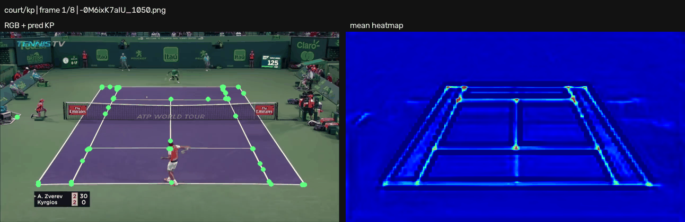
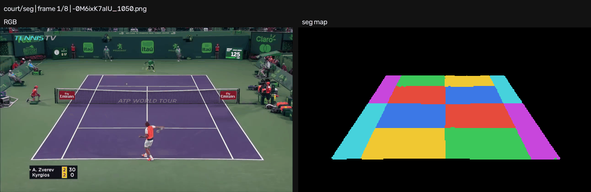
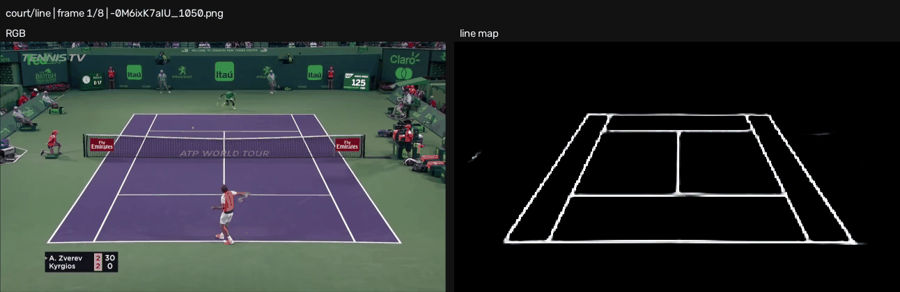

# Mixed-source dense+pose LoRA inference

`court_mixed_pose_lora_b8_e20_s42`の学習終了時checkpointを、TennisCourtDetector由来の実画像8枚へ適用した推論可視化です。

- checkpoint: `outputs/court_detection/mixed-source/dense-pose-lora-b8-e20-s42/logs/version_0/checkpoints/last.ckpt`
- source: `data/court/images/-0M6ixK7aIU_*.png`の先頭8枚
- rendering: 2 fps、8 frames、入力画像と各headの予測を左右に表示
- evaluation metrics / convergence: [`knowledge/nodes/run-court-mixed-pose-lora-b8-e20-s42.md`](../../../../knowledge/nodes/run-court-mixed-pose-lora-b8-e20-s42.md)

## Keypoints

左は予測keypoint、右は全channelの最大heatmapです。KP decoderはchannelごとに複数peakを許容します。



## Court-cell segmentation

7クラスのcourt-cell予測を色分けしています。



## Court-line segmentation

line headの確率mapを白黒で表示しています。



## Reproduction

各headは次の共通overrideに`visualization=kp|seg|line`と対応する`visualization.save`を指定して生成します。GPU実行時はrepositoryのtraining queueを使用します。

```bash
python -m src.tasks.court_detection.scripts.visualize \
  visualization=kp \
  'visualization.image_source=court/images/-0M6ixK7aIU_*.png' \
  'visualization.checkpoint=court_detection/mixed-source/dense-pose-lora-b8-e20-s42/logs/version_0/checkpoints/last.ckpt' \
  visualization.max_frames=8 \
  visualization.fps=2 \
  visualization.save=court_detection/mixed-pose-lora-b8-e20-s42/inference/kp.gif \
  run.device=cuda
```
