# 3DGS-native synthetic data 最終レポート

## 結論

BLCS、PLCS、court detection の3系統を、2D RGB overlayではなく、同一の
3D Gaussian sceneへ資産やcameraを合成してnative NHT rendererで描画する
基盤へ移行した。P0–P8の全acceptance gateは合格しており、統合P8は
15/15 gateを通過した。

最初のP0–P8で受理したのは、scene composition、制御、label、再現性、
dataset contractを含む **mechanics release** である。この段階の背景は
1-step NHT checkpoint由来で緑色の点群状に見えるため、production
photorealismは受理範囲に含めなかった。

その後cycle 17で、B00を30,000 step学習したproduction checkpointへ同じ
composition contractを移植し、実RGB背景、point alignment、multi-ball、
multi-person、6種類の周回cameraを追加検証した。したがって、本レポートでは
緑色のmechanics evidenceと、下記のproduction RGB evidenceを明確に区別する。

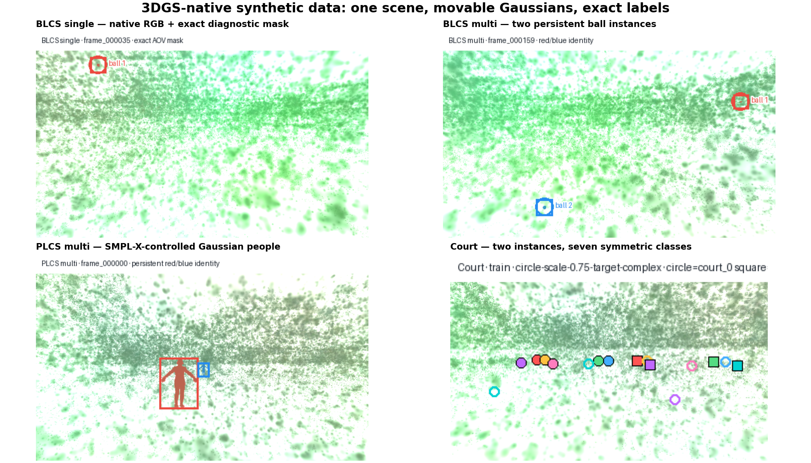

## Production RGB visual verification

production previewは
`/home/kamimura/projects/gaussian-splating/experiments/B03-NHT/results/ckpts/ckpt_29999_rank0.pt`
（SHA-256
`e8d722a172774de8df27e1ae38ac74d6a81d9a8e980fc83aca7c665eb9b68111`）
を使用する。背景は999,744 Gaussianで、court、net、trees、school buildingsが
RGBとして復元されている。以下はすべて左がnative raw RGB、右が別fileへ
書き出した診断overlayである。raw RGBへの2D描画は行っていない。

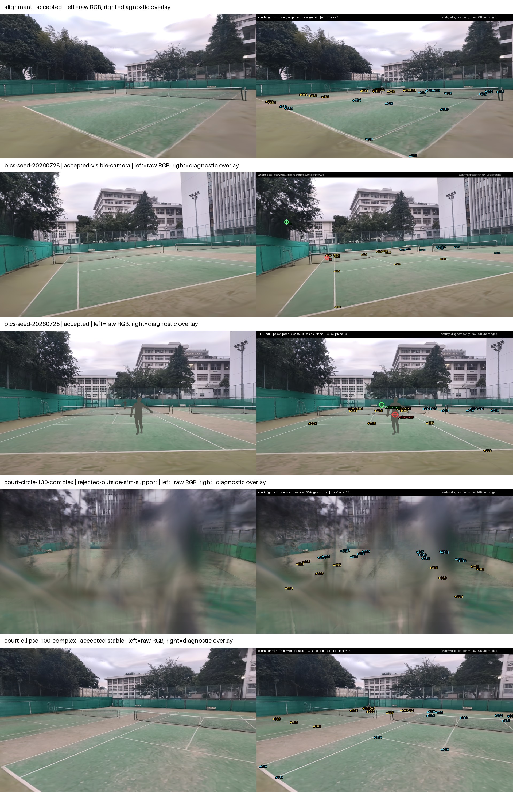

### Point alignment

captured SfM camera `frame_000080`へ、`court_0`をyellow、
`court_1`をcyanで投影した。目視ではnet、baseline、sideline上へ点が重なり、
二面のinstanceを区別した状態でalignmentを確認できる。

- [raw RGB video](assets/production-previews/alignment/rgb.mp4)
- [point-alignment overlay video](assets/production-previews/alignment/rgb-with-diagnostic-overlay.mp4)
- [raw / overlay contact sheet](assets/production-previews/alignment/contact-sheet.jpg)

### BLCS: 3-ball samples

各sampleは3個のprototype Gaussian ballを、drag、Magnus、wind、bounceを含む
物理simulation軌道へ置き、背景と同じnative NHT callで描画する。実径6.7 cmの
ballは通常の遠景cameraでは数pixel以下になる。そのため「見せるための拡大」は
行わず、SfM camera群から複数球が同時可視かつ投影径中央値が約55 pxになる
近接cameraを選んだ。診断overlayのB1/B2/B3 markerは別videoだけに存在する。

| seed | objects | frames | raw RGB | diagnostic overlay | contact sheet |
|---|---:|---:|---|---|---|
| 20260728 | 3 | 21 | [MP4](assets/production-previews/blcs-seed-20260728/rgb.mp4) | [MP4](assets/production-previews/blcs-seed-20260728/rgb-with-diagnostic-overlay.mp4) | [JPG](assets/production-previews/blcs-seed-20260728/contact-sheet.jpg) |
| 20260730 | 3 | 11 | [MP4](assets/production-previews/blcs-seed-20260730/rgb.mp4) | [MP4](assets/production-previews/blcs-seed-20260730/rgb-with-diagnostic-overlay.mp4) | [JPG](assets/production-previews/blcs-seed-20260730/contact-sheet.jpg) |
| 20260732 | 3 | 16 | [MP4](assets/production-previews/blcs-seed-20260732/rgb.mp4) | [MP4](assets/production-previews/blcs-seed-20260732/rgb-with-diagnostic-overlay.mp4) | [JPG](assets/production-previews/blcs-seed-20260732/contact-sheet.jpg) |

prototype ballはproduction assetの形状・fit経路を検証するための灰緑色の球で、
実ballの最終appearanceではない。遠景1280 pxで3球を描いた比較では背景との差が
4 pixel、最大52 uint8 LSBだった。このsub-pixel失敗例も保持し、camera選択を
可視性で行う理由にした。

### PLCS: 2-person samples

各sampleは2人の4,096-Gaussian SMPL-X prototype avatarを、位置、yaw、
ready/forehand poseで独立制御する。手前の人物だけでなく、反対court上の
小さい人物も同じraw RGBへ合成される。灰色appearanceはprototypeの制約であり、
geometry、identity、pose、occlusionのnative compositionを確認する成果である。

| seed | persons | frames | raw RGB | diagnostic overlay | contact sheet |
|---|---:|---:|---|---|---|
| 20260728 | 2 | 12 | [MP4](assets/production-previews/plcs-seed-20260728/rgb.mp4) | [MP4](assets/production-previews/plcs-seed-20260728/rgb-with-diagnostic-overlay.mp4) | [JPG](assets/production-previews/plcs-seed-20260728/contact-sheet.jpg) |
| 20260729 | 2 | 12 | [MP4](assets/production-previews/plcs-seed-20260729/rgb.mp4) | [MP4](assets/production-previews/plcs-seed-20260729/rgb-with-diagnostic-overlay.mp4) | [JPG](assets/production-previews/plcs-seed-20260729/contact-sheet.jpg) |
| 20260731 | 2 | 12 | [MP4](assets/production-previews/plcs-seed-20260731/rgb.mp4) | [MP4](assets/production-previews/plcs-seed-20260731/rgb-with-diagnostic-overlay.mp4) | [JPG](assets/production-previews/plcs-seed-20260731/contact-sheet.jpg) |

production appearanceで独立にfitした2回のavatarは、validation PSNR
56.1131 / 56.1019 dB、raw RGB差は最大1 uint8 LSB、平均
0.001092 LSBだった。

### Court detection: orbit-family samples

ユーザー質問中の「pose detection」は、ここではcourt detectionのcamera-pose
samplingとして扱った。circle/ellipse、radius scale、height、complex /
`court_0` / `court_1`注視点を変えた6本を実RGBでレンダリングした。

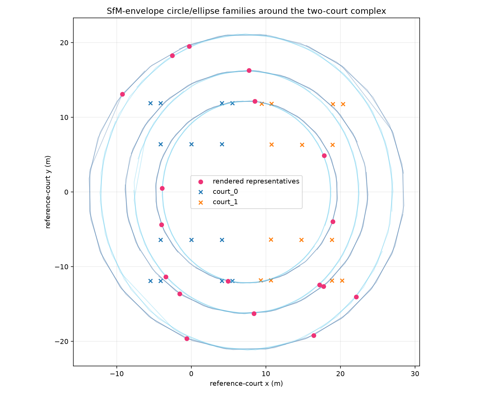

| family | radius / height | visual decision | raw RGB | diagnostic overlay | contact sheet |
|---|---|---|---|---|---|
| circle 0.75 / complex | 12.23 m / 1.59 m | stable | [MP4](assets/production-previews/court-circle-075-complex/rgb.mp4) | [MP4](assets/production-previews/court-circle-075-complex/rgb-with-diagnostic-overlay.mp4) | [JPG](assets/production-previews/court-circle-075-complex/contact-sheet.jpg) |
| circle 1.00 / court 0 | 16.30 m / 2.52 m | local artifactあり | [MP4](assets/production-previews/court-circle-100-court0/rgb.mp4) | [MP4](assets/production-previews/court-circle-100-court0/rgb-with-diagnostic-overlay.mp4) | [JPG](assets/production-previews/court-circle-100-court0/contact-sheet.jpg) |
| circle 1.30 / complex | 21.19 m / 4.24 m | **reject: SfM support外** | [MP4](assets/production-previews/court-circle-130-complex/rgb.mp4) | [MP4](assets/production-previews/court-circle-130-complex/rgb-with-diagnostic-overlay.mp4) | [JPG](assets/production-previews/court-circle-130-complex/contact-sheet.jpg) |
| ellipse 0.75 / court 1 | 11.34×12.23 m / 1.59 m | stable | [MP4](assets/production-previews/court-ellipse-075-court1/rgb.mp4) | [MP4](assets/production-previews/court-ellipse-075-court1/rgb-with-diagnostic-overlay.mp4) | [JPG](assets/production-previews/court-ellipse-075-court1/contact-sheet.jpg) |
| ellipse 1.00 / complex | 15.12×16.30 m / 2.52 m | stable | [MP4](assets/production-previews/court-ellipse-100-complex/rgb.mp4) | [MP4](assets/production-previews/court-ellipse-100-complex/rgb-with-diagnostic-overlay.mp4) | [JPG](assets/production-previews/court-ellipse-100-complex/contact-sheet.jpg) |
| ellipse 1.30 / court 1 | 19.65×21.19 m / 4.24 m | **reject: SfM support外** | [MP4](assets/production-previews/court-ellipse-130-court1/rgb.mp4) | [MP4](assets/production-previews/court-ellipse-130-court1/rgb-with-diagnostic-overlay.mp4) | [JPG](assets/production-previews/court-ellipse-130-court1/contact-sheet.jpg) |

0.75倍と1.00倍は、既存の0.25 m / 1.5° baselineより大幅に広い移動でも
court geometryを維持した。一方1.30倍は軌道の一部でdouble image、blur、
unsupported geometryが明確に出たため、成功扱いにせず失敗videoごと残した。
これにより、次のsamplerはfamily全体を固定小範囲へ戻すのではなく、native
visual qualityを用いて局所的なSfM support境界を学習できる。

### Production previewの境界

production RGB previewはすべて1 frameにつき公開`RGB+ED` rasterization 1回で、
renderer commitは`20bc323d613258e5d169fdbc962c9ef27d55ca69`である。
13 preview（alignment 1、BLCS 3、PLCS 3、court 6）のsource/output SHAは
[publication manifest](assets/production-previews/manifest.json)で再検証した。

ただし、production checkpointを既存のexact instance-AOV経路へそのまま通すと、
NHT RGB alphaとAOV alphaの差が`0.0977283`となり、許容値`0.005`を超えた。
dataset gateは緩めていない。そのため、ここで受理したのはproductionのraw RGB
visual evidenceであり、production checkpointでのexact mask/AOV dataset
acceptanceではない。exact label contract自体はmechanics checkpointで受理済み
だが、production用にはNHT eval pathと一致するAOV実装が別途必要である。

## Production pipeline refactor

プロトタイプ検証後、ユーザー選択の **Architecture A** と **NHT boundary N1**
へ再編した。現在と将来のdatasetは
`src/synthetic_data_generation/dataset/<dataset-name>`の一か所で管理し、
各vertical sliceがartifact、component、render、validation、reportingを所有する。
CLIは`src/synthetic_data_generation/scripts/{alignment,dataset}`に分離した。

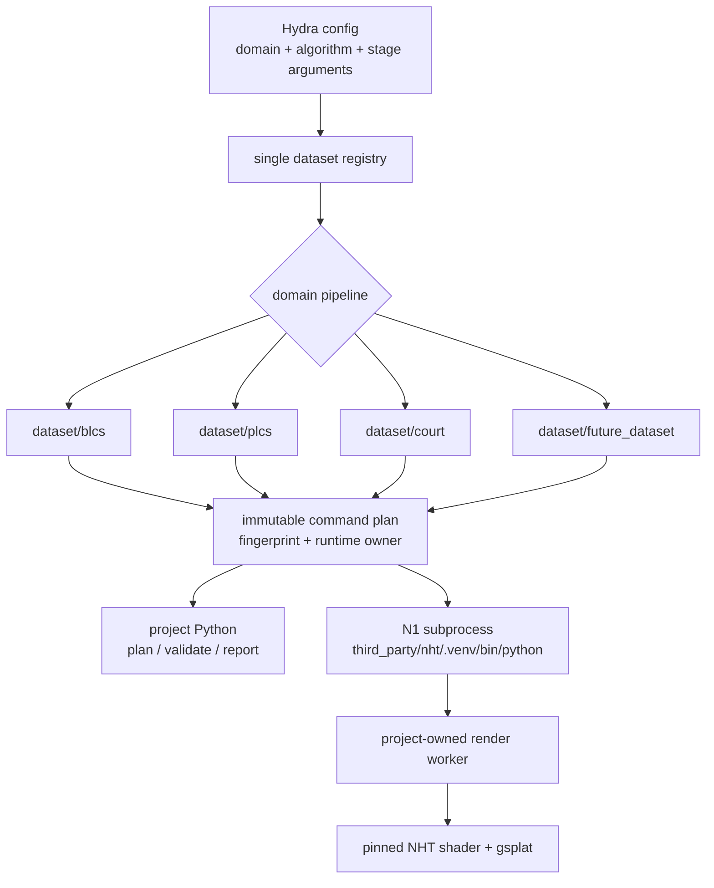

候補手法はprototype file名やphase番号で分岐せず、config上の安定した名前で
選択する。未知の名前は利用可能な候補一覧とともに即時失敗し、fallbackしない。

| dataset | config key | selectable algorithms |
|---|---|---|
| BLCS | `algorithms.ball_asset` | `procedural_fibonacci`, `registered_gaussian_asset` |
| BLCS | `algorithms.trajectory` | `rally_physics` |
| PLCS | `algorithms.avatar_control` | `gaussianavatar_query_lbs`, `hugs_topk_lbs` |
| PLCS | `algorithms.motion` | `seeded_court_motion` |
| court | `algorithms.camera_sampling` | `sfm_neighborhood`, `inward_orbit` |
| court | `algorithms.labels` | `symmetric_seven_channel` |

NHT forkからBLCS/PLCS/court固有worker、acceptance、previewを削除し、runtime、
training、checkpoint、shader、rasterizerだけを残した。tennis-labはsubmoduleの
完全なcommitとclean tracked stateを検証してから、shellを介さずproject-owned
workerをNHT Pythonで起動する。venv interpreter symlinkを実体化してbase Pythonへ
逸脱する不具合も回帰test付きで修正した。

### Refactor verification

export-first検証では新しい出力へ491 camera、491 image、217,336 scene pointを
再exportした。scene fingerprintは従来と一致し、exporter codeの移動を含む新しい
bundle fingerprintを発行した。

| gate | result |
|---|---|
| export | 493 files / 275 MiB、491 cameras、491 images |
| scene fingerprint | `2c16d09503118b08a30b3819d01c23b2bc0e575f00b4f30a931c8447d4d3e160` |
| refactor export bundle | `9a3546c83926c09b7e17d427680e5c25649bc02cba58d9580e44f070195692c6` |
| NHT submodule | `b3176cfe2f8e16f1f89fe29151db650f3867af4f` |
| isolated runtime | Torch `2.9.1+cu130`、CUDA device 1、gsplat editable checkout |
| real RGB smoke | 640×360、finite、overlayなし、renderer `20bc323d...` |

real RGB smokeではmulti-ball planの2 instanceをbackgroundと同じGaussian sceneへ
合成し、native RGBとexact AOVを2 renderer callで生成した。遠景frameではballが
sub-pixelとなりexact visible pixelは0だったため、これはN1実行境界とRGB renderer
のsmokeであり、ball visibility acceptanceではない。AOV/NHT alpha差は
`0.0130756`で、smokeでは明示的に`0.02`を指定した。近接1280 px試行は
`0.118223 > 0.03`で失敗したため、既定値を緩めず失敗artifactを保持した。

## 共通アーキテクチャ

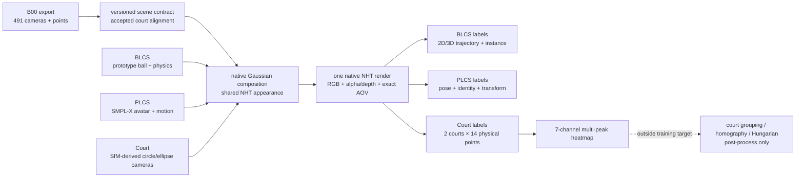

三系統は次の境界を共有する。

| 境界 | 受理値 |
|---|---|
| B00 camera | 491 |
| scene fingerprint | `2c16d09503118b08a30b3819d01c23b2bc0e575f00b4f30a931c8447d4d3e160` |
| provider bundle fingerprint | `4c013df9623422c036e9984710295c39491133f3479c056bb9f8dd53a243732b` |
| Gaussian composition fingerprint | `7a83e40ca75b139e5de1996652cd4015423e0e3e00801a6ba91eda063c20ed37` |
| NHT/gsplat renderer commit | `20bc323d613258e5d169fdbc962c9ef27d55ca69` |
| RGB overlay | 全系統で `false` |

overlay-eraの旧 `src/synthetic_data_generation/{dataset,provider,rendering}`
はP1で削除した。今回の`dataset`と`rendering/nht`は、その名前空間へ互換shimを
戻したものではなく、3D Gaussian native composition専用の新しいproduction API
である。alignmentに必要なprovider exportは引き続き
`src/synthetic_data_generation/alignment/scene_provider`が所有する。

## BLCS

実ボールassetを待たずに検証できるprototypeとして、直径6.7 cm、
512 Gaussianの球を生成した。asset provenanceは
`codex-generated-prototype`、`source_is_user_asset=false`として明示される。
8 viewのcapture、600-stepのfrozen-target NHT feature fit、registry ingestionを
production boundaryと同じ経路で通し、validation PSNRは56.05 dBだった。

物理軌道は既存の `BallPhysics` / `RallySimulator` を使い、drag、Magnus、
wind、bounceを含む。single/multi双方で背景Gaussianとball Gaussianを
render前に連結し、exact contribution AOVからinstance maskとvisibilityを
作る。singleは317 frame、multi prototypeは240 frame / 2 objectsで、描画した
代表frameでは各ballが全frameで可視だった。

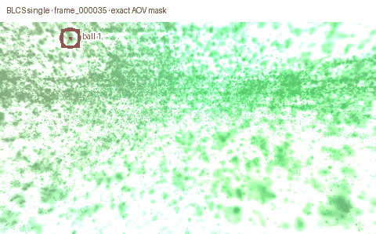

GIF上のringと色は診断表示であり、保存されたdataset RGBには描き込まれて
いない。背景の外観制約下でも、小さいballのexact AOV位置とidentityを目視
できるようにした。

## PLCS

一次論文と公式実装の比較結果から、
**GaussianAvatar-style fixed SMPL-X query LBS** を採用した。比較対象は
**HUGS-style top-k SMPL transform blending** である。公式commit、論文URL、
適用理由、限界、棄却案は
[PLCS research record](../../.codex-loop/3dgs-synthetic-data/research/plcs-avatar-methods.md)
に集約した。

受理assetは4,096 anisotropic Gaussians、55 SMPL-X jointsで、canonical /
ready / forehandの3 poseを持つ。最大p95 attachment errorは4.416 mm。
NHT feature fitのheld-out masked PSNRは67.880/67.922 dBで、独立repeat間の
native render差は最大1 uint8 LSB、平均0.00221 LSBだった。

P5ではsingle/multi personをscene内で移動・回転・pose制御した。12-frame
scheduleから各5 frameをnative renderし、identity、pose、position、
velocity、yaw、Sim(3)、exact instance mask/bboxを保存した。

| metric | single | multi |
|---|---:|---:|
| person count | 1 | 2 |
| exact visible pixels | 58–73 | 74–1,220 |
| root projection error max | 1.380 px | 1.790 px |
| path length min | 3.490 m | 3.671 m |
| pose transitions min | 2 | 2 |

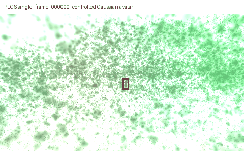

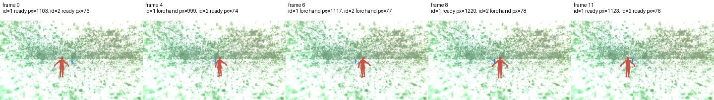

COCO17からSMPL-Xへの逆変換は不定であるため、silent fallbackは実装して
いない。将来COCO17制御を追加するときは、明示的なIK/fit成功をframe gateに
する。

## Court detection

### Camera trajectory

最初にcaptured pose周辺0.25 m / 1.5°のsupport-bounded baselineを作り、
farthest-view selectionで256 viewを選択した。その後、ユーザー方針に
合わせてSfM envelopeと実在する2 court geometryから、内向きcircle /
ellipse、scale 0.75 / 1.00 / 1.30、複数height、complex / `court_0` /
`court_1`注視点を組み合わせた18 familyへ拡張した。

このbold trajectoryでは、captured poseから最大15.35 m、
13.80°まで広げている。固定の小範囲へ戻すのではなく、collision、near
plane、court coverage、native renderの目視結果をgateにした。一次論文と
公式codeの判断は
[camera sampling research record](../../.codex-loop/3dgs-synthetic-data/research/novel-view-camera-sampling.md)
に記録した。

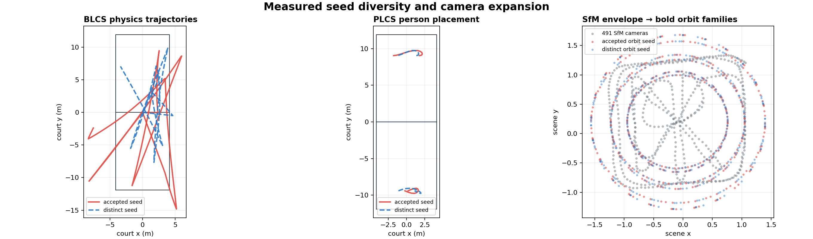

### Annotation

現在のsceneでは `court_0` / `court_1` の2面を保持する。各courtには14個の
physical pointがあり、annotationは全28点について
`court_instance_id`、UV、scene depth、in-front、in-frame、renderer-derived
visibility、occlusionを保存する。

学習targetでは、同一court内のnear/far対称点を同じsemantic classへ写像する。
したがって14 physical pointは7 classになり、2 courtの場合は1 channelに
最大4 peakが存在できる。

| 項目 | 学習target |
|---|---|
| heatmap channel | 7 |
| multi-peak composition | pixelwise maximum |
| court instance label | annotationには保持 |
| instance grouping | 学習対象外 |
| homography / geometry assignment | post-process |
| Hungarian matching | post-process |

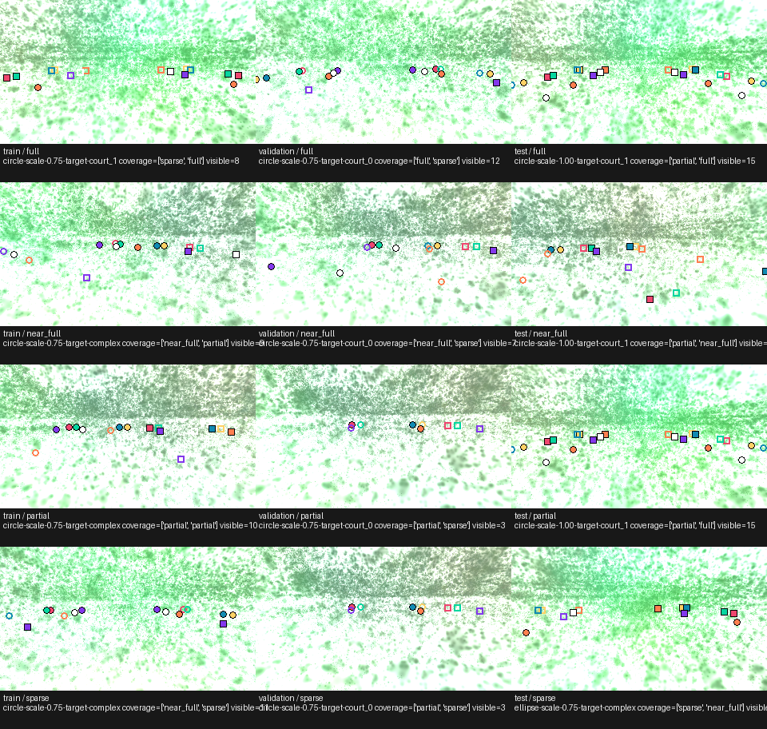

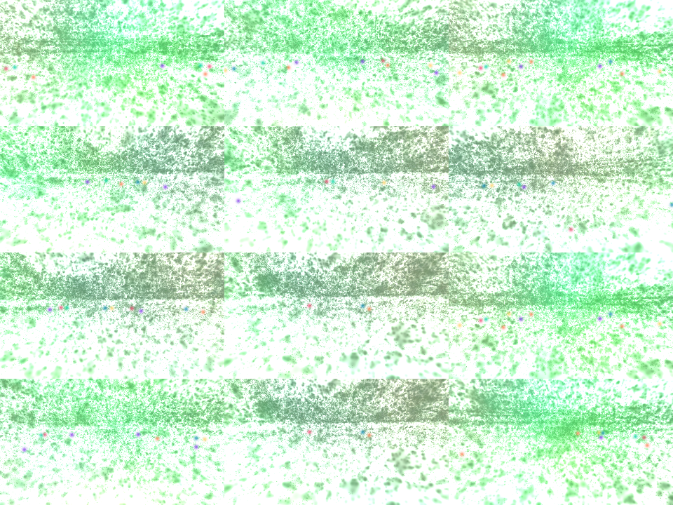

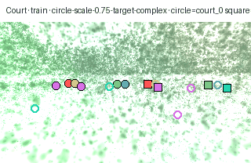

### Dataset release

family単位でsplitし、隣接frameがtrain/validation/testへ漏れないようにした。
全splitがcircle/ellipse、scale、target semanticsとfull/near-full/partial/
sparse coverageを持つ。

| split | frames | trajectory families |
|---|---:|---:|
| train | 284 | 12 |
| validation | 72 | 3 |
| test | 72 | 3 |
| **total** | **428** | **18** |

renderer-visible physical pointsは4,470、in-frameだがoccluded/unsupportedな
点は3,511。全physical point recordは11,984である。projection round-tripの
最大誤差はUV `1.678e-7 px`、depth `8.882e-16 scene unit`。visible point位置
でのheatmap値は最小0.8836だった。

## 再現性とseed diversity

再現性と多様性を混同しないように別gateにした。同一seedはtree全体の
byte一致、別seedは責務に応じた連続量の差で評価する。

| 対象 | 同一seed | 別seedの測定差 |
|---|---:|---:|
| BLCS single plan | 11 files byte-identical | position RMS 6.142 m |
| BLCS multi plan | 11 files byte-identical | position RMS 4.911 m |
| PLCS single plan | 11 files byte-identical | position RMS 0.451 m、max speed差1.640 m/s |
| PLCS multi plan | 11 files byte-identical | position RMS 0.421 m、max speed差2.190 m/s |
| PLCS single/multi render | 各36 files byte-identical | plan fingerprint変化 |
| court dataset | 1,285 files byte-identical | camera中心RMS 1.011 scene unit、orbit位相RMS 104.58° |

PLCSのpose順とyawはprototype motion semanticsとして固定し、seedはplacement
振幅・位相を変える。P8 v1は固定pose順までseedで変わることを誤って要求して
失敗した。失敗artifactを上書きせず保持し、seedの実際の責務である
positionとspeed差を測るv2へ訂正した。

## 統合検証

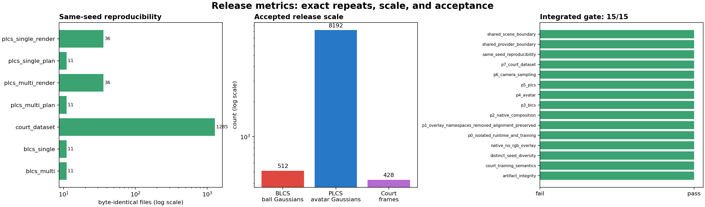

P8 acceptanceは、exportを起点にproviderの全宣言fileを再hashし、scene
contractとの491 camera完全一致を確認してから下流artifactを検証した。

- P0: isolated NHT CUDA forward/backward、real COLMAP 1-step training、
  loadable checkpoint/PLY/deferred asset/render/trajectory videoを再確認。
- P1: overlay-era namespaceの不在とalignment ownershipを確認。
- P2–P7:各acceptance reportのcontent fingerprintとstatusを再検証。
- BLCS/PLCS/court: renderer commit、composition fingerprint、
  `rgb_overlay_used=false` を横断検証。
- render/dataset reference 1,438件をhash/sizeで再検証。
- integrated gate: **15/15 passed**。
- synthetic-data unit/integration/e2e: **156 passed**（18.98 s、xdist 6 worker）。
- novel-view focused regression: **4 passed**。
- Ruff: 全synthetic-data source/testとthird-party publisherでpassed。
- mypy: P8 publisher 2 filesおよびcourt 5 modulesでpassed。
- script convention review、Python compile、`git diff --check`: passed。

## 成果物と制約

Gitで管理するものは、再現可能な実装、schema、test、research decision、
このreportと軽量visual evidenceである。58 MiBのcourt dataset、checkpoint、
NPY/AOV、repeat tree、失敗artifact、ログはGitへ含めず、immutable local
artifactとして `STATE.md` にSHA-256と正確なpathを記録する。

長時間学習したB03により背景RGBは確認できたが、prototype ball/avatarの
photorealism、production checkpointでのexact AOV、SfM support外となる
1.30倍軌道は未受理である。次の実運用ステップは、実capture由来の
ball/human assetへの差し替え、NHT eval pathと一致するAOV実装、0.75–1.00倍
周辺での局所的なsupport boundary推定である。
