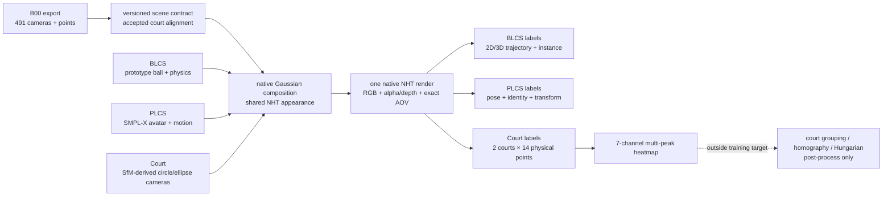

# 3DGS-native synthetic data 最終レポート

## 結論

BLCS、PLCS、court detection の3系統を、2D RGB overlayではなく、同一の
3D Gaussian sceneへ資産やcameraを合成してnative NHT rendererで描画する
基盤へ移行した。P0–P8の全acceptance gateは合格しており、統合P8は
15/15 gateを通過した。

ここで受理したのは、scene composition、制御、label、再現性、dataset
contractを含む **mechanics release** である。背景は1-step NHT checkpoint
由来で緑色の点群状に見えるため、production photorealismは受理範囲に
含めない。この制約はmanifestとacceptance reportにも明記されている。

## 共通アーキテクチャ

三系統は次の境界を共有する。

| 境界 | 受理値 |
|---|---|
| B00 camera | 491 |
| scene fingerprint | `2c16d09503118b08a30b3819d01c23b2bc0e575f00b4f30a931c8447d4d3e160` |
| provider bundle fingerprint | `4c013df9623422c036e9984710295c39491133f3479c056bb9f8dd53a243732b` |
| Gaussian composition fingerprint | `7a83e40ca75b139e5de1996652cd4015423e0e3e00801a6ba91eda063c20ed37` |
| NHT/gsplat renderer commit | `20bc323d613258e5d169fdbc962c9ef27d55ca69` |
| RGB overlay | 全系統で `false` |

旧 `src/synthetic_data_generation/{dataset,provider,rendering}` は削除した。
alignmentに必要なprovider exportは
`src/synthetic_data_generation/alignment/scene_provider`へ移動し、互換shimは
残していない。

## BLCS

実ボールassetを待たずに検証できるprototypeとして、直径6.7 cm、
512 Gaussianの球を生成した。asset provenanceは
`codex-generated-prototype`、`source_is_user_asset=false`として明示される。
8 viewのcapture、600-stepのfrozen-target NHT feature fit、registry ingestionを
production boundaryと同じ経路で通し、validation PSNRは56.05 dBだった。

物理軌道は既存の `BallPhysics` / `RallySimulator` を使い、drag、Magnus、
wind、bounceを含む。single/multi双方で背景Gaussianとball Gaussianを
render前に連結し、exact contribution AOVからinstance maskとvisibilityを
作る。singleは317 frame、multi prototypeは240 frame / 2 objectsで、描画した
代表frameでは各ballが全frameで可視だった。

GIF上のringと色は診断表示であり、保存されたdataset RGBには描き込まれて
いない。背景の外観制約下でも、小さいballのexact AOV位置とidentityを目視
できるようにした。

## PLCS

一次論文と公式実装の比較結果から、
**GaussianAvatar-style fixed SMPL-X query LBS** を採用した。比較対象は
**HUGS-style top-k SMPL transform blending** である。公式commit、論文URL、
適用理由、限界、棄却案は
[PLCS research record](../../.codex-loop/3dgs-synthetic-data/research/plcs-avatar-methods.md)
に集約した。

受理assetは4,096 anisotropic Gaussians、55 SMPL-X jointsで、canonical /
ready / forehandの3 poseを持つ。最大p95 attachment errorは4.416 mm。
NHT feature fitのheld-out masked PSNRは67.880/67.922 dBで、独立repeat間の
native render差は最大1 uint8 LSB、平均0.00221 LSBだった。

P5ではsingle/multi personをscene内で移動・回転・pose制御した。12-frame
scheduleから各5 frameをnative renderし、identity、pose、position、
velocity、yaw、Sim(3)、exact instance mask/bboxを保存した。

| metric | single | multi |
|---|---:|---:|
| person count | 1 | 2 |
| exact visible pixels | 58–73 | 74–1,220 |
| root projection error max | 1.380 px | 1.790 px |
| path length min | 3.490 m | 3.671 m |
| pose transitions min | 2 | 2 |

COCO17からSMPL-Xへの逆変換は不定であるため、silent fallbackは実装して
いない。将来COCO17制御を追加するときは、明示的なIK/fit成功をframe gateに
する。

## Court detection

### Camera trajectory

最初にcaptured pose周辺0.25 m / 1.5°のsupport-bounded baselineを作り、
farthest-view selectionで256 viewを選択した。その後、ユーザー方針に
合わせてSfM envelopeと実在する2 court geometryから、内向きcircle /
ellipse、scale 0.75 / 1.00 / 1.30、複数height、complex / `court_0` /
`court_1`注視点を組み合わせた18 familyへ拡張した。

このbold trajectoryでは、captured poseから最大15.35 m、
13.80°まで広げている。固定の小範囲へ戻すのではなく、collision、near
plane、court coverage、native renderの目視結果をgateにした。一次論文と
公式codeの判断は
[camera sampling research record](../../.codex-loop/3dgs-synthetic-data/research/novel-view-camera-sampling.md)
に記録した。

### Annotation

現在のsceneでは `court_0` / `court_1` の2面を保持する。各courtには14個の
physical pointがあり、annotationは全28点について
`court_instance_id`、UV、scene depth、in-front、in-frame、renderer-derived
visibility、occlusionを保存する。

学習targetでは、同一court内のnear/far対称点を同じsemantic classへ写像する。
したがって14 physical pointは7 classになり、2 courtの場合は1 channelに
最大4 peakが存在できる。

| 項目 | 学習target |
|---|---|
| heatmap channel | 7 |
| multi-peak composition | pixelwise maximum |
| court instance label | annotationには保持 |
| instance grouping | 学習対象外 |
| homography / geometry assignment | post-process |
| Hungarian matching | post-process |

### Dataset release

family単位でsplitし、隣接frameがtrain/validation/testへ漏れないようにした。
全splitがcircle/ellipse、scale、target semanticsとfull/near-full/partial/
sparse coverageを持つ。

| split | frames | trajectory families |
|---|---:|---:|
| train | 284 | 12 |
| validation | 72 | 3 |
| test | 72 | 3 |
| **total** | **428** | **18** |

renderer-visible physical pointsは4,470、in-frameだがoccluded/unsupportedな
点は3,511。全physical point recordは11,984である。projection round-tripの
最大誤差はUV `1.678e-7 px`、depth `8.882e-16 scene unit`。visible point位置
でのheatmap値は最小0.8836だった。

## 再現性とseed diversity

再現性と多様性を混同しないように別gateにした。同一seedはtree全体の
byte一致、別seedは責務に応じた連続量の差で評価する。

| 対象 | 同一seed | 別seedの測定差 |
|---|---:|---:|
| BLCS single plan | 11 files byte-identical | position RMS 6.142 m |
| BLCS multi plan | 11 files byte-identical | position RMS 4.911 m |
| PLCS single plan | 11 files byte-identical | position RMS 0.451 m、max speed差1.640 m/s |
| PLCS multi plan | 11 files byte-identical | position RMS 0.421 m、max speed差2.190 m/s |
| PLCS single/multi render | 各36 files byte-identical | plan fingerprint変化 |
| court dataset | 1,285 files byte-identical | camera中心RMS 1.011 scene unit、orbit位相RMS 104.58° |

PLCSのpose順とyawはprototype motion semanticsとして固定し、seedはplacement
振幅・位相を変える。P8 v1は固定pose順までseedで変わることを誤って要求して
失敗した。失敗artifactを上書きせず保持し、seedの実際の責務である
positionとspeed差を測るv2へ訂正した。

## 統合検証

P8 acceptanceは、exportを起点にproviderの全宣言fileを再hashし、scene
contractとの491 camera完全一致を確認してから下流artifactを検証した。

- P0: isolated NHT CUDA forward/backward、real COLMAP 1-step training、
  loadable checkpoint/PLY/deferred asset/render/trajectory videoを再確認。
- P1: overlay-era namespaceの不在とalignment ownershipを確認。
- P2–P7:各acceptance reportのcontent fingerprintとstatusを再検証。
- BLCS/PLCS/court: renderer commit、composition fingerprint、
  `rgb_overlay_used=false` を横断検証。
- render/dataset reference 1,438件をhash/sizeで再検証。
- integrated gate: **15/15 passed**。
- synthetic-data unit/e2e: **140 passed**（50.69 s、capture無効の直列実行）。
- novel-view focused regression: **4 passed**。
- Ruff: 全synthetic-data source/testとthird-party publisherでpassed。
- mypy: P8 publisher 2 filesおよびcourt 5 modulesでpassed。
- script convention review、Python compile、`git diff --check`: passed。

## 成果物と制約

Gitで管理するものは、再現可能な実装、schema、test、research decision、
このreportと軽量visual evidenceである。58 MiBのcourt dataset、checkpoint、
NPY/AOV、repeat tree、失敗artifact、ログはGitへ含めず、immutable local
artifactとして `STATE.md` にSHA-256と正確なpathを記録する。

残る制約は外観品質である。scene mechanics、camera、label、instance
consistencyは受理済みだが、背景、prototype ball、prototype avatarの
photorealismは未達である。次の実運用ステップはコード再設計ではなく、
同じcontractへ長時間学習したNHT sceneと実capture由来のball/human assetを
差し替えることである。
