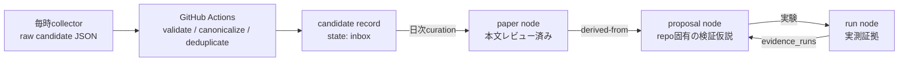

# Literature Radar

`knowledge/literature/` は、ChatGPTスケジュールが継続的に発見する外部論文を、既存の実験ナレッジグラフへ安全に接続するための入口です。

重要な原則は、**発見・レビュー・提案・ローカル検証を別の状態として扱うこと**です。論文を見つけただけでは `knowledge/nodes/` の正式ノードにしません。また「論文を読んだ」ことと「tennis-labで有効性を確認した」ことも区別します。

## 4段階の知識モデル



1. **Raw candidate**: 毎時スケジュールがqueue branchへ書く未信頼JSON。mainや正式グラフには置かない。
2. **Candidate record**: GitHub Actionsが検証・正規化・重複排除したJSON。`candidates/` に置く。
3. **Paper / Proposal node**: 日次curatorが本文・公式実装・制約を確認した正式グラフノード。
4. **Run evidence**: proposalを実験した既存run。`supported` 等の判定にはrun IDが必要。

したがって「検証済み論文」という単一状態は置きません。外部論文は `paper` としてレビュー済みにでき、tennis-lab上の有効性は `proposal.status` と `proposal.evidence_runs` で表現します。

## ディレクトリ

```text
knowledge/literature/
├── README.md
├── config.json                    # collector分担、閾値、branch、日次上限のSOT
├── schema/
│   ├── candidate.schema.json      # 毎時スケジュールが生成するraw JSON契約
│   └── record.schema.json         # Actionが生成するcanonical record契約
├── incoming/
│   └── README.md                  # queue branchだけにraw JSONを追加する場所
├── candidates/
│   └── README.md                  # Actionが生成するcanonical candidate records
├── digests/
│   └── README.md                  # 日次の収集一覧・curation判断
└── prompts/
    ├── hourly-perception.md
    ├── hourly-geometry.md
    ├── hourly-systems.md
    └── daily-curator.md
```

正式ノードは従来どおり `knowledge/nodes/` に置きます。

```text
knowledge/nodes/
├── run-*.md
├── group-*.md
├── paper-*.md
└── proposal-*.md
```

## 3体の毎時collector

3体は同時起動しても同じファイルを更新しないよう、探索責任とqueue branchを固定します。

| collector | queue branch | 主な探索領域 |
|---|---|---|
| `perception` | `automation/literature-inbox/perception` | 2D検出、segmentation、keypoint、pose、tracking |
| `geometry` | `automation/literature-inbox/geometry` | PLCS/BLCS、multi-view、3D、trajectory、物理制約 |
| `systems` | `automation/literature-inbox/systems` | synthetic data、3DGS/avatar、SSL、最適化、data engine |

各実行は候補を最大1件だけ生成し、次へ新規ファイルとして保存します。

```text
knowledge/literature/incoming/<JST-date>/<collector>/<timestamp>-<slug>.json
```

同じqueue branchの同じパスを更新してはいけません。候補がない、日次quotaに達した、既存候補と重複した場合はGitHubへ変更を加えません。

## GitHub Actions境界

`.github/workflows/literature-radar-ingest.yml` はqueue branchへのpushで起動します。3 collectorの同時pushはglobal `concurrency` で直列化されます。

Actionは次を行います。

1. raw JSONを一時領域へ退避する。
2. `discovered_at` からJSTの日付を決定する。
3. 対応する `automation/literature-radar/YYYY-MM-DD` branchを取得する。
4. JSON契約、collector責任、repo path、scoreを検査する。
5. DOI → arXiv → OpenReview → title hashの順でcanonical paper IDを決める。
6. main・当日branch・他のopen daily radar branchと重複を判定する。
7. quotaを満たす場合だけ `candidates/<paper-id>.json` を作成またはmergeする。
8. `digests/YYYY-MM-DD.md` の自動区間を更新する。
9. 検証後、当日branchへcommitする。

Raw JSONはdaily branchやPRへ混入しません。

## 日次curator

日次スケジュールは毎日1回、次の二つを同じ実行で行います。

- **前日をfinalize**: candidateをレビューし、paper/proposal node、digest、日次Issue、日次PRを作る。
- **当日をinitialize**: 当日daily branchをmainから作り、3本のqueue branchを当日branchへresetする。

日次単位は最大で次のとおりです。

- PR: 1件
- Radar Issue: 1件
- 本文レビュー: 6論文
- 新規proposal: 3件

候補もdiffもなければIssueとPRは作りません。Issueは論文ごとではなく、その日のダイジェスト1件です。個別の実験Issueはproposalが `ready` の要件を満たした場合だけ作成し、open件数上限は5件です。

## Candidateの状態

| state | 意味 |
|---|---|
| `inbox` | Action通過済み、日次レビュー待ち |
| `reviewed` | 本文等は確認済みだが正式paper nodeへ昇格しない |
| `rejected` | 重複、適用困難、証拠不足、ライセンス等で不採用 |
| `promoted` | `paper-*` nodeが作成済み |

`curation` に判断理由、paper node、proposal node、Issue番号を記録します。棄却候補も削除せず、将来の重複探索を止める負の知識として残します。

## Formal nodeの意味

### paper

外部論文の主張と制約を本文ベースでレビューしたノードです。少なくとも外部ID、一次情報source、対象task、repo path、evidence levelを持ちます。

### proposal

paperから導出した、tennis-lab固有の反証可能な仮説です。`derived-from` relationでpaperを参照し、baseline、metrics、seed数、合格条件、失敗条件を持ちます。

`proposal.status` は次の順で進みます。

```text
candidate → ready → issue-open → testing
                              ├→ supported
                              ├→ refuted
                              └→ inconclusive
supported → adopted
```

`supported` / `refuted` / `inconclusive` / `adopted` には `evidence_runs` が必須です。これにより、論文紹介だけで「検証済み」と誤表示されません。

## 競合と冪等性

- collectorごとにqueue branchを分け、3体が同じbranchへ同時writeしない。
- queue上のrawファイルはappend-onlyで、`schedule_run_id` を一意にする。
- Actionはglobal concurrencyでdaily branchへのcommitを直列化する。
- canonical IDが同じ候補は新規ファイルを作らず、独立したdiscoveryとしてmergeする。
- 日次Issue・PRには日付のmachine markerを入れ、再実行時は新規作成せず既存対象を更新する。

## 初期化順序

この機能をmergeした後、最初に日次curatorを1回実行して当日daily branchと3本のqueue branchを作成します。その後に毎時collectorを有効化します。queue branchが存在しない場合、毎時collectorはbranchを新設せず `INITIALIZATION_REQUIRED` で終了します。
