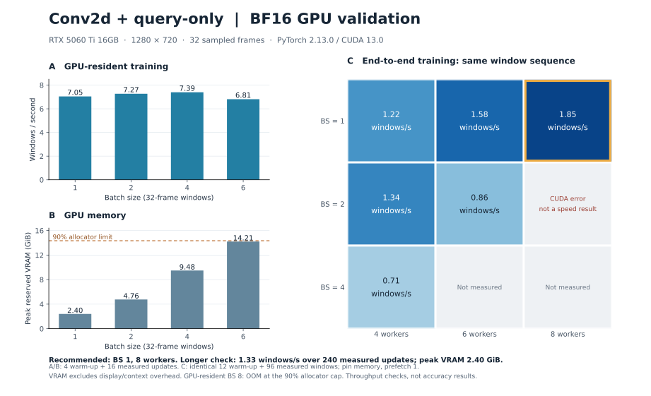

ユーザー指定によりBF16 AMPに固定した。同じtrain 108窓を各caseで同じ順に使い、
先頭12窓をwarmup、残り96窓を計測した。全caseの窓列hashの一致を確認した。
BSの変更はbatchへのまとめ方だけを変える。各caseは別processで、初回clip hashもreader時間に含む。

| BS | worker 4 | worker 6 | worker 8 | peak reserved GiB |
|---:|---:|---:|---:|---:|
| 1 | 1.2213 | 1.5822 | 1.8505 | 2.404 |
| 2 | 1.3380 | 0.8585 | CUDA error | 4.762（成功case） |
| 4 | 0.7059 | 未測定 | 未測定 | 9.482 |

速度の単位はwindow/s。BS=1・worker=8が成功case中の最高値で、32枚換算59.2入力frame/s。
BS=2・worker=8は最初のupdate前に`torch.isfinite`のCUDA呼出しが
`CUDA error: unknown error`で失敗し、queue jobはfailedになった。
原因は未特定で、OOMと断定しない。失敗caseを速度0や成功に置き換えない。
BS=1・worker=8について、実CLIのsave/resume/validationと長めの連続実行で追加確認する。

VRAMが空いていてもBS/worker増加で速くなるとは限らなかった。
clip全体の初回hash、CPU MDD、host memory/page cacheの影響を含む小規模診断であり、
全epochの速度や統計的な最適BSを確定したものではない。成功した6 caseは全updateがfinite。

CPUのみの補助profileでは3 source×3 FPSの9窓を同じreaderで2回読み、
2回目の合計5.84秒中、MDD生成が3.35秒、JPEG decodeを含む`read_bgr`が0.94秒だった。
初回のclip検証は合計1.35秒、2回目はcacheで省かれた。
この9窓はGPUの108窓と別の入力集合であり、全datasetの寄与率には一般化しない。
[profile.json](../../runs/run-i986-query-bf16-confirm-20261008/profile.json)と実行scriptを保存した。

GPUの各caseは[measurements](../../runs/run-i986-query-bf16-confirm-20261008/measurements)に保存。
test・checkpoint・TensorBoard曲線はこの比較では生成していない。

図の[印刷用PDF](../../runs/run-i986-query-bf16-confirm-20261008/bf16-gpu-validation.pdf)も保存。
