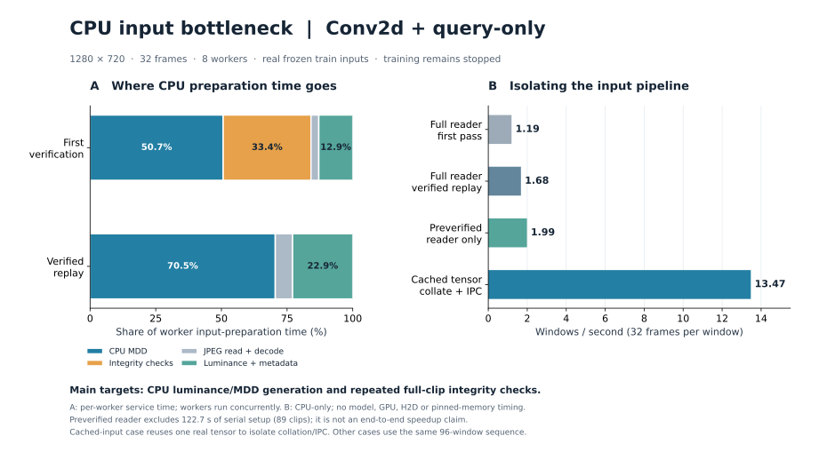

本学習は最終ログ400 update、平均1.061窓/秒の時点でユーザー指示により停止した。
最初のepoch完了前でcheckpointはなく、設定・進捗・停止receiptを同bundleに保存した。
今回の調査はCPU入力読込だけで、本学習・GPU演算を再開していない。

## 結論

主因はCPU上のMDD生成と、workerごとに重複するclip全体のhash検証。
JPEG decodeやworker間転送だけが主因という結果ではなかった。
BF16はモデル演算の設定であり、現行の前処理と転送するMDDはfloat32である。
以前の実GPU診断でも平均0.750秒/updateのうちreader取得待ちが0.562秒（約75%）だった。
この比率は本CPU診断ではなく、親nodeのGPU実測に基づく。

## CPUの時間分解

本学習と同じseed42・6,000窓sampler列の先頭96窓を使用した。8 workers、各1 thread、
prefetch 1、BS1。production readerの関数にtimerを付け、戻り値と処理内容は維持した。
CPU診断ではpin memoryを無効化し、CUDA/H2D/model処理を含めない。
下表は**1窓あたりのworker内平均所要時間**で、8 workersが並行するため、
各値を足して学習1 updateのwall timeと解釈してはならない。

| 入力準備の内訳 | 初回検証あり | 同じ窓の再読込 |
|---|---:|---:|
| MDD生成 | 2.347秒（50.7%） | 2.822秒（70.5%） |
| hashを含む整合性検証 | 1.549秒（33.4%） | 0.00015秒 |
| JPEG取得・decode | 0.138秒（3.0%） | 0.263秒（6.6%） |
| 輝度変換・その他metadata処理 | 0.599秒（12.9%） | 0.917秒（22.9%） |
| 合計 | 4.632秒 | 4.003秒 |

初回の平均process CPU時間は4.555秒、再読込は3.930秒と、worker内のwall timeに近い。
CPU計算・メモリ操作の負荷が大きい。MDDは差分、正負分離、clamp、積和、sigmoidなどの
大きな配列演算・確保を繰り返す。輝度変換もNumPy float32でCPU上にある。
計測時に8 workersが各約95〜97% CPUを使用する状態を確認した。
CPU演算とメモリ帯域・ページ割当の厳密な寄与分離は未実施。

## 整合性検証の重複

32枚だけを読む窓でも、各workerがclipを初めて扱う際はJPEG shard全体を検証する。
同じbyte列をhashlibとCPython `_sha256`の2方式で計算するので、file readは1 passだが
hash計算は2系統ある。検証済みdictはworker固有で、epochをまたいで維持される。

| 対象 | worker固有の検証回数 | hash論理読込 | 必要な32枚JPEGの論理読込 | clipごとに一度だけ検証する場合 |
|---|---:|---:|---:|---:|
| 先頭400窓 | 377回 | 48.23GB | 2.27GB | 37.24GB |
| 第1epoch・6,000窓 | 3,546回 | 428.62GB | 34.04GB | 83.59GB |

上記はsampler列・indexの実JPEG長・shard sizeからの推計。第1epochではhashだけで
JPEG取得量の12.59倍を読む計算になる。第2epochもworker固有cacheに未登録のclipがあり、
追加1,315回・133.25GBのhash読込が見込まれる。毎epoch全clipを再検証する実装ではない。
標準のround-robin割当を仮定し、本診断の96窓では実worker IDとの一致も確認した。
停止時の未消費prefetch分・400以降の未記録updateは含まない。

これらはOS page cacheを含む**論理読込量**であり、物理SSD転送量ではない。
別の親プロセス事前検証では10.85GBを論理読込したが、OSの`read_bytes`は約106MBだった。
cache上のデータでもhash計算のCPU負荷は残る。

## 切り分け実験

| 条件 | 96窓のreader速度 | 解釈 |
|---|---:|---|
| 通常・初回検証あり | 1.19窓/秒 | 現行経路 |
| 同じworkersで同じ窓を再読込 | 1.68窓/秒 | hashなしでもMDD/輝度変換が残る |
| 親で検証済みcacheを作ってfork | 1.99窓/秒 | 検証をtimed loop外へ移動。2回目は2.05窓/秒 |
| 作成済み実MDDを再利用しcollate＋IPCのみ | 13.47窓/秒 | 入力生成を除いたCPU転送側の切り分け。GPU/H2Dは含まない |

事前検証は89 clipsに対して**別途122.7秒**かかった。短い96窓だけなら、
事前検証＋readerで約171秒となり、通常の約80秒より遅い。
1.99窓/秒を、そのまま本学習全体の高速化率と主張してはならない。
改善対象は重複するhash計算の削減と、必要に応じた事前検証の並列化である。
OS cacheを意図的にflushしていないため、「初回」はworker内の検証cacheの初回を意味する。

## 改善の優先順位

1. **CPUはJPEGからsampled RGB uint8までを返し、輝度・MDD生成をGPUで行う。**
   FPSの間引き後に差分を作り、先頭MDD=0とFP32前処理を維持する。モデルへの入力はMDDのまま。
   GPUでの追加時間と数値一致は次に測定すべきで、現時点の高速化率は未測定。
2. **clipの検証結果を同じrunの全workerで共有する。**
   dual SHA-256・期待hash照合を一度行い、file identityと変更検出を維持する。
   直列で前に移すだけではなく、共有receiptまたは並列事前検証を検討する。
3. **前処理を変更した後にBS・worker数・prefetchを再測定する。**
   現行経路のBS1/worker8という選択を、高速化後の最適値とは扱わない。

1窓のpayloadは、現在のfloat32 MDDが225MiB、float32輝度なら112.5MiB、
uint8 RGBなら84.375MiB。RGB uint8を運んでGPUでMDDを作る案は、転送量も62.5%削減できる。
これはTensor容量の計算であり、実測転送時間が同じ比率で減る保証ではない。

集計は[profile-summary.json](../../runs/run-i986-query-cpu-input-20261008/profile-summary.json)、
hash計数は[hash-accounting.json](../../runs/run-i986-query-cpu-input-20261008/hash-accounting.json)。
各窓の生計測はgzipで保持し、元JSONのSHA-256、診断script、再現手順を保存した。
本番reader・学習コードは変更していない。checkpoint・test予測・TensorBoard曲線は生成しない診断である。
1個の実32×720p窓で、計測hookの有無とcollate後の全production fieldがbit一致することを確認した。
記録は[instrumentation-equivalence.json](../../runs/run-i986-query-cpu-input-20261008/instrumentation-equivalence.json)。

[印刷用グラフPDF](../../runs/run-i986-query-cpu-input-20261008/cpu-input-bottleneck.pdf)
