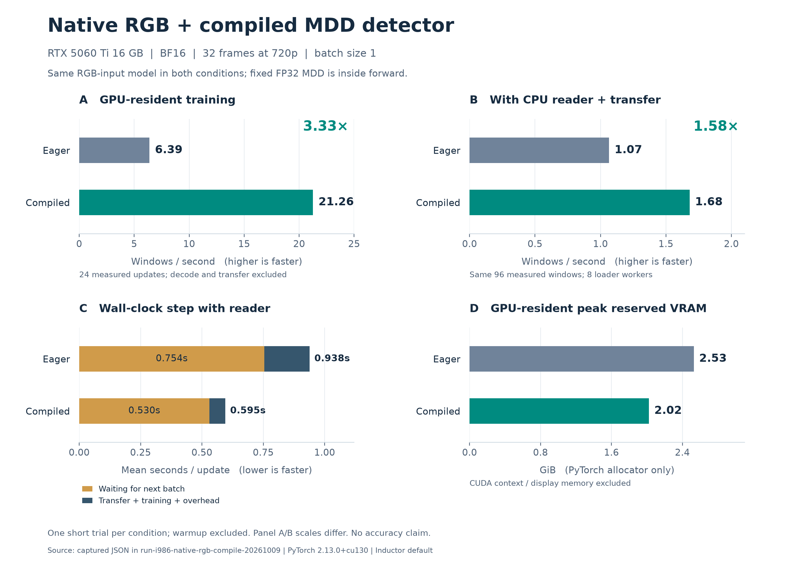

## 結論

RGB uint8から固定FP32 MDDをモデル内で生成し、その先のBF16座標モデルをfullgraph compileできた。
同じnative RGB経路のeagerに対して、GPU常駐は約3.3倍、CPU reader込みは約1.6倍の窓/秒だった。
CPU待ちが残るため、GPU単体の倍率を本学習全体へ適用しない。本学習は停止を維持した。

[印刷用PDF](../../runs/run-i986-native-rgb-compile-20261009/performance.pdf)・[ベクトルSVG](../../runs/run-i986-native-rgb-compile-20261009/performance.svg)。図のA/Bは比較内で同じ軸、比較間は異なる軸を使う。

## 条件と実測

RTX 5060 Ti 16GB、PyTorch 2.13.0+cu130、seed42、AdamW、dropout 0.1。
双方がnative RGB入力であり、旧CPU MDD経路との直接比較ではない。
compileはInductor default、fullgraph、dynamic=false。BF16 forwardとautocast外backwardに合わせ、
`backward_pass_autocast=off`を実forward/backward時に適用した。

| 測定対象 | eager | compile default |
|---|---:|---:|
| GPU常駐の学習update（窓/秒） | 6.3915 | 21.2622 |
| CPU reader込みの学習update（窓/秒） | 1.0659 | 1.6808 |
| reader込みの平均step（秒） | 0.9382 | 0.5950 |
| うち次batchの到着待ち（秒） | 0.7536 | 0.5299 |
| GPU常駐・最大reserved VRAM（GiB） | 2.5293 | 2.0234 |

GPU常駐は1実RGB窓を繰り返し、4 warmup＋24計測update。CPU decode・hash・転送は除くが、
モデル内MDD・forward・loss・backward・optimizerは含む。reader込みは8 workers、pin memory、
prefetch 1で同一108窓（12 warmup＋96計測）を使用し、転送も含む。
窓列SHA-256は両条件とも `3571baf08354e1f05ef411ef75a8bfea57f256f4a3ed9ec0ee2af096f603e774`。
全条件とも精度はBF16。compile版GPU常駐の初回updateは41.09秒で、compile・初期化を含み、定常速度には含めない。
compileのtrain/evalは2 graph、graph breakは0。勾配有限・重み更新・eval有限を確認した。

## 解釈と限界

1条件1回の短時間測定で、OS cache・初回hash・順序の影響は分離していない。
旧CPU調査の約2窓/秒は事前hash検証時間を除いた条件なので、このreader速度と単純比較しない。
次batch待ちはreaderとの重なりを含むwall clock観測であり、CPUの処理内訳ではない。
compile後もstepの約89%が次batch待ちだった。前回確認したworkerごとのclip hash重複は今回変更しておらず、
共有検証cacheとreaderの再計測が次候補。BS/worker数の再最適化も未実施。
VRAMはPyTorch reservedで表示やCUDA context分を含まず、診断のみallocatorを90%に制限した。
精度・収束・全epoch所要時間・長期安定性を示す実験ではない。

## 証拠と再現

[compute eager](../../runs/run-i986-native-rgb-compile-20261009/compute-off.json)、
[compute compile](../../runs/run-i986-native-rgb-compile-20261009/compute-default.json)、
[reader eager](../../runs/run-i986-native-rgb-compile-20261009/pipeline-off.json)、
[reader compile](../../runs/run-i986-native-rgb-compile-20261009/pipeline-default.json)に全stepを保存。
TensorBoardは使わず、JSONの実測値から[plot.py](../../runs/run-i986-native-rgb-compile-20261009/plot.py)で描画した。
GPU再実行は共有training queueから、保存commit＋patchを適用した隔離checkoutで行う。
`run.json`・元コマンドはそのまま保持し、repro.shのモデルYAML参照だけを同一hashのbundle内コピーへ修復した。
この変更は`repro-repair.json`、元スクリプトは`repro.captured.txt`に保存した。
