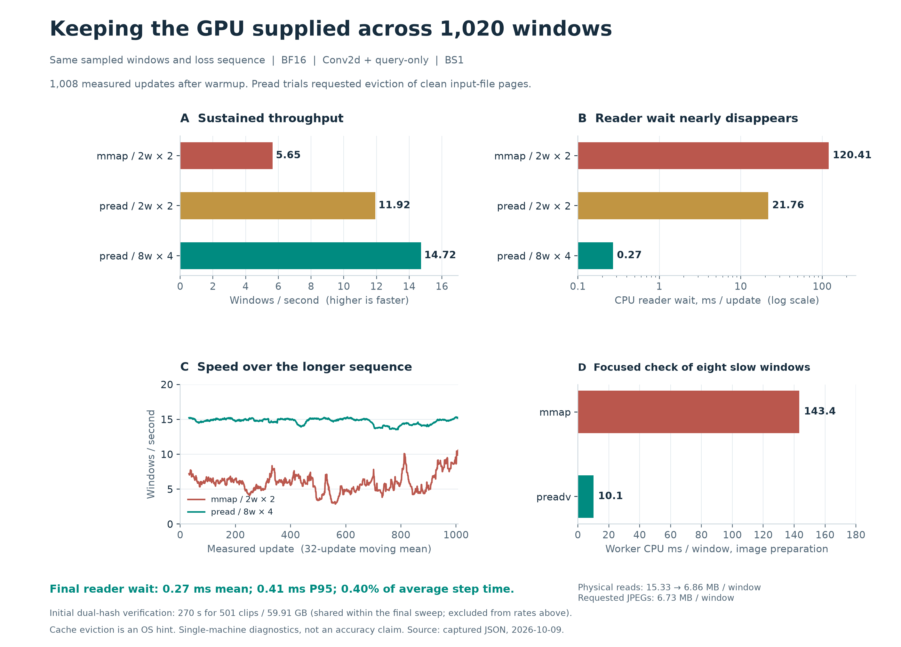

採用設定は**BS1・8 workers・prefetch factor 4・CUDA nvJPEG先読み・preadv範囲読込**。同じ1,020窓のうち12 warmupを除く1,008更新で14.718窓/秒、CPU reader待ちは平均0.270ms（stepの約0.40%）、P95 0.405ms、最大1.097msだった。128更新blockの速度も14.14〜15.02窓/秒に収まり、今回の条件ではCPU readerの供給待ちが律速ではなくなった。

[印刷用PDF](../../runs/run-i986-pread-prefetch-long-20261009/performance.pdf)／[SVG](../../runs/run-i986-pread-prefetch-long-20261009/performance.svg)。

| 条件（すべて同じ1,020窓、BF16、compile default） | 窓/秒 | CPU reader待ち ms/update |
|---|---:|---:|
| 4 workers × prefetch 8 | 13.388 | 3.146 |
| **8 workers × prefetch 4** | **14.718** | **0.270** |
| RAM内JPEG＋同じCUDA先読み | 12.009 | 0.0019 |

pipeline条件は事前検証後に対象fileのclean page破棄をOSへ要求した。RAM基準にはJPEG復号を含む。pipelineがRAM条件を上回った分をI/Oの因果的な改善とは解釈しない。準備済みJPEGの配置・pin buffer再利用・実行順・cache状態が異なり、この対照は厳密な速度上限ではない。4 worker条件の一部はCPU通常テストと重なったため、worker数の小さな優劣の精密比較にも使わない。採用根拠は8 worker条件の低いreader待ちと長い窓列での安定性である。

全条件で窓列hashが一致。mmap版・preadv版・採用8 worker版の**1,020更新のloss列が完全一致**した。今回のI/O最適化による学習内容の変更は観測しなかった。nvJPEGとOpenCVの画素差は別の承認済み変更であり、精度同等性は未評価。

501 clip・59.91GBのdual SHA-256検証に270.42秒を要し、3条件で共有した。このCPU準備時間を省略せず総費用へ含める。新runでは再検証し、以降もstatの変更を拒否する。GPU診断のallocator上限は90%で、本学習は上限を変更しない。

CPU reader待ちはproducer内、入力準備完了待ちはmain内の観測で、後者にはJPEG復号も含む。両者は重なっており加算しない。以前の225MiB FP32 MDD／84.375MiB RGBを運ぶ方式から、JPEG bytesの供給へ移した。モデル内FP32 MDDとBF16の学習構造は維持した。

全case JSON・verification.json・描画scriptをbundleへ保存。元データのtestを使わず、精度・全epoch収束・別hardwareへの一般化は主張しない。TensorBoardなし。原scriptと同じYAMLの参照修復も保持した。
