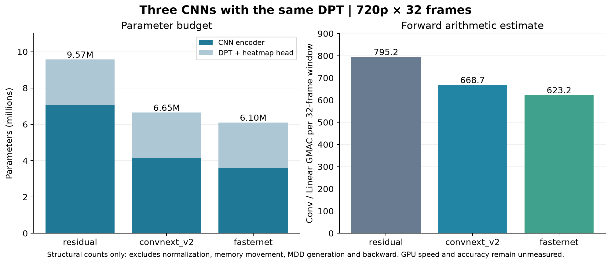

現在のresidual CNNを基準に、ConvNeXt V2系とFasterNet PConv系を実装した。研究根拠と提案の正本は[拡張#1049](https://github.com/Motoki0705/tennis-lab/issues/1049)と[CNN比較#1050](https://github.com/Motoki0705/tennis-lab/issues/1050)、実装は[PR1051](https://github.com/Motoki0705/tennis-lab/pull/1051)。これはCPUによる構造計数と準備検証の完了記録で、追加CNNのGPU学習が完了したという意味ではない。

[印刷用PDF](../../runs/run-i1050-cnn-structure-20261009/architecture-comparison.pdf)。

| CNN | encoder param | DPT込み param | Conv/Linear GMAC/32frame |
|---|---:|---:|---:|
| residual | 7,054,544 | 9,572,689 | 795.185 |
| convnext_v2 | 4,127,888 | 6,646,033 | 668.697 |
| fasternet | 3,581,456 | 6,099,601 | 623.197 |

Conv/Linear演算数はCPU/meta上のforward shapeから計数し、固定MDD・正規化・活性化・転送・backwardは含まない。実測速度の代用にしない。追加2候補は空間blockとfactorized時間blockを同時に変えるパッケージ比較で、個々の要因の因果効果ではない。同じseedでも初期化の乱数消費順は異なり、DPTの初期値を一致させた比較ではない。

CPUテスト169件成功。v1 residual/dense3d checkpointの明示的転送、異種CNN拒否、4段pyramid、時間受容野±2frame、両時間層の勾配、blank BF16 GRN、同期GT warp、人工遮蔽でも既知GT維持、crop拒否、seed再現、clean非拡張、固定→解凍、比較予算/seed不一致拒否、bestのみqueue、全repo設定監査を確認した。実train clipでCPU/OpenCVの拡張GIFを確認したが、本学習decoderはnvJPEGのまま。GPU augmentation/compile後の解凍は将来の専用probeで検証してから本事後学習へ進める。

追加CNNはGPU smoke96更新が成功した場合だけ本pretraining6万更新を行う。baselineを継続し、3run全完了とdata/split/seed/budget/precision/DPT条件を照合してcommon validation誤差最小の1構成だけposttrainingする。postはCNN固定1epoch→小LRで解凍、SwiGLU704。cleanでbestを選び、camera/occlusion/combinedの固定stressを別評価する。拡張なしpostの対照runは含まないため、拡張単独の改善は未実証。

PR1047とbyte一致を確認したCLI heartbeatを120分間隔で同じthread/runtimeへ登録した。登録/次回予定は確認済み、初回の実受信はまだ。状態の正本はoutputs/ball_detection/campaign/robust-cnn-20261009のplan.json/progress.json/memory.md。学習終了時に別runとして結果を登録し、全作業完了後timerを止める。学習途中・GPU未検証を完了と扱わない。TensorBoardなし、test選択なし。
