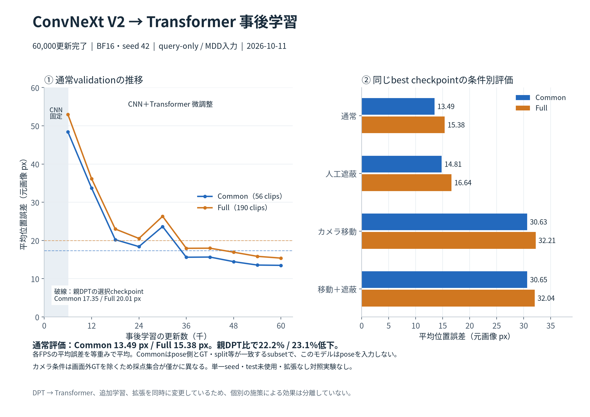
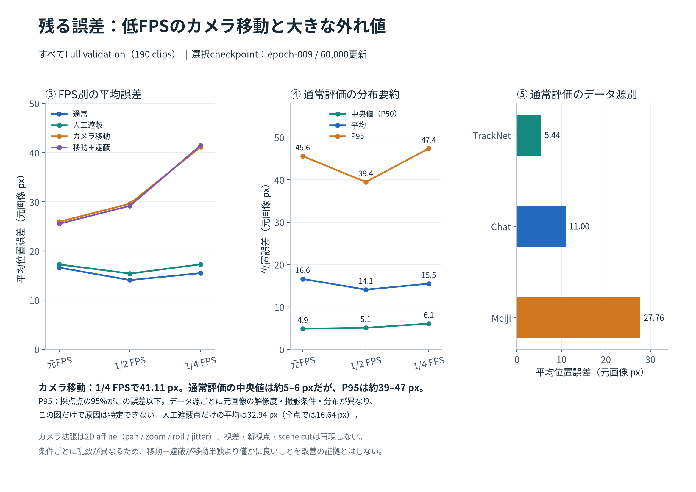

ユーザー指定のConvNeXt V2 encoderにquery-only Transformerを接続した事後学習が、2026-10-11 03:55 JSTにclean/stress評価まで完了した。60,000更新の `epoch-009.pt` がCommonで最良。通常validationはCommon **13.4896px**、Full **15.3847px**。親DPTの選択checkpointに対して平均誤差はそれぞれ22.2%、23.1%低下した。ただしdecoder交換・追加学習・拡張を同時に変更しており、個々の効果を分離した比較ではない。

## レシピと対象

ConvNeXt V2系＋factorized時間CNNを事前学習checkpointから転送し、DPTを破棄。dim256・4層・8heads・SwiGLU704のquery-only Transformerを新規初期化した。同時刻のMDD tokenへの片方向Cross-Attention後、query列を時間Self-Attentionで混合する。pose/courtは入力しない。

BF16・BS1・seed42・32frame・FPS stride1/2/4混合、6,000窓×10epochs。1epoch目はCNN固定、残りはCNNのLRをdecoderの0.1倍にして全体微調整。AdamW、peak decoder LR1e-4、warmup500、cosine、weight decay0.01、gradient clip1。trainだけにカメラ・遮蔽拡張を適用した。RGB復号はnvJPEG serial、固定FP32処理でMDD生成、`CUDA_LAUNCH_BLOCKING=1`。親と同じ凍結manifestを使用し、train824 clips / Full validation190 clips / Common56 clips。詳細な設定とsource hashは `config.json` に保存。

## 評価

| 条件 | Common平均px | Full平均px | Full採点frame/FPS数 |
|---|---:|---:|---:|
| clean | 13.4896 | 15.3847 | 155,080 |
| camera | 30.6314 | 32.2148 | 154,977 |
| occlusion | 14.8132 | 16.6382 | 155,080 |
| combined | 30.6513 | 32.0401 | 154,966 |

Commonはpose側とGT・split・時間軸等が一致する比較用subset。現在のモデルでposeを使用する意味ではない。各clip/frame/FPSを窓の中心に最も近い予測（同距離なら早いstart）で一度採点し、FPSごとの平均誤差を等重み平均する。source間の等重み平均や、重複frameをpoolした平均ではない。位置が既知のGTだけを採点し、存在判定や位置不明frameの性能はこの値で示さない。

人工遮蔽では元の既知座標を維持する。実際にowner窓でボール中心が合成矩形に入った点だけではFull平均32.9412px（9,204 frame/FPS）。これは自然遮蔽の評価ではない。camera/combinedは画像とGTを同期変換し、画面外のGTを除いてからownerを決めるため、cleanと採点集合が僅かに異なる。25%超のGTを失う・8点を保てない変換はidentityへ戻るが、その回数はstress JSONに未保存。条件ごとの乱数も異なるため、combinedがcamera単独より僅かに良い結果を遮蔽の改善効果とは解釈しない。

Full cleanの元/1/2/1/4 FPS平均は16.5979 / 14.0779 / 15.4782px、中央値4.8748 / 5.0867 / 6.0588px、P95 45.5621 / 39.4417 / 47.3505px。中央値から大きく外れる誤差が残る。データ源別macro平均はChat10.9993、Meiji27.7645、TrackNet5.4391px。元画像解像度・撮影条件・ラベル分布が異なるので、数値だけから原因を決めない。

[印刷用2ページPDF](../../runs/run-i1049-convnext-query-posttrain-s42/validation-figures.pdf)。図は保存したJSONから `plot_results.py` で再生成する。

## 完了検証と運用

queue done、60,000更新、10epochs、1,200学習ログを照合。CNN固定120記録→全体微調整1,080記録、encoder/decoder LR比、63 source hash、manifest/親checkpoint hash、bestと最小Commonスコアを確認した。checkpointのmodel205・optimizer603 tensorsがfiniteで、CPU上のモデルへstrict loadが成功。初回照合ではtorchのtupleとJSONのlistの表現差が出たため、JSONへ正規化して比較し、値の同一性を確認した。

49 GIF（train10、clean validation30、stress9）を全フレームdecodeし、各32frameを確認した。全GIFは元のrunの `previews/` に保持し、パス・hashを `verification.json` に記録。生の重みや大きなGIFの全量はgitへ複製しない。TensorBoardは使わず、数値ログと図を保存。`train-summary.jsonl` はtrainログから大きなaugmentation audit配列のみ除いた抜粋。

best SHA-256: `3c250d313b745d6c6430ce544c01f8a630eb146439251b4b83f3028829f22f5d`。2時間CLI timerをpauseし、inactive・次回実行なしを確認した（`monitor-final-status.json`）。現在の監視ターン自体の完了receiptはターン終了後に観測される。baseline/FasterNetを再開していない。メモリ監視・圧迫自動停止は追加せず、ユーザー指定の.wslconfig24GBのみを維持した。

## 解釈と次の判断材料

低FPSのカメラ移動に弱さが残り、Full 1/4 FPSは41.1075px。2D affineは視差・新視点・scene cutを再現しない。単一seed、拡張なし対照実験なし、test未使用であり、汎化性能や拡張の因果効果、3 CNN間の優越、sceneへの配備可否は未確定。次の有効な調査は大誤差clipの確認、camera変換棄却率と同一採点点での比較、拡張なし対照の比較である。これらは今回追加実行していない。
