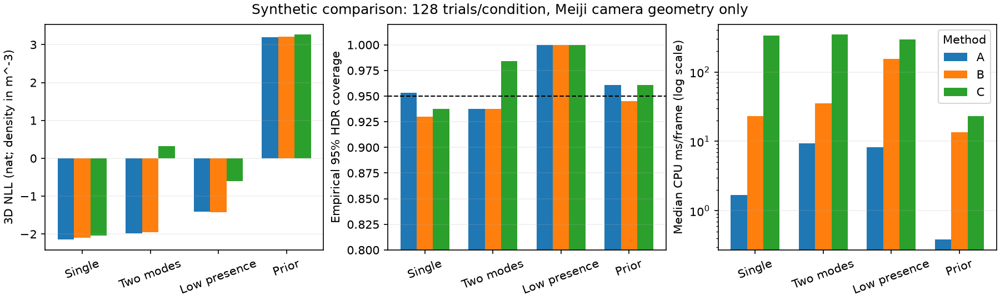

## 結論

方式Aを次の合成データ生成に使うCPU実装として暫定採用する。単峰・2モードでBと近いNLL/coverageを得て、中央値の計算時間が小さい。Cの2D標本化＋三角測量＋KDEは多峰時に異なるcameraの成分を混ぜた粒子を生み、今回の実装ではNLLと速度が劣った。これは全てのparticle推論の否定ではなく、importance補正などは未比較。実Meijiの位置精度や3D refinerの性能を示す実験ではない。

## 方法・入力

- 実装時点はmanifestのcommit。CPU/native thread=1、GPUなし。再現は同commitへcheckout後にbundleのrepro.shを実行する。JSONに全trialと実行環境を保持した。後続のfloat32重み和の丸め誤差修正は別unit testで検証し、この測定を上書きしていない。
- video_002/clip_010のcam0/1/2（1920×1080）だけを使用。court校正artifactからK/R/t/sourceサイズをコピーし、fixtureに元ファイルのSHA256を保存。近似的な単一平面pinholeで歪み補正はない。実ボール位置・注釈・refiner予測は読んでいない。
- 3D正解を固定Gaussian priorから標本化（平均[0,0,2]m、共分散diag[0.36,1.44,0.25]m²）。各cameraの投影へ共分散[[36,12.6],[12.6,64]]px²の独立なnoiseを加え、既存BallGMM2Dを構築してpixel_moments経由で融合した。
- unimodalはK=1/presence=1。ambiguousは別位置[1.2,2.4,0.4]mオフセットを投影した成分を追加し、重み0.55/0.45。low_presenceはK=1、p=[0.85,0.6,0.2]。prior_onlyはp=0。各条件の3D正解は別の128例、手法間では同じ入力とseedを使用。
- A/Bの確率モデルと存在の近似は[geometry README](../../../src/utils/geometry/probabilistic_triangulation/README.md)を参照。Bはpriorの各軸±4σの有限boxを16³から最大5levelに細分、各level上位512セルをrefineし未細分の裾も保持。A由来の初期値や正解位置でgridを誘導しない。camera背後をBでは除外するがAのGaussian tailは切断しない。
- Cはpresenceと2D GMMを引き、priorも標本化するrandomize-then-optimize。256粒子にScott帯域のGaussian KDEを適用してNLLを定義する。異なる成分組合せの幾何evidenceによる再重み付けはしない。
- NLLはm⁻³の密度の負の自然対数（負値も正常）。90/95%領域は各出力分布から1024標本を引き、混合全体の密度分位点から求めたHDR。時間は分布構築のみ（KDE構築を含む）、HDR採点・import・入出力は含めない。全trialを報告し成功例だけに限定しない。

## 4条件×128例の結果

| 条件 | 方式 | 3D NLL mean ± SE | 90% coverage | 95% coverage | median / p95 ms |
|---|---|---:|---:|---:|---:|
| unimodal | A | -2.150 ± 0.116 | 89.1% | 95.3% | 1.69 / 2.63 |
| unimodal | B | -2.104 ± 0.121 | 88.3% | 93.0% | 22.95 / 32.15 |
| unimodal | C | -2.040 ± 0.117 | 90.6% | 93.8% | 332.84 / 377.92 |
| ambiguous | A | -1.988 ± 0.114 | 89.8% | 93.8% | 9.44 / 13.98 |
| ambiguous | B | -1.954 ± 0.120 | 89.1% | 93.8% | 35.53 / 46.06 |
| ambiguous | C | 0.324 ± 0.059 | 97.7% | 98.4% | 346.68 / 407.25 |
| low_presence | A | -1.414 ± 0.072 | 100.0% | 100.0% | 8.30 / 12.83 |
| low_presence | B | -1.420 ± 0.071 | 100.0% | 100.0% | 154.32 / 190.54 |
| low_presence | C | -0.605 ± 0.043 | 100.0% | 100.0% | 293.87 / 361.12 |
| prior_only | A | 3.192 ± 0.112 | 91.4% | 96.1% | 0.38 / 0.54 |
| prior_only | B | 3.209 ± 0.115 | 91.4% | 94.5% | 13.62 / 20.36 |
| prior_only | C | 3.266 ± 0.103 | 91.4% | 96.1% | 23.03 / 35.26 |

low_presenceの100% coverageは良い較正の証拠ではない。全cameraの平均は依然として正解付近の合成分布なのにpresenceだけを弱めるstress条件なので、prior/単眼項による過大な不確実性を含む。128例しかなく、例えばA単峰の95% coverage=122/128のWilson 95%区間は約90.2–97.8%。AとBの小差を有意な優位としない。

## 計算予算を増やした対照

同じseedの先頭16例/条件でBを24³・6level・1024 refinementへ、Cを1024粒子へ増量。下表は同じ16例に限定した比較（主表128例との母数差に注意）。

| 条件 | 方式 | NLL 通常予算 → 増量 | 増量median ms |
|---|---|---:|---:|
| unimodal | B | -1.813 → -1.917 | 62.27 |
| unimodal | C | -1.737 → -1.592 | 1312.46 |
| ambiguous | B | -1.480 → -1.510 | 91.37 |
| ambiguous | C | 0.406 → 0.208 | 1452.65 |
| low_presence | B | -1.441 → -1.425 | 426.94 |
| low_presence | C | -0.652 → -0.760 | 1287.26 |
| prior_only | B | 3.085 → 3.110 | 40.39 |
| prior_only | C | 3.137 → 3.094 | 103.51 |

格子の解像度とKDE粒子数によってNLLは動くが、C多峰の差と計算時間の順位は解消しなかった。16例での収束証明ではない。Bは境界・粗いgridによるmode見落とし、CはKDE帯域とproposalの差が残る。

## unit test・費用・制限

- 線形極限の共役Gaussianの平均/共分散、解析的evidence（共分散determinantを含む）、180例のwhitened posterior error、3D mixtureの成分間分散、画素scale/camera順不変性、全不在/単眼、列挙上限/最適化失敗を検証。Bの全box体積/正規化/共役moment、Cの400粒子moment、#935のsource画素変換も検証。
- 主比較204.91秒/peak RSS 959,512KiB、増量98.35秒/994,984KiB。ログと全trial JSONをbundleに保存。GPU/queue jobなし。訓練runではないのでTensorBoard曲線はない。
- 狭い既知prior、3camera・小K、仮定した較正noiseの局所比較。camera摂動、広いcourt prior、極端な外れ値、K=3/全64成分の長系列、camera間で相関する誤差は未評価。AはGauss–Newton Laplaceと単一開始点であり、大きな残差/弱い幾何では近似誤差や明示的なsolver失敗が起こり得る。
- [#935の未較正診断](../ball_refiner/000004-run-i935-calibration-hdr-ft-e13-r5-20260928.md)で実GMMの裾の過信が残る。今回の合成coverageを実refinerへ外挿しない。

## 次の一手

[dataset_plan.yaml](../../../src/tasks/ball_refiner/refiner_3d/dataset_plan.yaml)のCPU smokeを実装する。240Hz物理原系列を60000/1001Hzへ再標本化し、Meiji校正の摂動→refiner相当GMM→このAPIの全分布を保存。広いprior/全64成分と長欠損で分布の健全性・生成時間を測ってからpilotへ拡張する。datasetは今回未生成。3D diffusion（flow matching/x0）、同backbone回帰、実LOCO、pipeline統合は後続。GPUの時間/VRAM概算はrefiner_3d READMEとissueに申請として記録し、今回投入しない。
