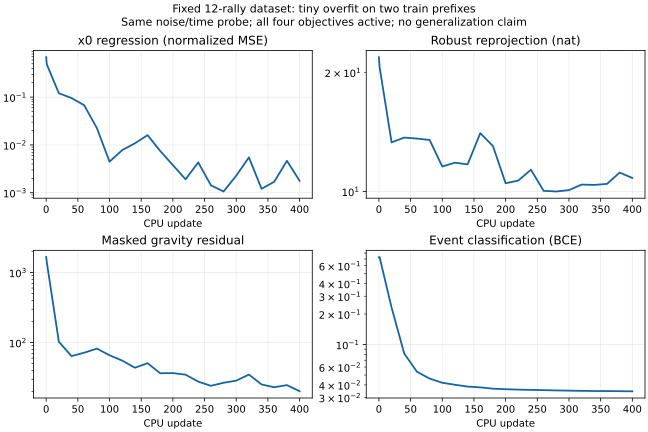

固定12ラリーの全4,809frame・40windowでforwardと4損失を確認し、CPUで400 updatesを完了した。
ソート順で最初の2つのtrainラリー（train-00000/00001）の各先頭128frameだけをtiny overfitした。
val/testは配線確認のみで、更新・モデル選択に利用していない。GPU、本学習、品質対照、実Meiji評価は未実施。
このsmokeは数値開発にも使った集合であり、独立holdoutの性能とは呼ばない。

## 入力と実行

[前段の再積分](000010-run-i936-ray-convergence-r6-s936.md)の全64成分・全2D GMMを保持する。
実装・型・path契約は[3D refiner README](../../../src/tasks/ball_refiner/refiner_3d/README.md)を参照。
データ全体の未収束584frame、overfit対象256frame中の未収束48frameを、明示的なplumbing許可のもとで保持した。
frame/成分選別をしない。右paddingと欠損を区別し、イベント前後±5と差分stencilの全3frameでphysics maskを適用する。

入力manifest SHA、各NPZ SHA、全windowの形状/損失はmanifest.json/plumbing.json、
code SHAはprovenance.json、毎updateの4損失・gradient norm・固定probeはupdates.jsonlが正本。
B=2、T=128、M=64、2Dは3camera×K=3。unit testではK=4/M=125の変換・相関共分散・paddingも確認している。
73,925 parameters、fp32、width64/2層/4heads、CPU/native thread1。
毎updateで新しいflow time/noiseを使い、絶対x0を予測する。4損失は全て非ゼロ重みで同時に学習する。

## 曲線とtiny overfit

表は学習中のランダムなtime/noiseと区別した、同じ固定probeの前後比較。

| Loss（未加重） | 初期 | 400 updates後 |
|---|---:|---:|
| x0（正規化MSE） | 0.684224 | 0.001777 |
| robust再投影（nat） | 21.8512 | 10.8132 |
| masked重力残差（gで正規化したHuber） | 1663.3448 | 20.1688 |
| hit/bounce BCE | 0.726412 | 0.034577 |
| 加重合計 | 1.141712 | 0.115383 |

同じnoiseから4 samples×8 Euler stepsを生成した訓練prefixの平均軌道RMSEは26.6307→0.9341m。
lossの低下と生成経路の接続は確認できるが、0.93mは高精度な軌道再構成の証拠ではない。
再投影項は劣化した2D分布に対する損失で、人手注釈へのLOCO誤差ではない。
重力項はdrag/Magnus/windを含まない弱いpriorであり、数値をm/s²の加速度と読み替えない。
BCE低下だけで打球/bounceの検出精度を保証しない。モデルのuncertainty較正も未評価。

内部loop経過12.05秒、process wall17.09秒、peak RSS1,002,436KiB、GPU0。
checkpointは310,028 bytes、SHA=`cfa249d48195320ac0cabcaa91cae3678bf7bde4116476081e3003d92ed70c49`。
`diagnostic_only`を付け、重みはoutputs内に保持しGitへ追加しない。TensorBoardではなくJSONLを曲線の正本とする。

## 次の判断

4損失のforward/backward、実datasetのshape/mask、固定小集合でのloss低下というplumbing目的は達成した。
#929/同backbone回帰への優位、汎化、実Meiji LOCO、pipeline接続は未検証。
全camera欠損とK=4の積分収束、最終#935較正を解決してから本学習を提案する。
現在のcheckpointを本学習へ昇格しない。
