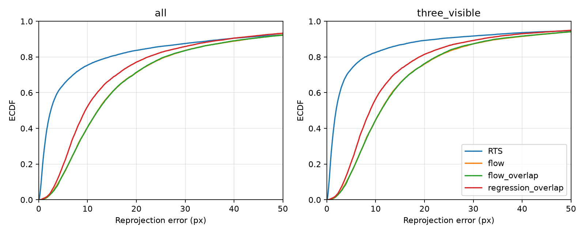

同16val/6,383frameの保存済み20k予測だけを使った事後記述診断。
[全統計/損失/勾配/behind](../../runs/run-i936-reprojection-gap-r17-s936/results/analysis.json)、
[入力/code/hash監査](../../runs/run-i936-reprojection-gap-r17-s936/audit.json)、
[再現script](../../runs/run-i936-reprojection-gap-r17-s936/analyze.py)を保存した。
trainの既存loss logを読むが新しい学習・推論はしない。追加val/test/実Meijiは使わない。
5手法の全再投影metricが元comparisonと一致し、全予測hashを再確認した。

## なぜRMSEは良くてもp50が約12pxか

RTSのRMSE4.408mは1camera可視467frameの14.049mなど少数の大きな誤差に影響される。
一方、3camera可視は**4,831/6,383frame（75.69%）**、画面内採点14,493件を占め、
そのp50はRTS **1.886px** / flow **11.067px** / overlap flow **11.101px**。
RTS誤差5px未満の同じ**11,271 camera-frame**に限ってもflow p50 **9.613px**、
overlap9.617px、RTS1.297px。欠損や少数のbehindだけでは中央値の差を説明できない。
flowは大外れを減らしてRMSEを改善する一方、多数の良好な観測区間で位置精度を失う。
この層別は事後診断であり、frameを正式評価やmodel入力から除外する変更ではない。

3camera可視かつ全5frameが自由飛行の8,487 camera-stencilで、画素残差ベクトルを
固定5frame平均と残差に記述分解した。flowはtrendの大きさp50 **10.975px**、
残差 **0.172px**。overlapも11.057/0.172px、RTSは1.866/0.059px。
大きい中央値は細かな振動よりゆっくり変わる位置ずれに対応する。
trendを新しい予測や性能指標へ代入せず、原因を窓/モデル容量/最適化のどれかに断定しない。

## 損失の重みと観測の不確実性

実装は全2D GMMをStudent-t (ν=4)へ変換したlog mixture NLLをpresenceで加重する。
pixel L1やGT再投影距離を直接最小化しているわけではない。
全成分のcovarianceは維持され、camera間の誤差や多峰性を0へ潰さない。
観測cameraの成分内RMS幅（重み付きtrace、成分間分散は含まない）のp50は**7.223px**、
gapは**59.773px**。amodal presenceの観測p50は**0.999912**で、存在重みがほぼ消失している説明は支持しない。
太い分布とStudent-tの裾では追加画素誤差の費用は緩やかになる。

**係数0.01だけを見て「再投影lossが小さすぎる」とは言えない。**
最後の2,000 train updateにおけるflowの重み付き値は
x0 **0.004190**、再投影 **0.098437**、physics **0.002690**、event **0.004313**。
再投影はscalar lossの約90%で、NLLの正規化定数・covariance等も含む。
保存生成出力でのNLLはGT7.127、RTS7.895、flow10.218（overlap10.205）で、
現在の観測目的自身にも改善の余地がある。

全ラリーの保存生成位置に対し、各損失の重み付き**出力座標勾配×frame数**のL2ノルムを診断した。
flowのp50はx0 **0.001836**、reprojection **0.115539**、physics **0.287865**。
x0/reprojection勾配cosineのp50は0.668で、典型的にはGT方向と同じ側を向く。
これはnetwork parameter勾配でも学習flow-time分布の勾配でもなく、物理差分の隣接相殺もある。
したがって重み不足の因果や最適重みの推定ではないが、観測対物理のバランスを単因子で試す理由になる。

## 残るギャップと次の1件

(c) CUDAのbehind4件はval-00000/frame128/cam0とval-00003/frame128〜130/cam0。
元窓先頭に集中し固定overlapでは0になったが、seam診断全体は不合格で本番採用の根拠にしない。
overlap flowのRTSに対するfree accel/jerkは1.046/1.592倍、reprojection mean/p50は1.290/4.912倍。
最大の相対差と大量の良好観測の劣化から、次は再投影忠実度を対象とする。

指示どおり**512train＋physics1e-3を新しい基準(c)として維持**し、
reprojection weightだけ**0.01→0.03（3倍）**にする案を推奨する。
出力勾配中央値の約2.5倍の開きに対する小さい単一対照で、3倍が最適という主張ではない。
NLLが誤った観測にも強く適合して3D/粗さを悪化させ得るため、RMSE/粗さ/behindのguardを付ける。
architecture/bank/covariance/成分/seed/窓/評価点は変えず、訓練validationは元stride128。
判定規則と費用は実行前にissueへ固定する。正式15軸・behind=0は不変。

診断6.508秒、peak RSS1.035GB、最小空きRAM21.867GB。TensorBoardはなく元JSONLを利用。
analysis.pyを含む当bundleのcommitからCPU/native1で再現する。学習実行commitとは区別する。
