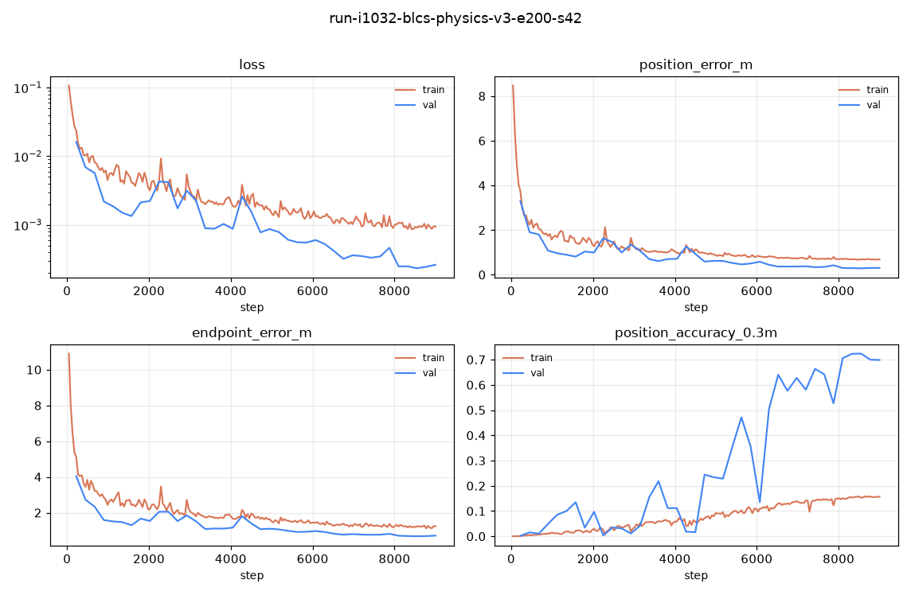

## 結論と採用範囲

[PR #1038](https://github.com/Motoki0705/tennis-lab/pull/1038)で再生成した物理GT付きv3データを用い、BLCS axial baseを初期重みから200 epoch / 9,000更新学習した。validation位置誤差の最小値からepoch 189（0始まり）を選定し、固定test中心窓の平均位置誤差は **0.265211 m** だった。testはcheckpoint選定に使用していない。

2026-10-07のユーザー判断で[旧PR #1036](https://github.com/Motoki0705/tennis-lab/pull/1036)は不採用・クローズとした。今回はローカルckptの置換と本knowledge登録だけを行い、**tennis_sceneの設定・実装・組み込み経路は変更しない**。合成testの結果を実動画への採用判定とは扱わない。

## データと固定条件

元データ data/blcs/single_object を data/blcs/single_object-physics-v3-cc863cacd-20261007 へコピーし、全59,006ファイル（63,359,688 bytes）の内容一致を確認してから学習した。学習前後も全ファイルのSHA-256と一覧が一致した。正本はbundleの dataset_files.jsonl.gz と dataset_snapshot.json で、manifestを展開したJSONLのSHA-256は 36c1c978867016173a32e0f75bae06165bb557bfd981a32db27bec2a291e9544。generator設定とsplitは dataset_metadata/ に保存した。

全1,000シーンが blcs_generated_dataset_v3 / ball_physics.v1、6カメラ、30 FPS、g=9.8で、surfaceはclay 355 / grass 334 / hard 311。全件で記録した速度・スピン・場から飛行区間をCPU再積分し、保存位置との最大誤差0を確認した。生成元commitは元データに記録されていないため、PR説明とschema/設定との対応を確認した範囲に限る。学習コードのcommit cc863cacdd347027acd0a4700706fec6cca86f81 はqueue bundleに固定した。

| split | 元シーン数 | 128 frame以上の評価・学習対象 | 短いため除外 |
|---|---:|---:|---:|
| train | 800 | 715 | 85 |
| validation | 100 | 92 | 8 |
| test | 100 | 88 | 12 |

学習はaugmentationありのランダム窓、validation/testはaugmentationなしの決定的中心128 frame窓とsample-local seed 42による3–6 view選択。test 88シーンのID・順序が固定splitと一致し、11,264 frameすべてが有効かつ有限だった。短い12シーンや全シーンの全長評価は今回行っていない。

## 学習・選定・評価

モデルは51.7Mパラメータのaxial base（幅512、8 stage、8 head、SwiGLU、CourtKP14、位置出力のみ）。batch 2 × gradient accumulation 8、seed 42、AdamW LR 1e-4 / weight decay 0.01 / warmup 200更新 / cosine min LR 1e-6。position weight 1.0、reprojection weight 0.1、smoothness/gravity weight 0、GAN・compileは無効。RTX 5060 Tiでbf16-mixedを使用した。resume/init_weightsはnullで、旧checkpointの継続学習ではない。

validationは5 epochごとに40回、val/position_error_m 最小のtop-1を選定した。学習終了時のlast（epoch 199）を自動testする設定は無効にし、学習完了後にcheckpoint選定台帳を固定してから別の共有queue jobでbestを一度testした。学習は09:44:32 JSTにqueueで開始、最終epochの記録は11:30:25 JST。開始captureから約1時間46分であり、純粋なGPU計算時間ではない。

| 指標 | 選定validation（epoch189） | 最終validation（epoch199） | 選定ckptのtest |
|---|---:|---:|---:|
| 平均位置誤差 [m] | 0.286819 | 0.303324 | 0.265211 |
| 0.3m未満率 | 0.723760 | 0.698370 | 0.757635 |
| 窓末端の位置誤差 [m] | 0.681224 | 0.719044 | 0.729438 |

testの軸別MAEはX 0.105358 / Y 0.198412 / Z 0.075536 m、0.6m未満率0.931108、1.2m未満率0.978072。末端誤差は平均位置誤差より大きく、軌道全域やイベント境界で一様な精度が得られたとは言えない。testがvalidationより良い点も、別シーン集合の結果であり未知分布への頑健性を示さない。

prediction_validation.json には保存NPZからの再計算を記録した。CUDA bf16評価ではdenormalization・恒等座標回転・差分の丸め後にpow/sum/sqrtをfloat32で計算する。これをCPUで再現すると公表指標と1e-7以内で一致した。保存正規化座標を直接float64でメートルへ戻す診断値は平均0.265592 mで、丸めを省くため約0.38 mm異なる。この診断は再推論でも選定基準でもない。再計算scriptは verify_saved_predictions.py に保存した。

学習曲線は全体として誤差が低下するが、validationには途中の悪化があり、最終epochは選定epochより悪い。trainはaugmentation・ランダム窓・学習mode、validationは固定窓・augmentationなしなので、train/valの差をそのまま汎化gapとは解釈しない。

## checkpoint配置と再現資料

選定重みは ckpt/blcs/axial-base-physics-v3-kp14-t128-v3-6-e200-s42-epoch189.ckpt へ配置した。621,076,139 bytes、SHA-256は 67e01836b1016ca1d0fb2acf088bfe44aa49a804c91aa8fb9cc132ec115dd197。独立した2実装のSHA-256で学習出力と配置先の一致を確認した。巨大な重み自体はgit管理外である。

旧epoch189重みと、旧PRのtennis_scene採用記述が残ったsidecarは、旧学習runの superseded_checkpoint/ へhash確認付きで退避した。新しいsidecarの適用範囲はckpt置換のみ。歴史的な重み・記録は保存し、active ckpt/blcs/ から退避した。具体的な旧/新配置とhashは checkpoint-placement.json が正本。

bundleの run.json / repro.sh / uncommitted.patch は学習jobの原本、evaluation_repro/ は別評価jobの原本である。config.yaml と evaluation-config.yaml、queue job/log、選定台帳、全scalar履歴 scalars.json.gz、test予測と指標を保存した。再実行には記録された版、同じデータsnapshot・入力rootと環境が必要で、現mainの設定で代用しない。既存出力を上書きしないよう再実行先を明示する。

## 旧実験との比較・限界・次の確認

旧#1036はvalidation 0.337445 m / test 0.382467 mだったが、旧データと有効シーン数（train669 / val80 / test85）、更新数8,400が異なる。今回の値の低下をモデル改善や物理更新単独の因果効果とは主張しない。モデル・BLCSの学習/augmentation実装と主要hyperparameterは維持したが、データ分布と更新数を同時に変えた再学習である。

単一seed・合成入力・固定128frame窓に限定し、実検出ノイズ、実動画3D精度、全長整合性、複数seedは未評価。次は組み込み経路を人間が確定した後に、その入力契約に合わせた検証を別タスクとして設計する。今回、組み込み実装や追加の実動画実験は行わない。

## 検証

学習・別queueのbest testはともに完走。全件データhashの前後一致、全1,000シーンの物理再現、testのID/順序/有限値/指標再計算を確認した。BLCS checkpoint IO・datamodule・metrics・physics recordの既存CPUテスト32件が通過している。knowledge構造検証（origin/main比較を含む）は0 error、再現script参照は0 missing / 0 unverifiable、保存script 4本のruff/mypyも通過した。独立validatorは回数指定がないため実施していない。
