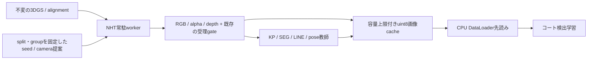

## まとめ

採用方針（2026-09-13の追加指示）: 本番は事前生成＋可逆圧縮とする。
オンデマンド比較は判断根拠として保持するが、学習経路には導入しない。
Court assemblerの圧縮保存と全下流readerを接続し、NHT公開コマンドは
checkpoint/shaderを一度だけロードして上限付きカメラバッチを処理する。

最初にfloat32の可逆圧縮を導入する。3DGSオンデマンド生成は実行可能だが、今回の同一GPU・毎batch新規描画では学習が大きく減速した。容量上限付きcacheを用いたオンデマンド方式も比較したが、今回の採用範囲は事前生成と圧縮保存までとする。

## 実測した容量

2026-09-13、B00〜B03の58,374ファイルを全件走査した。

| 項目 | 論理容量 |
|---|---:|
| scenes全体 | 95.04 GiB |
| Court RGB float32 NPY | 48.61 GiB |
| Court alpha float32 NPY | 16.21 GiB |
| Court depth float32 NPY | 16.21 GiB |
| Court PNG（RGB + alpha） | 3.59 GiB |
| 未共有の完全一致コピー | 2.45 GiB |

最後の行は他の行に含まれる削減候補であり、合計に加えない。既にinodeを共有する約0.69 GiBは重複削減候補へ再計上していない。完全一致コピーの中心はreconstructionのcheckpoint、PLY、SfM公開用コピーだった。[監査結果](run-court-storage-audit.md)

B00の全2,176 sample、6,528配列を変換し、owner全体が **22.18 → 8.81 GiB（60.3%削減）** になった。全復元byteが一致し、split・教師・camera geometryを含む既存の完全validatorに合格した。[圧縮実験](run-court-storage-lossless-b00.md)

他sceneにもB00と同じowner圧縮率が成立すると仮定すれば、scenes全体は約44 GiBになる。これは外挿であり、全scene移行の実測値ではない。2.45 GiBの完全一致コピーを共有する施策は別途必要となる。

## 実測した学習速度

RTX 5060 Ti 16 GB、DINOv3 ViT-B/16 + 8層transformer + DPT、LoRA、KP/SEG/LINE、batch 8、bf16、24 step/mode。B00の64カメラを使用し、959×539 RGBから通常のtrain pipelineで256×256へcrop/resizeし、color jitter/blurを適用した。optimizerはAdamW。forward、loss、backward、gradient clipping、optimizer stepを含む。

| 経路 | 学習画像/秒 |
|---|---:|
| GPU上の準備済みbatch（データ供給を除く上限） | 31.59 |
| 未圧縮NPY、DataLoader 4 worker | 30.83 |
| 可逆圧縮、DataLoader 4 worker | 30.21 |
| 同期オンデマンド | 10.80 |
| レンダリングを1 batch先読み | 12.46 |
| CPU前処理まで別threadで先読み | 11.26 |
| 描画batchを4回学習に再利用 | 22.68 |

圧縮は4 workerで十分に先読みできた。worker=0では未圧縮18.35、圧縮11.28画像/秒であり、データ供給の並列化を外すとCPUコストが表面化する。[詳細・全step時間](run-court-storage-ondemand-v5.md)

同じGPUでもrendererの重みを常駐させる余地はあった。rendererのPyTorch allocated peakは約0.45 GiB、reservedは約0.61 GiB。学習processのallocated peakは約5.57 GiBだった。ただしこれらはCUDA context・他processを含むGPU総使用量ではなく、他の入力解像度・batch sizeで収まる保証はない。

描画だけなら常駐化後は8枚を約0.17〜0.19秒で生成できる。公開CLIをバッチごとに起動する経路は数秒かかる。現行NHTは画像ごとにcheckpoint/shaderを初期化するため、オンデマンド化の前提としてNHT側の常駐workerが必要である。

学習・描画を別processに置いても、同じGPUの計算資源は増えない。またCPUでのラベル読み込み・画像処理・共有メモリ上のNPY受け渡しも残る。「描画と学習を並列にすれば、所要時間は単純に遅い方だけになる」とは実測上いえなかった。GPU競合だけの寄与は今回分離していない。

固定評価変換256×456を用いた[先行比較](run-court-storage-ondemand-v4.md)でも、圧縮4-workerと未圧縮は近く、毎batch描画は遅くなる傾向だった。

4回再利用の値は学習に渡した画像数/秒で、新規画像の生成速度ではない。新規描画は24 step中6 batchであり、このrunの循環indexでは異なる画像は16種類だった。

## 新しいカメラへの適用

B00〜B03のtrainから各8カメラを離して選び、local-Xへ5 cm移動した計32の新規cameraを生成した。RGBとV3のKP/renderer visibilityを再計算でき、全提案で可視KPが正数だった。既存cameraの再描画は全sceneでfloat MAE=0だった。

幅256pxの新規描画は8枚で約0.09秒だった。画像とalpha/depthは一時bufferだけに保存し、run終了時に削除した。したがって、サンプル数を増やしてもRGBの永続保存量を増やさない構成は実現できる。[カメラ実験](run-court-storage-views-v1.md)

ただし、5 cmの変化は動作確認であり、広い未観測領域における画質や学習上の多様性改善を証明しない。低解像度での直接描画も、高解像度から縮小した画像とは異なる可能性がある。新規cameraに対するproductionの境界・target binding・release gate、SEG/LINE生成から学習までの接続は今後の対象である。

## 提案する保存構造

### 1. 現行精度を完全に維持する移行

今回の可逆codecとreader変更を先に統合し、scene単位で変換・検証・owner置換を行う。既存PNGを無条件に学習用へ置き換えたり、float16へ丸めたりしない。`rgb.npy`とPNGの丸め実装が独立しているため、学習用8bit化は別の明示した契約にする。

移行API・codec・復旧方法の正本は[canonical storage contract](../../src/synthetic_data_generation/dataset/court/README.md#lossless-storage-compaction)。今回は確認用の圧縮B00をworktreeのoutputsへ公開し、既存scenesは保持した。production全体の置換・削除は未実施。

### 2. 原本の所有者を一本化する

- 3DGS、court alignment、共通court geometryをimmutableなscene revisionとして保存する。checkpoint/PLYは内容SHA-256で参照し、同じものをreconstruction/exportへ複製しない。NHT public exportのasset参照契約も変更対象となる。
- カメラ姿勢はsampleごと、共通intrinsics・court transform・3D点はtableへ一度だけ保存する。現行のmanifest / labels / metadata内の同一projection・camera・transformの反復を、整数ID参照へ置換する。
- 再現用情報はscene revision、sampler version、master seed、epoch/sample index、split/group、renderer/GT schemaとする。決定的に再生成できるcamera明細は毎回保存せず、固定評価・監査対象のcamera/target court/受理判定・visibilityだけを確定記録する。float64が必要なcamera/KP authorityは保つ。
- alpha/depthはvisibility判定・ラベル生成後に一時データとして解放する。生のfloat32を必要とする再検証用archiveは、通常のtraining storeとは別の明示した保存方針にする。
- 学習RGBは従来の丸めを固定したuint8 lossless画像を正本にし、previewはその参照またはオンデマンド生成とする。JPEG/H.264は別の非可逆実験に限定する。

hardlinkを既存の可変checkpointへ直接張るのは採用しない。書き込みが一方へ伝播しないimmutable publication、参照先hash検証、revision単位のGCを先に用意する。

### 3. ファイル数とcache上限を制御する

長期保存には、Zarr v3のように1画像単位のchunkと複数chunkを束ねるshardを分離できる構成が候補。読み込み単位を1画像とし、書き込み側は128〜256 MiB程度のshardから実測調整する。この値は提案で、今回Zarr自体の比較ベンチマークは行っていない。[公式sharding資料](https://zarr.readthedocs.io/en/v3.2.0/user-guide/performance.html)

現行NPZ試作は追加依存なしで圧縮効果とconsumer互換性を測るためのもの。sampleごとのファイル数は維持するので、58,374ファイル問題の解消は別途shard化が必要となる。

## 提案するオンデマンド供給

最初の実装候補は、同一GPUで「一定数生成 → 一定step学習」を交互に行う方式。学習が常にrendererの応答を待つ構造を避け、画像の再利用回数を明示してcacheを更新する。cache量は例としてRAM 512 MiB、disk 2 GiBから開始し、sample数ではなくbyte数で制限する。例の値は上限設定案である。

描画workerだけがCUDAを使用し、DataLoader workerはCPU処理だけを行う。request/responseをNHTの公開境界へ追加し、request ID、scene/checkpoint hash、camera、解像度、renderer・GT・量子化versionをcache keyに含める。処理中bufferを上書きせず、受け取り確認後に再利用する。training queueではrendererとtrainer全体を1つのGPU jobとして確保する。

validation/testは固定scene revision・camera・画像・教師を保存する。trainだけを更新し、trajectory groupのtrain/val/test境界を継承する。同一trajectoryから生成した別seedの画像を別splitへ混ぜない。scene汎化を見る評価はsceneごと分けた別条件として定義する。

## 実装・測定の範囲

可逆圧縮、移行・再開、完全validator、学習source、Review、動画・publication readerを変更した。NHT常駐rendererは別の専用worktreeで実験したもので、productionの公開CLIへdaemon機能を導入した状態ではない。NHT変更は[再現用patch](../runs/run-court-storage-views-v1/nht-resident.patch)に保存した。

今回の速度試験は短時間のforward/backward計測。compileは無効、Lightningログ・評価処理は測定外、OS page cacheはwarm、各modeを順番に実行している。Mixed-sourceの実画像4＋合成4、長期収束、同一精度へ到達するまでの総時間、全scene移行後の読み込み性能は未測定。したがって「ストレージを固定できる」「今回の学習速度」を根拠に設計を絞り、精度や多様性改善は次の比較学習で判断する。
