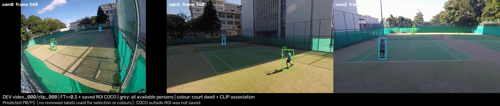

## 結論

中止済みGPU runの23archive（ft_base 12/12、ft_1080 11/12）をhash検証して再利用し、ソース比較・3ソースのCPU追跡/滞在選別・既存CLIP対応・3camera動画まで完了した。既定設定と両DINO重みのhashは不変。新GPU jobは無い。

**この滞在基準のまま既定へ採用する根拠は足りない。** 全8選手ラベルIDは50%単位保持の基準では残る一方、FT低閾値とunionでは既知の隣コート人物を滞在だけでほとんど除けない。遠側cam0も、追跡では見えているframeを候補選別で大きく失う。結果をorchestrator経由でユーザーへ提示し、既定変更は先送りする。

camera×近遠の全ソース表、共通11件表、identity/unit選別、隣コート/コート外の除外、far coverage、対応後の距離、動画は **[CPUレポート](../../runs/run-i964-court-selection-cpu-r4-20260929/report.md)** を正とする。CSV・JSONも同じbundleにある。入力/出力のhashは [artifacts.json](../../runs/run-i964-court-selection-cpu-r4-20260929/artifacts.json) と各manifest、再現手順と段階ごとのcode commitは [run.json](../../runs/run-i964-court-selection-cpu-r4-20260929/run.json)。

## 比較と限界

COCOの保存結果はcourt ROI後のみで、ROI外人数は不明。unionも全画面のCOCOを含まない。参照ラベルは旧COCO/旧tracker由来で、特にold_pipeline baselineに有利な循環比較である。未ラベル人物をFPと数えず、**検出recallや全画面性能ではない**。IoU .3を併記したのは#937のboxがラケットを含むため。ft_1080の欠損camera-clipを他条件で補完していない。

共通11件では1080低閾値のIoU .5一致はわずかに高いが、IoU .3一致の改善はなく、候補数とforward時間が増えた。この診断では800/1333・0.01、COCO、unionを選別に使った。[暫定判断](https://github.com/Motoki0705/tennis-lab/issues/964#issuecomment-5890149058)は本番採用を意味しない。GPU forwardと旧COCO component全体の壁時計時間の範囲は違い、unionの和を実測runtimeとは扱わない。

2D trackerの追加score gateとscore fusionを無効にしたUltralytics baselineへ全候補を渡し、scoreは元値を保存した。raw検出rowの足元を既存校正でコートへ写し、既存の領域・25% presenceをcamera-local trackに適用した後で上限6をかける。実際には候補はcameraごと2–4本で、上限による除外は0。短い断片の時間をこの段階で合算しておらず、raw検出の高い一致率が選手保持へそのまま繋がらない。

FT低閾値は12 camera-clipで累計912 track、COCOは67、unionは111だった。cam0遠側はFTで追跡2993 frame→滞在後1859 frame（参照3270）。断片化・選別の関与を示すが、ここから特定のtrackerやencoderを最終選択しない。BoT-SORT-style derivativeは全人物のpose/外観が未保存で、このrunでは未評価。過去120frameの旧入力smokeをこの比較へ混ぜない。

第2確認はCLIP-ReIDをCPUで実行し、既存の区間分割・短い曖昧区間除外・handoffを含むcamera間対応を使った。4 clip中の決定はFT 2、COCO 3、union 3、旧経路4。未決定を別方式で埋めず、associatedの数値は成功したclipに限るため分母が異なる。成功率の高低だけを公平な追跡方式比較とは解釈しない。

対応後には同じ予測identityのcamera間足元距離を測定した。これはz=0の3D地面仮説の整合であり、人体再構成や独立した3D GTとの誤差ではない。新しい距離閾値で採否を当て直していない。動画の色は予測IDで、ラベルは色付けや選別に入力していない。

## 検証と次の一手

通常検証は関連35 tests passに、欠損1080範囲を厳密に拒否する2 caseと対応後地面距離1 caseを追加（追加後のfocused 9 tests pass）。ruff/mypy/hooks成功。12秒・1920×410・20fpsの全240動画frameを読戻し、代表frameも目視した。学習していないためloss曲線は無い。

このrunで必要なCPU証拠は揃った。次はユーザーがソース/選別表と動画を確認し、滞在前の短いtrack断片の扱い・プレー領域と隣コートの分離を判断する。既定変更、新しい2–3追跡方式の最終比較、SOLIDER/KPR encoder比較、全pipeline接続とclip_000完走、調整凍結後の未見一回評価は別段階で、未完了のまま保持する。#935 branch/worktreeとmain .venvは変更していない。
