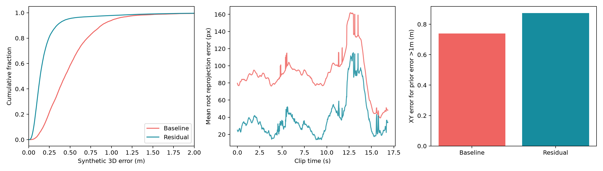

## まとめ

合成test全体と指定実映像の2D整合性は改善した。一方、疑似位置が大きく外れる層の精度は未解決で、既存直接回帰モデルの全面的な置き換えを裏付ける結果ではない。

| 指標 | 既存最良 epoch29 | 足元残差 epoch4 |
|---|---:|---:|
| 合成test 平均3D位置誤差 | 0.498538m | 0.200131m |
| 合成test 平均水平位置誤差 | 0.483328m | 0.186659m |
| 合成test 3D誤差95%点 | 1.040451m | 0.471586m |
| 合成test 0.5m未満の割合 | 58.51% | 95.47% |
| 合成test 平均yaw誤差 | 10.6017° | 6.0014° |
| 疑似位置誤差1–2m層の水平誤差 | 0.845086m | 0.477516m |
| 疑似位置誤差2m以上層の水平誤差 | 0.637782m | 1.254946m |
| 疑似位置誤差1m以上全体の水平誤差 | 0.739451m | 0.873667m |
| 指定実クリップ 平均root再投影誤差 | 89.831px | 38.691px |
| 指定実クリップ 再投影誤差95%点 | 260.513px | 136.767px |

3D平均誤差は59.86%、実再投影平均は56.93%減少。補正をゼロにする崩壊は確認されなかったが、極端なprior外れ値への補正不足が残る。学習・sampling・各層の詳細と次の実験案は [新モデルrun](000098-run-plcs-foot-residual-hard-ft20.md) に記録。

主比較は同じGPU・float32・seed1234・合成test全998シーンの中心128フレーム。採用checkpointは合成validationの最小誤差で選択した。運用中のepoch19も確認したが、より強い指定configのepoch29を主比較に用いた。epoch19の追加情報は [運用checkpoint評価](000096-run-plcs-foot-baseline-epoch19-eval.md) を参照。

実クリップは `data/tennis_multivew/processed/meiji_3cam/dataset/videos/video_000/clips/clip_000`、3カメラ・2人・1010フレーム。共通の保存済み2D観測から本番PLCS推論（stride2、128/64窓、三角重み融合、元frame数へ補間）を実行した。再投影はコート点だけから求めた近似カメラによるrootと、可視COCO hip中点との距離である。カメラfit RMSEはcam0/1/2で4.008/3.418/2.164px。**独立3D正解はないため、実映像で3D位置誤差を測定したとは解釈できない。**

成果物は専用worktreeの `outputs/plcs/foot_residual/comparison/` に保存:

- `smpl_overlay/{cam0,cam1,cam2}_comparison.mp4`: 各元動画に、各選手あたり既存/新PLCSの2体のGVHMR SMPLを重畳。赤=既存、水色=新。
- `comparison.mp4`: 既存epoch29（赤）と新モデル（水色）の軌跡・3view再投影、H264 1600×900、505フレーム・16.850秒。白い十字は観測hip。
- `residual_best.ckpt`: validation最良epoch4、推論用optimizer除去済み。SHA256 `990cf9247af7a06328d664379873dc4fcc740ffd573d2fd8069c0ba5c450603d`。
- `residual_scene.npz` + `residual_scene.metadata.json`: 既存GVHMR/SMPLと新PLCS位置・回転の標準SceneResult。入力元SHA・checkpoint・座標系をsidecarに保存。
- `baseline_best_*` / `residual_*`: 両モデルの生予測・評価JSON。test予測と主要評価を各knowledge run bundleにも保存。

## 実験スクリプトの履歴

この比較で使った `prepare.py` / `evaluate.py` / `finalize.py` / `render.py` / `render_smpl.py` と README は
実験用のスクリプトであり、現在のツリーからは削除済み。実行時の実装はcommit `2ce01844` のツリーで確認できる。保存済みの `outputs/plcs/foot_residual/` の成果物と学習モデルは当時の生成物である。

各runノードの `repro.command` と `knowledge/runs/*` の `run.json` / `repro.sh` / `uncommitted.patch` は、
当時実行したコマンドと training queue bundle の監査記録であり、現行の再実行手順ではない。
再度動かす場合は commit `2ce01844` のスクリプトを参照し、GPU実行は共有 training queue を使う。
