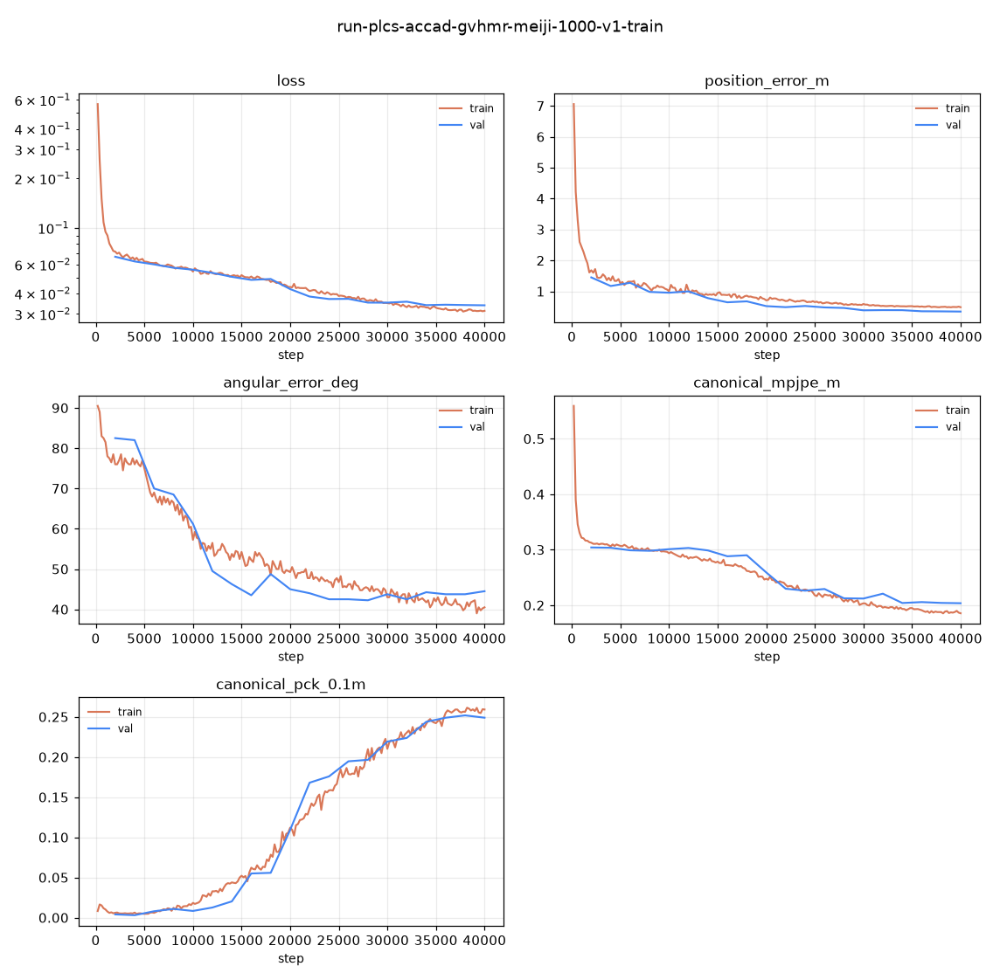
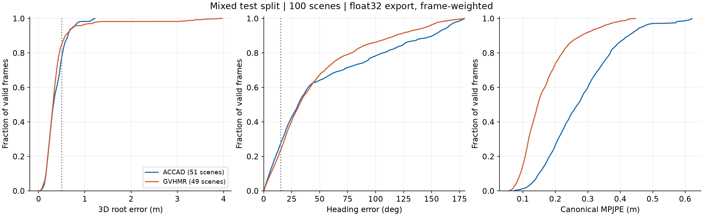
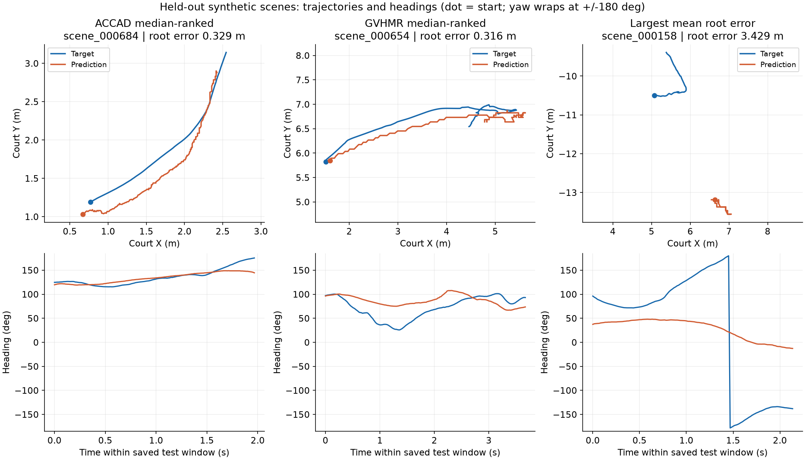

## 考察 / Findings

### 要約

200 epoch完了。混合test 100シーンに対する学習時の評価値は、位置誤差0.382341 m、向き誤差50.5°、canonical COCO17 MPJPE 0.228291 m。位置0.5 m以内80.5%に対し、向き15°以内は25.3%で、向き・姿勢には改善余地がある。これは生成シーンの教師信号に対する評価であり、実動画の独立した3D正解に対する精度ではない。

### アーキテクチャ詳細

標準multiview_axial_base（約52.2M parameters）、batch 4、bf16-mixed、seed 42、compile無効、200 epoch、10 epochごとの検証。lossはposition 2.0、rotation 0.02、canonical pose 1.0、joint/torsion/torso各0.1、bone length 0.5、reprojection 0.0。実効設定は[training_config.yaml](../runs/run-plcs-accad-gvhmr-meiji-1000-v1-train/training_config.yaml)。

親runの1000シーンをtrain800／val100／test100に分割。testはACCAD51／GVHMR49。学習時のみ28/30/60Hzへ同期リサンプリングし、評価はnative FPS。ACCAD元モーション／GVHMRラリー単位でsplit間の重複を防いだが、収録単位の分離ではない。今回の学習は後続のHydra抽出設定・再現性改修より前の114モーションを使用している。

### メトリクスの解釈

位置・poseのtrain/val誤差は低下。後半はval改善が緩やかになり、向きはおよそ40〜45°付近で頭打ち。testの向き誤差は50.5°で、学習損失の低下だけでは十分な精度を保証しない。

図は保存されたfloat32予測を再計算し、有効15,734フレームで集計（各source内のフレーム加重）。ACCADは位置0.371 m／向き53.84°／pose0.280 m、GVHMRは0.394 m／46.61°／0.168 m。同じモデルの異なるテスト集団であり、学習手法間の優劣比較ではない。

公式値は`metrics.json`を保持。図の全体位置誤差は0.381468 m、向き50.4925°で、学習時のbf16経路とfloat32保存予測の再計算を同一値とは扱わない。pose MPJPEは公式値と1e-6以内で一致を検証。

旧`_concat_padded`はbatch間の長さ調整でboolean maskもFalseで埋めていた。そのためpadding_maskだけでは無効領域を除外できない。今回の図ではtarget headingがゼロの追加3,660フレームを除外し、該当箇所の全数値配列がゼロ、有効headingが単位ベクトルであることをassertする。学習中の公式metricは保存前のmaskで計算されるため、この保存上の問題による再集計への混入を避けた。元NPZは変更していない。汎用exporterの修正は本可視化の範囲外。

source別にシーン平均位置誤差の中央値順位（偶数なら上側）を選び、全体最大誤差例も併記。選定は決定的で、成功例の手選びではない。最大誤差例scene_000158は平均3.429 m。XYは物理コート座標、位置誤差はZを含む3D距離。時間は保存された評価窓内の相対時刻で、動画の絶対時刻ではない。yawの±180°境界は表示上の折り返し。

再生成: `python knowledge/runs/run-plcs-accad-gvhmr-meiji-1000-v1-train/visualize.py`。必要なNPZとscene metadataを同梱し、GPU・動画・checkpoint不要。生成曲線の元TensorBoardイベントも同梱。選定ID・集計値は`visualization_summary.json`。巨大な動画・重み・生成データセットはGitに含めない。

### アーキテクチャ⇄メトリクスの因果考察

混合入力で学習・テスト・保存予測まで完走したことを確認した。GVHMR subsetのpose誤差が小さい原因は、動作分布や教師信号のばらつきの差である可能性があるが、仮説に留まる。比較runがないため、GVHMR追加による改善や悪化は断定しない。入力候補には直接観測率80%未満の7モーションも残る。

### 既存実験との比較

親runはデータ生成の確認であり精度baselineではない。旧ACCAD-only固定val/testではなく新規混合splitを使っているため、過去の別split結果と数値を直接比較しない。

### 次に有効な実験

同一val/testを固定したACCAD-only対混合trainの比較、未見収録をholdoutした評価、低観測率モーション除外の比較を順に行う。まず最大誤差例の視点・可視性とroot/yaw教師信号を点検する。これらの追加学習は本runでは未実施。
