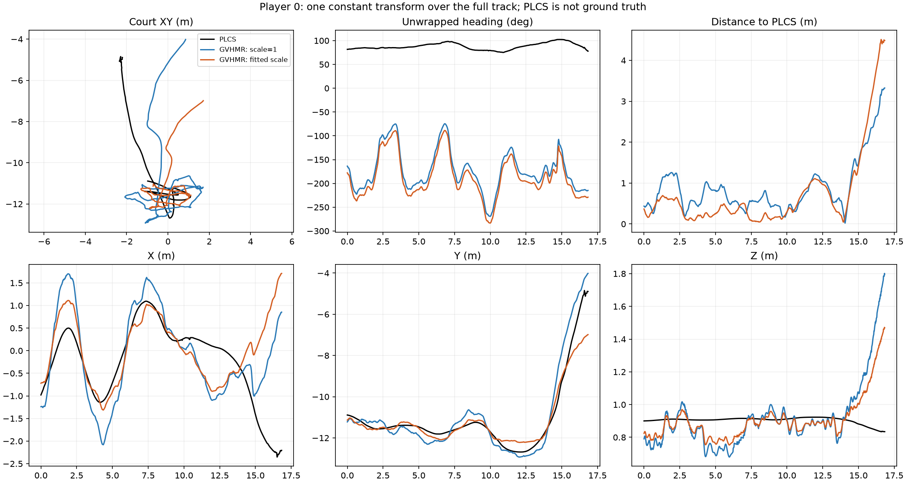

## 考察 / Findings

### 要約

共通相似変換はGVHMRの細かなモーションを保存できるが、このクリップ全体をPLCSへ
位置・向きともに整合させるには不十分だった。特に選手0はscaleを解放すると0.641となり、
身体を約36%縮めても向きの中央値誤差74°と終盤の位置ずれが残る。
選手1はscale=1.016で、scale固定からの改善は小さい。初期案の標準条件にはscale=1を残す。

### アーキテクチャ詳細

1回のCPU比較実験で、同じ入力に固定scaleと可変scaleを適用した。
学習・GPU利用なし。59.94006fps、1010フレーム（約16.85秒）、選手0はcam1、選手1はcam2。
cam1は1010、cam2は895フレームが観測済み。選手対応は2D腰位置で確認し、
対応先との画像正規化距離の中央値は両者約2.9e-8だった。

従来のclip内GVHMR JSONにはworld translがないため、同じclipのglobal SMPL抽出物を使用した。
原本をrun bundleの`inputs/`へ固定コピーし、入力SHA256をmetricsに保存した。
rootはSMPLから回帰したjoint0で、raw translではない。
実装・confidence・保存契約の正本は[モジュールREADME](../../src/tennis_scene/motion_alignment/README.md)。

### メトリクスの解釈

以下は**PLCSへの一致度**であり、正解3Dへの誤差ではない。観測済みフレームで集計した。

| 選手 | scale | 位置中央値 m | 位置RMSE m | heading中央値 ° |
|---|---:|---:|---:|---:|
| 0・固定 | 1.000 | 0.641 | 1.080 | 88.22 |
| 0・可変 | 0.641 | 0.386 | 1.192 | 74.05 |
| 1・固定 | 1.000 | 0.423 | 0.546 | 19.95 |
| 1・可変 | 1.016 | 0.417 | 0.547 | 19.92 |

選手0は中央値を下げてもRMSEは悪化する。Robust lossが少数の大きな残差を弱く扱うため、
中央値とRMSEは同じ方向に変化しない。終盤の上方向・XYのずれは一定変換で吸収できない。
前半のみでfitした場合、後半の位置中央値は固定/可変で選手0が1.854/1.387m、
選手1が0.894/0.932m。選手0の前半可変scaleは下限0.5に達した。

sourceの足首速度<0.2m/s区間を共通マスクにすると、現行配置規則からscale=1への変更で
足首平均速度は選手0が1.070→0.115m/s、選手1が1.319→0.111m/sになる。
これは共通座標変換がsourceの速度を保持することの確認であり、独立した接地精度の証明ではない。
可変scaleでは速度もscale倍されるため、0.641倍による低下を接地改善として評価しない。
可変scaleの選手0は足首高さ中央値が0.422mとなり、浮き上がりが目立つ。
選手1固定では足首高さ中央値-0.063mで、地面との整合も完全ではない。

保存済み近似カメラでのCOCO17再投影にも一貫した改善はない。
選手0/cam1の平均誤差は直接配置174.2px、固定183.6px、可変197.8px、
選手1/cam2は175.1px、182.5px、182.6px。カメラは単平面近似・歪み未補正なので
絶対値の解釈には限界があるが、今回の変換を画像精度改善として支持する結果ではない。
全camera・時間区間・optimizer診断は[metrics.json](../runs/run-plcs-gvhmr-similarity-clip000/metrics.json)。

全関節の骨長倍率と相対回転の保存を数値確認した。さらに両選手の先頭・中央・最終フレームで、
保存したSMPLパラメータから再生成した全6890頂点が直接相似変換したmeshと
絶対許容誤差3e-5m以内で一致した（scale固定/可変の両方）。
通常検証はunit test 57件、実assetのmesh round-trip 1件が通過し、変更Pythonのruff・mypyも通過した。
最適化は非学習なのでTensorBoard収束曲線はない。

### アーキテクチャ⇄メトリクスの因果考察

選手0ではheading差の円周平均が約48.1°に対し、XY点列が求める回転は約162.8°であり、
単一yawに要求される向きが約115°異なる。全体fitは固定142.5°・可変128.3°へ寄り、
身体headingとの大きな不一致を残した。少なくともこの出力の組合せは「一定変換で位置と向きを
同時に説明できる」という前提を十分満たさない。

仮説: GVHMRの終盤のworld復元ドリフト、PLCSの向き・位置誤差、rootの上流定義の不一致が混在する。
この実験だけから片方のモデルを原因と断定できない。PLCS学習targetはAMASS trans、
描画anchorは回帰pelvisという意味のずれも、別途実データで監査すべき。

### 既存実験との比較

同じsource articulationを現行レンダラー規則で直接PLCS配置した条件を対照にした。
元sceneのincam meshそのものを再評価した比較ではない。
knowledge内にはこのclipでの同一変換実験の先行ノードはなかった。

[3方式の同期比較動画](../runs/run-plcs-gvhmr-similarity-clip000/comparison.mp4)

### 次に有効な実験

まずscale=1のまま、選手0の終盤とheadingを映像・カメラ校正・root定義から監査する。
そのうえで時間依存ドリフトが確認できた場合に限り、補正量だけを低自由度スプライン化し、
接地制約を加える。今回の0.641というscaleを身体サイズ補正として採用しない。
