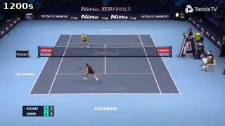
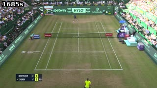
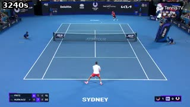
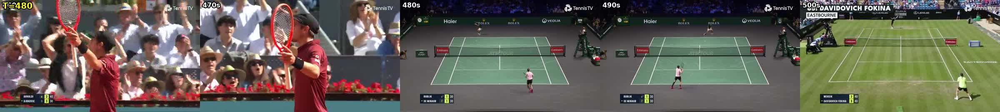

## 考察 / Findings

### 要約

未使用raw区間の疎なRGB目視から、Torino・Halle・Sydney・Chengduのラリー候補を得た。
新規ball注釈・連続区間の品質検証はなく、追加採用clipは0。実行中の固定dataset比較には混ぜない。

### アーキテクチャ詳細

モデルや学習は実行していない。元動画は640×360・30fps・105912frame・約3530.55秒で、SHA256はsummary.jsonに固定した。
360〜3360秒を120秒間隔の26時点でsoftware decodeし、5区間の近傍、うち3区間を5秒間隔で追加確認した。
元媒体・dataset・splitは変更しない。scoutのシートに加えて親も保存画像を目視し、既存9clipの中央画像と比較した。

### メトリクスの解釈

| 会場候補 | 広角を目視した時点（秒） | 残る確認 |
|---|---|---|
| Torino / Nitto ATP Finals | 1190, 1195, 1200, 1205 | 正確なカット境界・静止性・球観測 |
| Halle | 1680, 1685, 1690, 1695, 1700, 1705 | near選手が端で切れる区間・球観測 |
| Sydney / United Cup | 3235, 3240, 3245, 3250 | 3255はclose-upで除外、連続性・球観測 |
| Chengdu | 1920, 1930 | 短い候補で、前後カット境界未確定 |

点の間がすべて同じ広角とは確認しておらず、上表を切出し済みの開始/終了区間とは扱わない。
元動画にも会場切替・close-up・doubles・replayが混在する。ball判読性とカメラ静止性を縮小静止画だけでは保証できない。
学習runではないためTensorBoard曲線はない。

### アーキテクチャ⇄メトリクスの因果考察

少数の既存broadcastを反復するより会場の多様性を増やせる可能性はあるが、学習効果は未検証。
新しい区間へ既存detectorの疑似2D ballを与える場合もGTとはせず、confidence・未観測mask・教師QCが必要である。
640×360の原動画でballが小さいため、検出器を走らせただけでは有効な教師になるとは限らない。

### 既存実験との比較

480/490秒はHaier/Rolex/Veoliaの室内コートで既存val会場、500秒はEastbourneでtest会場に当たり、いずれもtrain候補から除く。
scoutの初報「480〜500秒すべてEastbourne」は親の画像照合で訂正した。Sydneyの3255秒もwideではなくclose-upへ訂正した。
Halleがtestと同じ芝であること自体はvenue/recording分離に反しないが、会場の同定と品質確認なしに採用しない。
現行のtrain/val/testやSLCS held-out予測は一切変更・評価していない。

### 次に有効な実験

既存のclip export・ball検出・疑似観測取込の契約と利用可能なcheckpointを確認し、候補の精密な境界・元解像度でのball観測を検証する。
採用可能なら新dataset版として教師生成・カメラdrift・人物/ball支持率QCを実施する。現在の片側context単独比較のdataset/splitは固定したままにする。

read-onlyの入口調査では、`export_clips`はClipStudio projectからv2 manifestを生成でき、配備済みball detectorは`BallDetectionResult`へUV・visibility・scoreを保存できる。
一方、detector結果をbuildの`saved_scene`入力である`observations/ball_detection_result.json`と媒体SHA付き`ball_import.metadata.json`へ移すCLIは未整備だった。
旧v1専用の`copy_legacy_broadcast`を新v2へ流用しない。既存の配備ball重みの根拠は[run-i618-convnext-v2-ft](run-i618-convnext-v2-ft.md)で、候補会場における精度は未検証。
これは実装経路の調査結果であり、clip projectの作成・detector推論・取込・新dataset版の生成はまだ実施していない。
