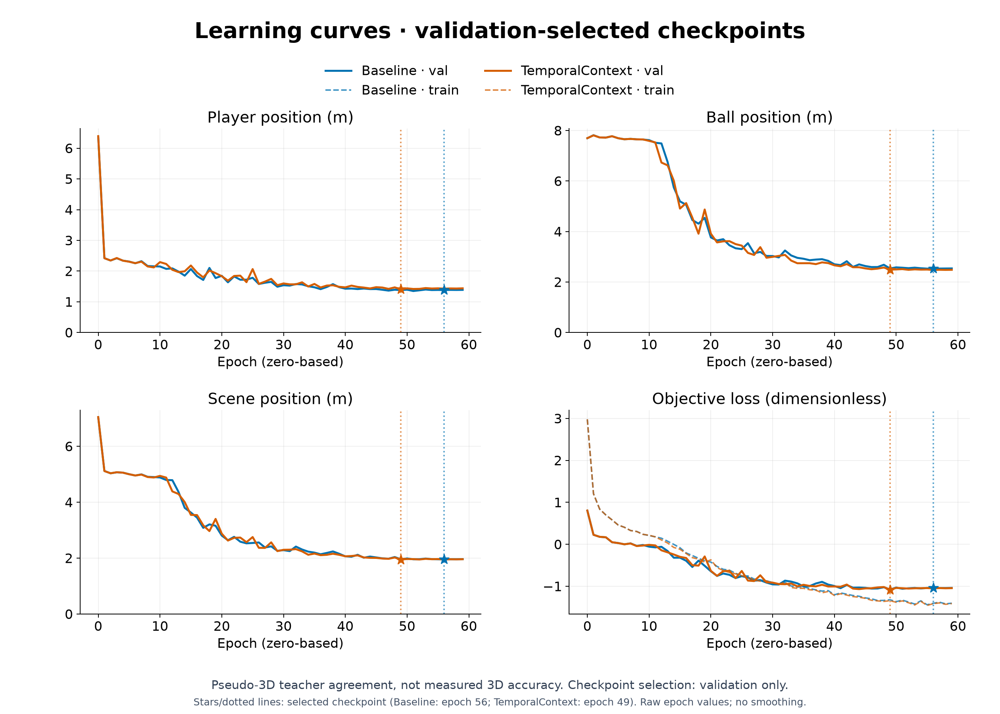
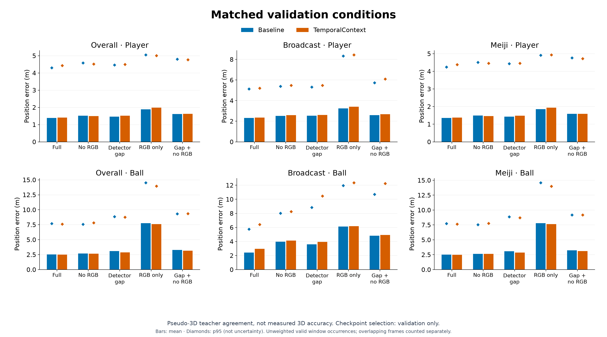
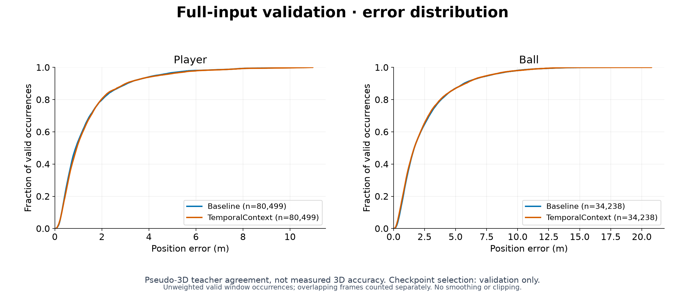

## 考察 / Findings

### 要約

固定validation 343窓・5条件を完走し、32必須成果物の非空・構文・数値有限性・選定SHAを確認した。
ballのfull/gap平均・p95と両欠損境界は改善したが、broadcast全5条件のballとplayer、全体full/gapのplayerは悪化した。
狙った欠損境界には効果があったという限定した結論を残し、単一seedの本候補を基準の全面置換には採用しない。testは未実行。

### アーキテクチャ詳細

60epoch・1800更新のvalidation scene最良epoch49を固定した。
SHA256は`94793e761d22a1f163d8089ae0210b6cb45f7c37144deb498c31b4d85fd6f961`。
court-only contextとvelocity lossは無効。元のvisibilityを保持し、同じoffline窓の両側に存在する観測済みball特徴だけを不可視tokenへの補助入力にする。
特徴の線形合成であり、物理的な軌道補間・観測の捏造・出力平滑化ではない。片側のみ・全欠損・paddingの補助量は0。
全5条件の教師・mask・weight・window・FPSを基準と厳密照合した。高速教師の閾値26.4250385982m/sはtrain-onlyから固定した。

### メトリクスの解釈

full ball平均2.4899m/p95 7.6022m、gap平均2.8936m/p95 8.7473m。
fullの観測→欠損329ペアは速度ベクトル誤差平均35.0919m/s、欠損→観測338ペアは35.6178m/s。
gapの同境界は46.1122/44.0505m/s、高速教師3088ペアのfull誤差は平均20.6096/p95 44.9732m/s。
最大予測速度はfull493.14m/s・gap462.29m/sで、極端な誤差は残る。
すべて疑似3D教師との一致度であり、実測3D精度ではない。重複windowを別occurrenceとし、外れ値・不連続を除去していない。
評価だけのrunに独立したTensorBoardはないためkg_curvesはskip。PR図は親の60epochと基準の保存TensorBoardから生成した。
図の入力とSHA・集計値はfigures/manifest.jsonに記録する。棒は平均、菱形はp95で信頼区間ではない。

### アーキテクチャ⇄メトリクスの因果考察

欠損tokenに両側観測を与える変更は、狙った欠損境界の平均/p95を大きく改善した。
ただし学習し直した単一seed比較で、他の重みも更新されるため残差機構だけの因果効果とは断定しない。
両側観測を持たない入力は補助できず、観測区間の誤差やbroadcast/player退行は別途確認が必要。
全体の改善だけでは2ドメインへの頑健性を満たしたと判断できない。

### 既存実験との比較

基準→候補でfull ball2.5210→2.4899m、gap3.0973→2.8936m、gap p95 8.8647→8.7473m。
fullの両境界は61.9056→35.0919m/s、60.7835→35.6178m/s、gapは67.9426→46.1122m/s、65.2736→44.0505m/sへ改善。
高速教師のfull p95も46.6518→44.9732m/sへ改善したが、両端観測のfull速度誤差平均7.4694→7.7088m/sは悪化した。
broadcast full ball2.4293→2.9542m、gap3.6010→3.9365m、全体player full1.3826→1.4058m、gap1.4631→1.5188mは悪化。
full最大速度481.77→493.14m/s、gap418.79→462.29m/sも悪化している。
5条件・domain・主要遷移の数値は同runのsummary.jsonを正本とする。

### 次に有効な実験

testを開かず、入力の欠損/観測・両側anchorの有無で誤差を分け、最大速度の発生条件を確認する。
併せてtrain側のdomain別window数と品質weightを監査し、broadcastの学習露出が不足していないかを調べる。
品質weightは教師の信頼性なので、単に引き上げて高品質と見なさない。samplingを変える場合もtrain限定の別施策として記録する。
