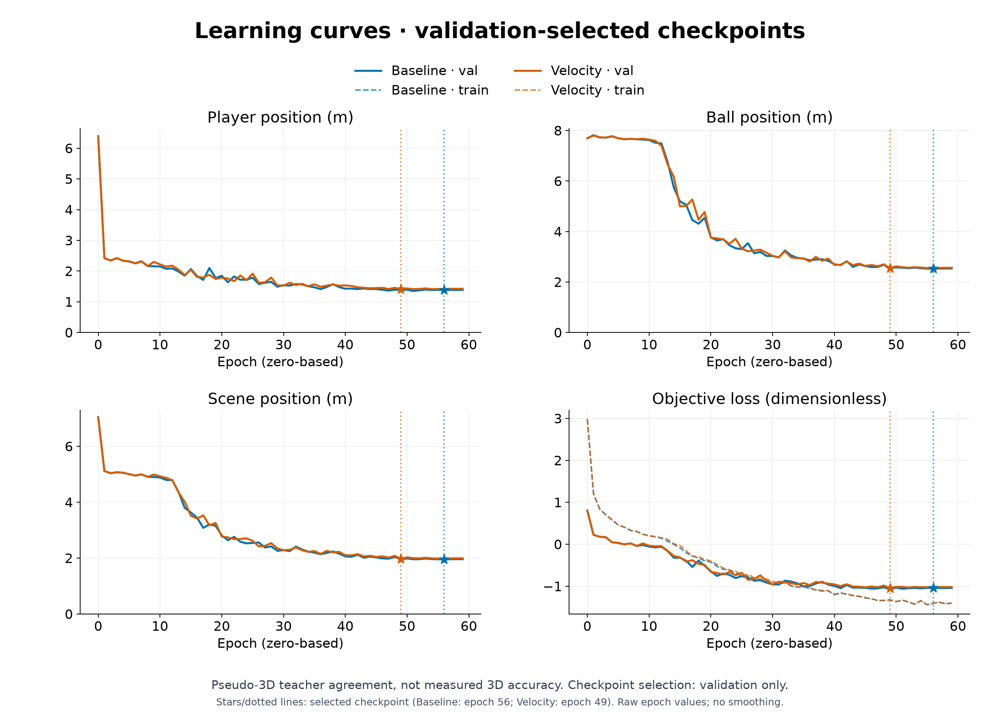
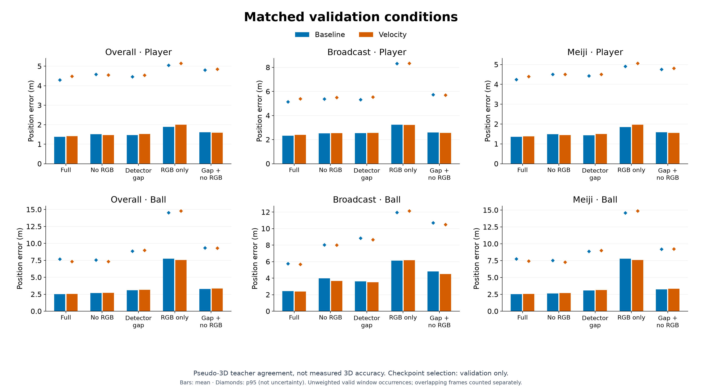
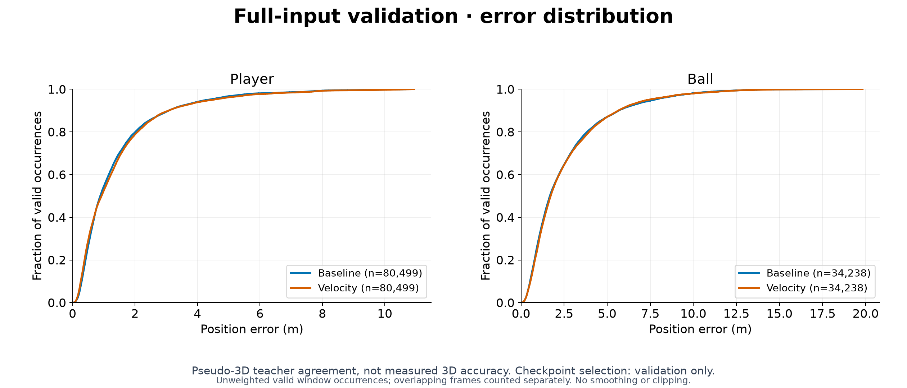

## 考察 / Findings

### 要約

ユーザーのgoal優先・ローカル継続指示を受け、共有GPU queueのall予約で新しい出力先へ5条件を再評価した。
全343窓で完走し、32必須成果物の非空・JSON/YAML構文・NPZ数値有限性を確認した。
full最大速度は低下したが、full/gapの位置平均とvisibility境界の速度ベクトル誤差が悪化し、基準モデルを置換しない。
初回評価の空出力と中断記録は保持する。今回の完走はWindowsのクラッシュ原因解決を意味しない。

### アーキテクチャ詳細

親の60epoch学習からvalidation scene最良epoch49を選定。checkpoint SHA256は
`b50e0052db299abe141704beaca1246c4bb492fae6cf6c63d6cf3dca1bdad708`。
比較基準はno-ball-smooth epoch56。同一教師・mask・weight・window・入力条件・実FPSを厳密照合し、
全5条件の保存配列から既存CPU CLIでvisibility遷移を集計した。
高速区間閾値26.4250385982m/sは既存train-only統計から固定し、val/testでfitしていない。
評価は疑似教師との一致度であり、独立実測3D精度ではない。testは実行していない。

### メトリクスの解釈

full ball平均2.5475m / p95 7.3376m、player平均1.4103m。gapではball3.1569m / player1.5270m。
全33702隣接validペアのfull速度ベクトル誤差は平均8.6605m/s、p95 25.9455m/s。
観測→欠損329ペアは62.9149m/s、欠損→観測338ペアは64.9700m/sで、全体平均だけではこの失敗を捉えにくい。
window重複は別occurrenceとして数え、速度の外れ値除去・clip・平滑化は行っていない。
収束曲線は親の学習runを参照し、本runには独立したTensorBoard学習系列がない。
PR用の比較図は保存済み評価と両学習のTensorBoardからCPUで生成し、入力SHA・選定receipt・図のSHAをfigures/manifest.jsonへ保存した。
青が基準epoch56、橙が速度候補epoch49。学習曲線は生値、条件別の棒は平均・菱形はp95（信頼区間ではない）。

### アーキテクチャ⇄メトリクスの因果考察

速度lossの学習低下とfull最大速度低下は、欠損境界での改善を保証しなかった。
同じseedの単一対照であり、lossが境界のovershootを直接引き起こしたとは断定しない。
欠損ball tokenがcourt情報ごと定数へ置換される入力経路は次の仮説だが、
既存の不可視token自体も欠損を表すため「mask情報が一切ない」とは解釈しない。

### 既存実験との比較

基準→候補でfull ball平均2.5210→2.5475m、player1.3826→1.4103m、
gap ball3.0973→3.1569m、player1.4631→1.5270mと退行した。
full ball p95は7.6934→7.3376m、最大速度481.77→354.57m/sへ改善した一方、
gap最大速度は418.79→429.58m/sへ悪化した。
full高速教師3088ペアの速度誤差p95も46.65→48.98m/sへ悪化した。
両端観測の速度誤差平均7.4694→7.3107m/sは改善するが、
観測→欠損61.9056→62.9149m/s、欠損→観測60.7835→64.9700m/sは悪化。
全体・Meiji・broadcastの5条件と主要遷移の実数値は同runのsummary.jsonを正本とする。

### 次に有効な実験

速度係数の再掃引や事後的な最大速度clipは行わず、入力欠損時に観測済みcourt文脈を維持する単独仮説を比較する。
同じbaseline・教師・split・seed・60epoch・burst24へ戻し、velocity lossは追加しない。
両visibility境界の誤差とfull/gap位置平均・p95、domain、player、高速教師区間を同時確認し、
最大値だけの改善や1clipの見た目を採用理由にしない。
