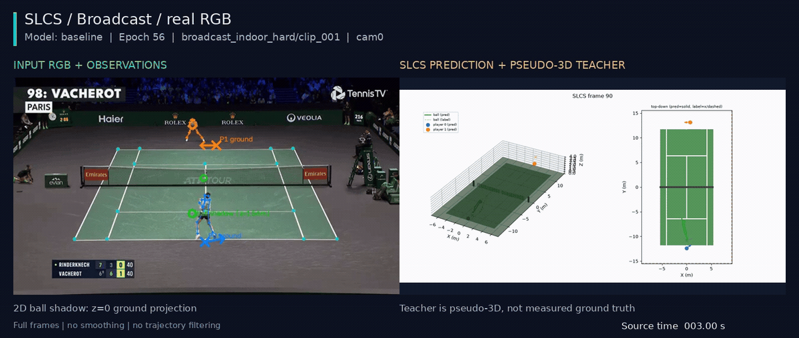

## 考察 / Findings

### 要約

broadcast validationの唯一のclipを、validation選定epoch56でCPU推論・可視化した。CLI終了コード0、
全1172frameのoverlayと391frameの3D動画を確認した。性能の採用判定ではなく定性的な確認である。

### アーキテクチャ詳細

既存predict_clip CLI、CPU float32、window120/eval stride120、augmentationなし。
入力root・checkpoint root・出力rootを明示し、保存checkpointのSHAは
`870407e89ca0ff31d07a33395acf3a3538f49146274f3566bd36ff969b6733a2`。
3Dは3frame間隔で描画し、2D overlayは原動画の全frameを保持する。

### メトリクスの解釈

全予測配列は有限、coverage最小1。overlayは640×360・30fps・1172frame、3Dは1200×600・10fps・391frame。
投影用homographyがないframeは0。6時点のcontact sheetも保存し目視した。
遠側選手の地面投影に実画像の足元からのずれが残る。ball shadowは高さ0への投影なので、画像上のballとの一致度には使わない。

### アーキテクチャ⇄メトリクスの因果考察

平均誤差で隠れる選手位置のずれを確認できるが、単眼homographyと擬似教師を用いた表示であり独立3D正解ではない。
見た目が成立することを頑健性の達成と呼ばない。

### 既存実験との比較

親runのbroadcast10窓の定量結果と同じ選定重み・clipを使う。clip推論では重なるwindowを平均するため、
window occurrencesの定量評価をこの動画から再計算したとは扱わない。

### 次に有効な実験

全体版gap48の学習完了後も同じclipを比較する。full/gapの位置・motion・裾誤差を主な採否根拠とする。

PR向けにはMeijiと同じ3.0–11.0秒を10fpsで同期合成した。既存の予測動画を使い、時間補間・軌道の外れ値除去はしない。
1440px MP4・3時点PNG・生成コマンドとSHAはpr_preview/へ保存した。GIFは表示用の縮小・色量子化のみ。
これは定性的な例で、遠側選手の地面投影ずれなどの失敗も残している。teacherは実測3D正解ではない。

