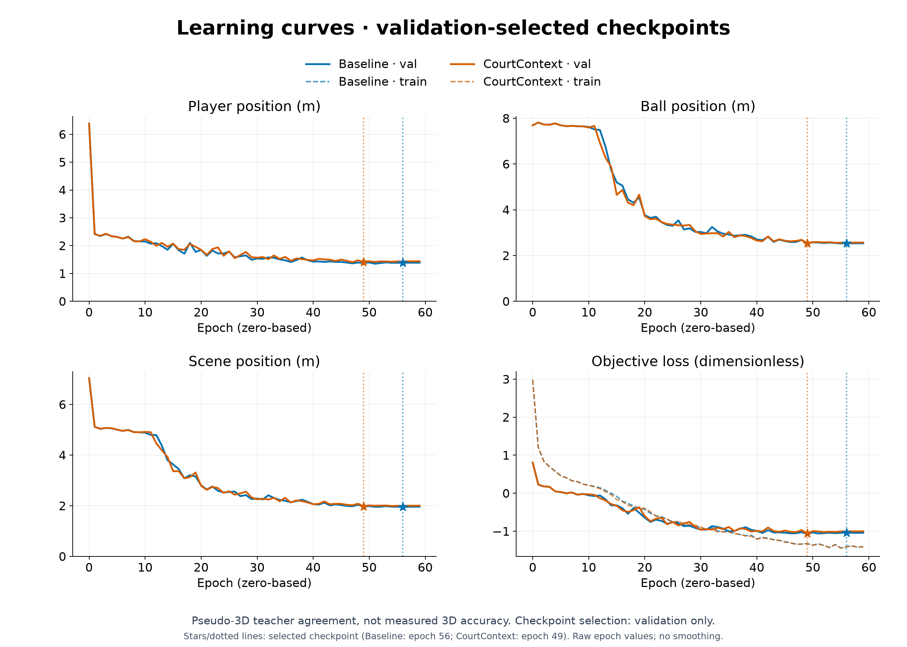
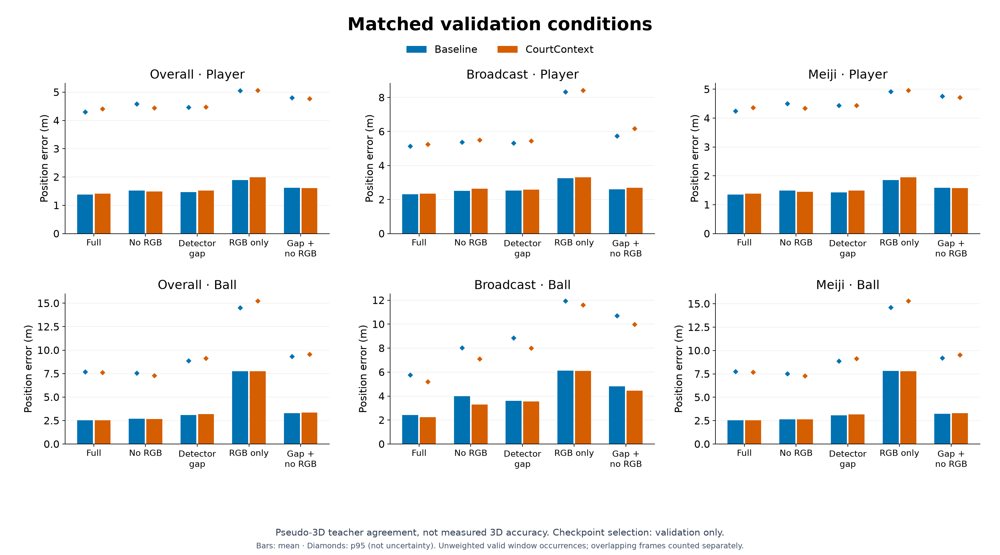
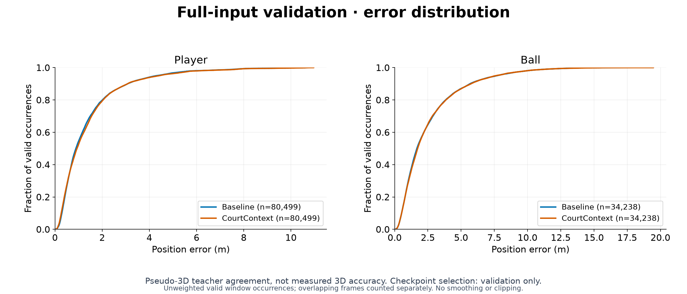

## 考察 / Findings

### 要約

共有GPU queueのall予約で固定validation 343窓・5入力条件を完走した。
32必須成果物の非空・JSON/YAML構文・NPZ数値有限性・選定SHAを確認した。
fullの最大速度と一部domainは改善したが、full/gapのball/player平均とgap境界の誤差が悪化し、不採用とする。
testは実行していない。

### アーキテクチャ詳細

親の60epoch・1800更新からvalidation scene最良epoch49を選定した。
checkpoint SHA256は`3e59feda9f3f5ba1a52d85716c658f22546a8c8f3b9eff01aeb9cdbf4887f6a4`。
不可視ball tokenにゼロ初期化したcourt-only projectionを加え、可視ball経路・損失・burst24・seed42を基準と揃えた。
全5条件の教師・mask・weight・window・入力条件・実FPSを基準epoch56と厳密照合し、既存CPU CLIで遷移を比較した。
高速教師の閾値26.4250385982m/sはtrain-onlyから固定し、val/testにfitしていない。

### メトリクスの解釈

full ball平均2.5373m/p95 7.6085m、player平均1.4067m。gapはball3.1814m/p95 9.1202m、player1.5203m。
fullの観測→欠損329ペアは速度ベクトル誤差61.8506m/s、欠損→観測338ペアは61.0307m/sで、依然大きい。
gap境界はそれぞれ71.2789m/s、66.9484m/s。高速教師3088ペアのfull誤差p95は48.5131m/s。
これは疑似教師との一致度で、独立実測3D精度ではない。window重複は別occurrenceとし、外れ値除去・平滑化・速度clipはしない。
独立した学習系列はないため収束曲線生成はskipし、PR図は親と基準の保存TensorBoardから生成した。
図の入力とSHAはfigures/manifest.jsonに保存する。棒は平均、菱形はp95で、信頼区間ではない。

### アーキテクチャ⇄メトリクスの因果考察

court射影の全5376重みは学習で更新されたが、courtを保持するだけで欠損境界の不連続は解消しなかった。
ゼロ初期化による初期baseline一致と、同seedの1回比較であり、全てのcourt利用方法が無効とは断定しない。
不可視tokenに時間的なball座標anchorがないことは次の仮説で、今回の比較だけから原因確定とはしない。

### 既存実験との比較

基準→候補でfull ball平均2.5210→2.5373m、player1.3826→1.4067m、
gap ball3.0973→3.1814m、player1.4631→1.5203mへ悪化した。
full ball p95は7.6934→7.6085m、最大速度481.77→356.47m/sへ低下したが、gap最大速度418.79→517.16m/sは悪化。
fullの観測→欠損61.9056→61.8506m/sはほぼ同等、欠損→観測60.7835→61.0307m/sは悪化した。
gapの観測→欠損67.9426→71.2789m/s、欠損→観測65.2736→66.9484m/sも悪化。
broadcast full ball2.4293→2.2343m、gap3.6010→3.5517mの部分改善はあるが、playerとMeijiの退行を隠さない。
5条件・全体とdomain・主要遷移の実数値は同runのsummary.jsonを正本とする。

### 次に有効な実験

基準は変更せず、現在のoffline入力window内の観測ballだけから時間的な位置anchorを作れるかを調査する。
教師・隠された座標は使わず、元の欠損maskを保持する。補間を真の軌道や新しい観測と見なさない。
full/gapの位置平均・p95、両欠損境界、高速教師、domain、playerを同時確認する採否方針は維持する。
