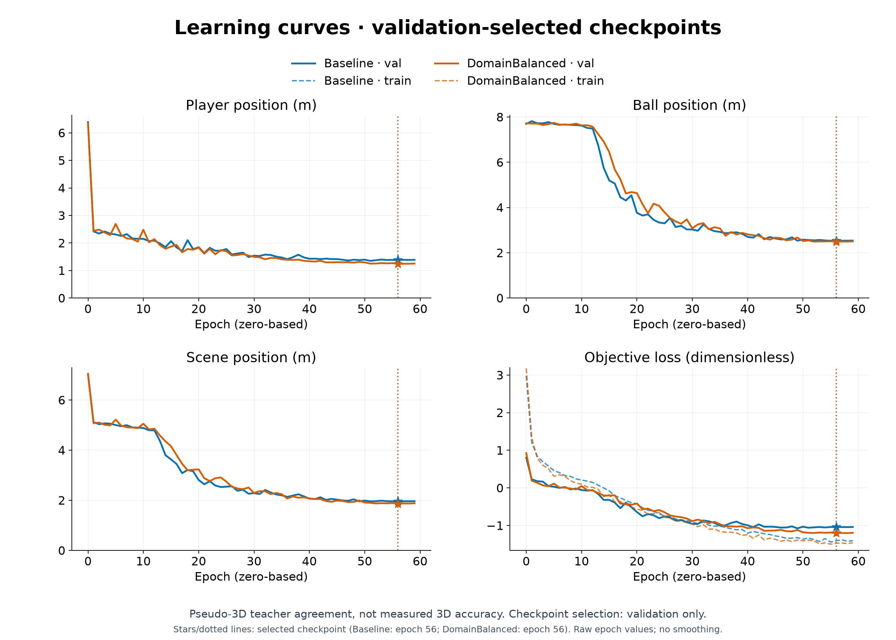
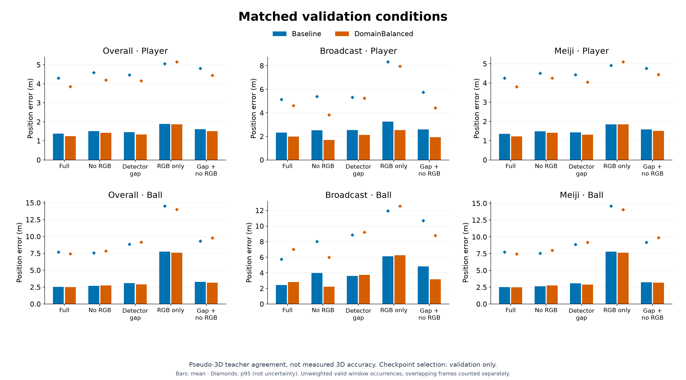
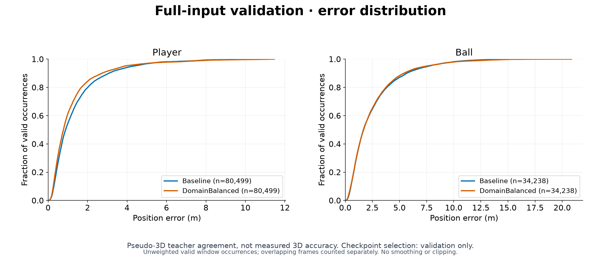

## 考察 / Findings

### 要約

固定validation343窓・5条件を完走し、32必須成果物の非空・構文・数値有限性・選定SHAを確認した。
全体・両domainでplayer位置が改善したが、ball欠損の裾と両visibility境界は直接対照より悪化した。
全体の平均だけでは頑健性改善とみなせず、単一seedの本候補は全面置換に採用しない。testは未実行。

### アーキテクチャ詳細

epoch56/SHA `5438fb94cd3be5e57994423293e02cda9bdf9ed40478290458a389f99102edee`を固定したfloat32 CUDA評価。
直接対照はTemporalContext（epoch49）で、学習側domain頻度逆数の復元抽出だけが異なる。
元のno-smooth基準（epoch56）とはtemporal contextとsamplingの2要因が異なり、単独変更の因果比較ではない。
teacher・mask・weight・window・FPS・観測maskは両対照と条件ごとに厳密照合した。
train-only速度閾値26.4250385982m/sを維持し、5条件×2対照の遷移比較JSONを元outputへ保存した。
samplingはtrainだけに適用し、valの窓集合やdomain比は変更していない。

### メトリクスの解釈

| validation指標 | 元の基準 | TemporalContext（直接対照） | DomainBalanced |
|---|---:|---:|---:|
| full ball平均 m | 2.5210 | 2.4899 | 2.4896 |
| full player平均 m | 1.3826 | 1.4058 | 1.2432 |
| gap ball平均 m | 3.0973 | 2.8936 | 2.9157 |
| gap player平均 m | 1.4631 | 1.5188 | 1.3365 |
| full ball位置p95 m | 7.6934 | 7.6022 | 7.4464 |
| gap ball位置p95 m | 8.8647 | 8.7473 | 9.1721 |
| full 観測→欠損速度誤差 m/s | 61.9056 | 35.0919 | 47.9500 |
| full 欠損→観測速度誤差 m/s | 60.7835 | 35.6178 | 48.1747 |
| full 最大予測速度 m/s | 481.77 | 493.14 | 935.38 |
| gap 最大予測速度 m/s | 418.79 | 462.29 | 881.89 |
| broadcast full ball平均 m | 2.4293 | 2.9542 | 2.8193 |
| broadcast gap ball平均 m | 3.6010 | 3.9365 | 3.7448 |

gapの両visibility境界も直接対照46.1122/44.0505→60.8300/62.0646m/sへ悪化した。
高速教師3088ペアのfull誤差は平均20.6096→21.4552m/s、p95 44.9732→46.8262m/sへ悪化した。
これらはpseudo-3D教師との一致度で、実測3D精度ではない。外れ値を除去せず、重複windowを別occurrenceとして集計する。
評価runにTensorBoardはないためkg_curvesはskipし、図は学習親のTensorBoardを使用する。
figuresは元の基準との比較、direct_control_figuresはsampling単独の直接対照。各manifestに入力SHA・集計値を保存した。
samplingでtrainの提示分布が変わるため、train lossの単純比較は同一分布上の精度比較ではない。

### アーキテクチャ⇄メトリクスの因果考察

broadcastの提示増加でplayer表現を学びやすくした可能性はあるが、単一seedの再学習であり機構の因果証明ではない。
同domainでball full2.8193mに対しno_rgb2.2292m、gap3.7448mに対しgap_no_rgb3.1818mで、
今回のbroadcastではRGBを入れた方が悪い。全体ではfull2.4896<no_rgb2.7491m、gap2.9157<gap_no_rgb3.1722mで逆方向となる。
全体平均によって特定domainのRGB悪化を隠さない。少数のbroadcast train clip反復では視覚的多様性自体は増えない。
保存配列のfull/gap最大速度上位10件と反例をCPUで再計算し、入力SHA付き`edge_context_diagnostics.json`へ保存した。
full上位10件はすべてMeiji `video_001`の片側anchorしかない観測↔欠損境界だった。距離は欠損端点から最近傍観測までで全件1frameであり、
「両端とも観測」と「欠損端点の左右にanchorがある」は異なる条件である。

| 固定occurrence | 条件・欠損端点のanchor | 教師速度 m/s | 元の基準 | TemporalContext | DomainBalanced |
|---|---|---:|---:|---:|---:|
| clip_001/cam0、frame30→31 | full・右だけ | 22.44 | 34.01 | 270.16 | 935.38 |
| clip_014/cam1、window106、frame185→186 | gap・左右両方 | 15.21 | 50.51 | 325.38 | 171.37 |
| clip_002/cam2、window240、frame276→277 | full・右だけ | 31.28 | 481.77 | 409.27 | 261.47 |
| 同じframe276→277 | gap・右だけ | 31.28 | 248.87 | 462.29 | 280.61 |

最大例のball位置誤差は16.30→1.22mと隣接frameで急変した。gap上位には自然の端欠損だけでなく、人工欠損との合成で片側anchorになる例もある。
一方で左右anchorがある破綻例と、TemporalContextより改善する片側例も残る。後者のgapは元基準より悪く、「常に改善」とはしない。
片側経路の不足を次の仮説として支持する局所診断ではあるが、教師ノイズ・hardware・sampling・特定入力経路を単独の原因と断定しない。

### 既存実験との比較

直接対照からplayerのfull/gap平均は両domainで改善。broadcast full ballも2.9542→2.8193mへ改善したが、
元の基準2.4293mまでは戻らず、full p95とgap裾・境界・極値には別の退行がある。
ball full平均の差2.48994→2.48957mは極小で、これを有意な改善とは主張しない。
元の基準より全体gap平均は良くても、gap p95 8.8647→9.1721m、broadcastのRGB寄与逆転と巨大な不連続が残るため採用を見送る。

### 次に有効な実験

source在庫と上記の局所診断を踏まえ、次は非均衡samplingのTemporalContextを直接対照として片側の観測featureだけを追加する。
論文根拠・固定条件・採否基準は[実験groupの事前計画](000009-group-slcs-real-rgb.md#次の単独変更片側観測のfeature-context)に記録する。
少数domainをさらに繰返す、出力速度をclipする、失敗区間を除くことを解決と扱わない。固定validation/test収録と品質基準は維持する。
