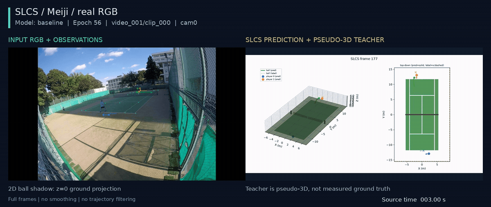

## 考察 / Findings

### 要約

全frame保持から既存VideoWriterによる逐次保存へ切り替えた公開predict_clipを実動画で確認した。
全1316frameのoverlayと439frameの3D動画を完走し、推論を含む最大RSSは1659224KiB（約1.58GiB）。
修正前runの予測配列および両動画の全decoded frameと完全一致した。

### アーキテクチャ詳細

推論checkpoint・clip・設定は親と同じで、checkpoint SHAは
`870407e89ca0ff31d07a33395acf3a3538f49146274f3566bd36ff969b6733a2`。
overlay/3D画像を描画した順に既存writerへ渡し、frame画像の保持をO(1)にした。
同一directoryの一時MP4へ保存し、frame数検証とencoder close成功後にatomic replaceする。
失敗時は一時fileだけを削除して既存の最終動画を保全し、matplotlib figureもfinallyで閉じる。

### メトリクスの解釈

CLI終了コード0、経過151.10秒。ffprobeの全decode計数でoverlayは1920×1080・1316frame・59.94006fps、
3Dは1200×600・439frame・19.98002fps。欠損homographyは0。
旧run `s42-takeover-004`と新runの15個のNPZ配列/metadataを`np.array_equal`で照合した。
動画は`ffmpeg -i <video> -map 0:v:0 -f hash -hash sha256 -`で全decoded frameのhashを比較し、両方一致した。
比較結果とresource_usage.txtをbundleへ保存した。学習ではないため収束曲線は対象外。

### アーキテクチャ⇄メトリクスの因果考察

旧overlayのlist+stackはこの動画の画像配列だけで約15.25GiBを必要とする実装だった。
旧runのpeak RSSは測定していないため、この試算と新しい実測値から厳密な削減率は算出しない。
今回の完走と低RSSは逐次保存の効果を支持するが、過去のsignal停止原因が解決したことの証明ではない。

### 既存実験との比較

親と同じ推論・描画内容を維持し、解像度・frame数・CRF17・fpsも変えていない。
統合先でSLCS unit/integrationとVideoWriter計241 testsが通過。新規17件は実動画、read/write順序、
空入力・短decode・draw/write/close失敗時のcleanupと既存動画保全を含む。対象Ruff/mypyも通過した。

### 次に有効な実験

以後のモデル比較ではこの逐次描画経路を使用し、定量評価と固定clipの目視を併用する。
省メモリ化そのものは位置精度・欠損時の頑健性を改善しないため、モデル学習の採否とは分ける。

PR向けには既存動画の3.0–11.0秒を10fpsで同期合成した。元の異なるFPSに対し同じwall-timeの直前frameを使い、補間はしない。
推論はやり直さず、全画角・未加工の軌道を維持する。GIFは表示用の縮小・色量子化のみ。1440px MP4・3時点PNG・生成コマンドとSHAはpr_preview/へ保存した。
この区間は定性的な例であり、全体の性能を代表する統計的な抽出ではない。ball影はz=0の投影で、画像ballとの一致には用いない。

