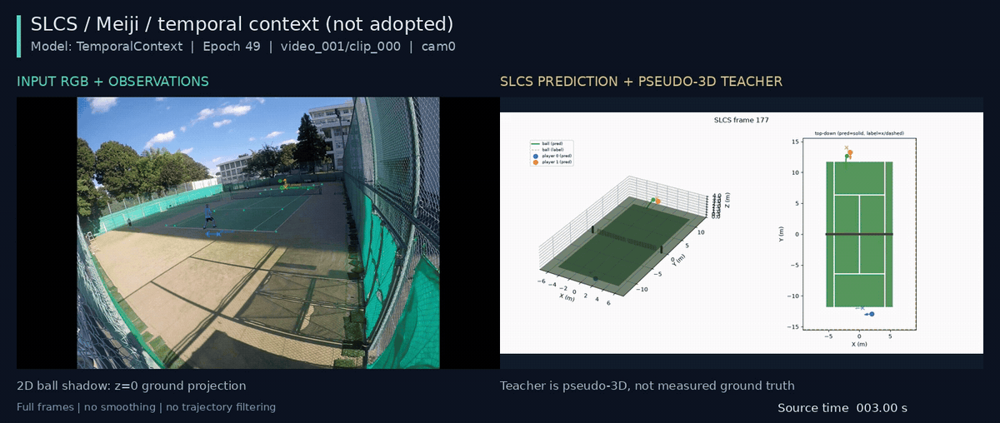

## 考察 / Findings

### 要約

未採用のTemporalContext候補を、基準と同じMeiji validation clip・cam0で全長CPU推論した。
全1316frameの予測、overlay 1316frame、3D 439frameを確認し、PR用に同じ3.0–11.0秒を同期合成した。
改善例の選別ではなく既存の固定区間を維持し、候補が未採用であることを映像内にも表示した。

### アーキテクチャ詳細

親のvalidationで選定したepoch49を使用。checkpoint SHA256は`94793e761d22a1f163d8089ae0210b6cb45f7c37144deb498c31b4d85fd6f961`。
推論sourceは`dda1cc664080a0360550b7b6766b476cd23808de`、既存動画の合成sourceは`760195c02ace1f61a102cd1ce8f97431f52ad0fc`。
元の解像度・全画角を維持してletterboxし、異なるFPSは同じwall-timeの直前frameを選ぶ。時間補間・平滑化・軌道filterは加えない。
GIFは1200×508へ表示用に縮小・色量子化し、元の1440×610 MP4と3時点PNGも保存する。

### メトリクスの解釈

NPZの全数値配列は有限、各frameのwindow coverageは1–2。全元動画と比較MP4のdecode、およびGIF 80frame・8秒を確認した。
previewは定性的な例で、当該clipやdomain全体の性能を代表する統計的抽出ではない。
全343 validation窓における定量評価は親ノードを参照し、この動画から別の精度値を推定しない。
推論のみのrunでTensorBoardはなく、収束曲線は対象外。入力・出力SHAと配列形状をsummary.jsonに保存した。

### アーキテクチャ⇄メトリクスの因果考察

動画では選手位置のずれなど残存誤差も確認できるが、視覚的な印象だけでは原因・汎化を断定しない。
右側の教師はpseudo-3Dであり実測ground truthではない。左側のball影はz=0投影で、画像ballとの一致度には使わない。
公開predict_clipは重複windowを平均してclipを組み立てるため、window occurrence単位の評価と見え方が異なり得る。

### 既存実験との比較

基準epoch56とclip・camera・表示区間を固定した比較である。候補は欠損の全体平均とvisibility境界を改善したが、
broadcastの位置誤差やplayerなどが悪化したため親の判定は不採用。この動画を根拠に判定を覆さない。
基準動画はrelations先を参照する。図中のモデル名・epochとPRの数値表を対応させる。

### 次に有効な実験

進行中のtrain-domain抽出頻度を均衡化する比較を5条件validationで評価する。
数値と固定clipの両方を確認し、候補を採用する場合はそのcheckpointで可視化も再生成する。

