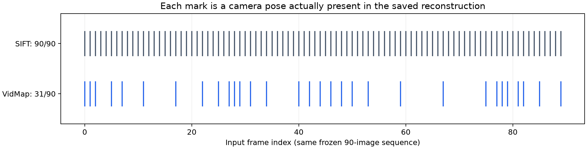

## 現時点の判断

初夜は現行SIFT/COLMAPを維持する。VidMap既定構成はRTX 5060 Ti 16GBでB00共通90枚を完走したが、出力は31 keyframeだけで、59枚のposeはrecにない。NHTへの直接置換条件を満たすとは確認できていない。独立GTがないため、絶対精度や地面ドリフトの改善も結論しない。

| 共通入力90枚 | SIFT/COLMAP | VidMap既定 |
|---|---:|---:|
| 出力pose / 元入力 | 90/90 | 31/90（選択keyframeは31/31登録） |
| 疎点 | 44,993 | 10,280 |
| 再計算した点残差p95 | 1.987 px | 2.415 px |
| queue実行時間 | 480.068秒 | 105.863秒 |
| 装置全体のサンプル最大memory | 1,522 MiB | 15,860 MiB |

[基準run](000025-run-i1034-nht-b00-p90-s42-a1.md)と[VidMap共同比較](000028-run-i1034-vidmap-b00-p90-default-a0.md)に、定義・config・原始metrics・logを保存した。同じmanifestと原寸pixel座標を確認し、両方の最終geometryから残差を再計算した。今回の保存済みerrorとの差は両方0だった。特徴点集合とcamera modelは異なり、内部残差だけで品質の優劣を決めない。SIFTはCPU、VidMapはGPU frontend/CPU mapperかつsanity cache再利用であり、時間の比を一般的な高速化率にしない。

## 成立性・失敗・予算

[初回SIFT](000024-run-i1034-nht-b00-p90-interrupted-a0.md)は容量不足によるWSL停止で結果を失った。後のconfigを当時のものとして補完せず、正確な再実行不能という制限を保持した。[小tensor probe](000026-run-i1034-vidmap-cuda-probe-a0.md)と[実画像12枚sanity](000027-run-i1034-vidmap-b00-sanity12-a0.md)を経て、共通90枚まで拡大した。

完了4 runの実測予約時間は952.011秒。中断分の保守的な会計値1260秒を足した使用枠は2212.011秒（36分52秒）/6時間で、予算を超えていない。待機とCPU環境構築は含めない。VidMap 90枚の観測最大memoryは約15.49 GiBであり、長尺拡大やhalf並列への余裕は確認していない。

## 導入に必要な次の処理

NHTの公開境界はstandard scene exportで、raw recの直接importではない。既存candidate benchmarkへ渡すには候補manifest/frames/modelへのbridgeが必要。非keyframe poseを用意する比較と、両手法の共通登録view集合に絞る比較を分ける。後者では同一の学習・validation画像名とNHT recipeを固定してRGB/白線品質を測る。品質gateを根拠なくacceptedへ変更しない。PyCOLMAP 4.1.1でVidMap recと同じcamera centerを読めたが、旧trainer SceneManagerとNHT training/exportは未検証。

[LIMAP v2.0.0](https://github.com/cvg/limap/releases/tag/v2.0.0)は既存SIFTモデルへ点・線・平面構造を加える候補。Holistic BAには平面検出器とnative環境の追加準備が必要で、今回は未実行。[GLUEMAP](https://github.com/colmap/gluemap/blob/main/INSTALL.md)も別native/Python環境と複数の重みが未準備で、16GB/90枚の適合・性能は未確認。今夜の数値表に両方式の性能を埋めない。

## 検証の範囲

入力hash・原寸・有限geometry・最終残差・旧PyCOLMAP読込と通常テストを確認した。knowledgeの構造検査は科学的妥当性の独立評価ではない。独立validator回数は未指定なので0回。raw reproの保存を優先し、初回失われたconfig、保存先の変わったconfig参照、外部native moduleを現行repro path checkerが解決できない制限を残す。自動再現チェックまで全件成功とは主張しない。
