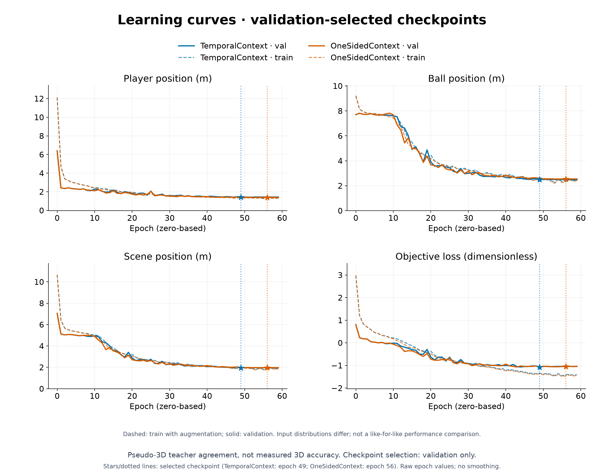
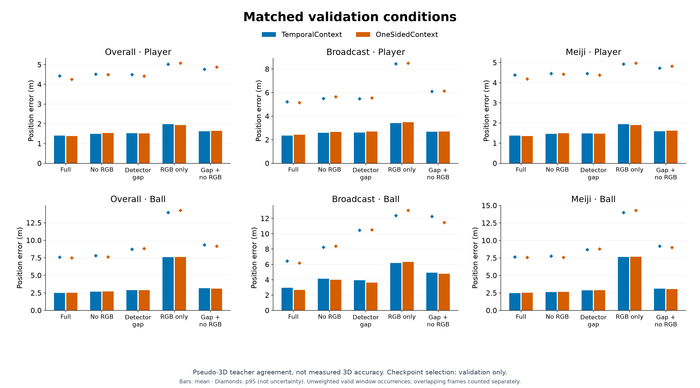
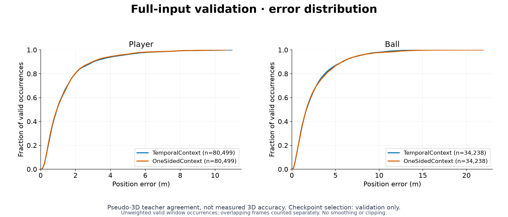

# 実RGB SLCSの到達点と採否 — PR #902

2026-09-19時点。Meiji全56clipの教師生成・全件監査、broadcast 5clipとの統合、PLCS/BLCSおよびSLCSの60epoch学習を完了した。全体版SLCSは定数に近いball出力から前進し、RGBの寄与も確認できた。一方、欠損境界の不連続・domain別の退行・裾誤差が残り、**頑健な最終モデルは未達**である。固定test 239窓は最終モデル評価にまだ使っていない。

この文書はレビュー時の結論と根拠をまとめる。生成・評価の操作は[データ生成ガイド](../../src/tennis_scene/dataset_pipeline/README.md)、各試行の設定・数値・失敗履歴は[実験グループ](../nodes/group-slcs-real-rgb.md)とリンク先のrunを正本とする。

## 要求と現在の状態

| 要求 | 実装・根拠 | 状態と限界 |
|---|---|---|
| `src/tasks`の出力規約統一 | [出力規約](../../src/tasks/OUTPUTS.md)、学習・生成・評価のrun別出力 | 実装済み。過去runの保存コマンド・実行時pathは履歴として保持 |
| 指定CourtとMeiji outsourceから教師生成 | [v9 Court](../nodes/run-slcs-meiji-v9-court-v1.md)、[全件QC](../nodes/run-slcs-meiji-v9-full-qc-v2.md) | 56clip完了。疑似3D教師であり実測GTではない |
| PLCS/BLCSを60epoch学習し比較 | 下記の教師評価、各runの曲線・予測 | 完走・validationによる重み選定済み。実映像の全指標改善ではない |
| 実RGB SLCSの学習と欠損頑健化 | 全61clip、60epoch比較、固定valの5入力条件 | 学習成立と部分効果を確認。最終採用・固定test評価は未完了 |
| 1コマンドで教師・RGB特徴まで生成 | [生成ガイド](../../src/tennis_scene/dataset_pipeline/README.md)、[cold/warm/cold検証](../nodes/run-slcs-meiji-one-clip-repro-takeover-v1.md) | 通常経路を実装し1clipで3回完走。coldのbit-exact一致は不成立 |
| 学習・誤差・実映像を可視化してレビュー | run添付の曲線、条件別・分布図、[Meiji](../nodes/run-slcs-temporal-context-meiji-visual-v1.md)・[broadcast](../nodes/run-slcs-temporal-context-broadcast-visual-v1.md)の可視化 | 保存成果と根拠を提示。単一clipの見た目を採用根拠にはしない |
| 別会場を追加して頑健化 | [候補在庫](../nodes/run-slcs-broadcast-unused-source-inventory-v1.md)、生成ガイドの監査付きdetector入口 | 入口は実装済み。候補の教師生成・QC・追加採用・学習は未実施 |

ここで「完了」はローカルで実行・検証した範囲を指す。run内の `outputs/`・`data/`・checkpoint参照はローカル成果であり、PRに大容量原本が含まれることを意味しない。Git管理の文書・集計・図とローカル原本を区別し、PRへのpush・CI・独立評価・merge可否は統合時の確認対象とする。本稿作成時の指定validator評価は3回、試行／完了は0／0である。

## データと評価値の意味

[全体版 `real_rgb_v1`](../nodes/run-slcs-real-rgb-full-assembly-v1.md)はMeiji 56clip＋broadcast 5clip、173 clip-camera、32,973時刻を持つ。frame数はカメラ数を掛けた数ではない。[本番loader計数](../nodes/run-slcs-real-rgb-cpu-smoke-v1.md)はtrain/val/test = 466/343/239窓、低品質窓の除外0。分割は次のとおり固定した。

| split | Meiji収録 | broadcast会場 | clip数 / 窓数 |
|---|---|---|---:|
| train | `video_000` | Shanghai、Washington | 15 / 466 |
| val | `video_001` | indoor hard | 22 / 343 |
| test | `video_002` | Eastbourne | 24 / 239 |

Meiji ball入力はoutsourceの2D注釈、Courtは指定checkpointによる推定と幾何fit、人物はDINO/ViTPose観測である。PLCS/BLCS推論と多視点幾何補正から3D教師を作り、支持・再投影・速度等の品質条件を適用する。人物軸は視点ごとのnear/farから共通軸へ対応付ける。単眼broadcastのballは保存scene由来の疑似2D観測で、Meijiの人手注釈とは異なる。単眼ball教師weightは0.15で、奥行きの不確かさを残す。教師の定義・支持mask・補間・除外の規則は[品質判定](../../src/tennis_scene/dataset_pipeline/README.md#品質判定と教師の意味)を参照。

以下のSLCS誤差は、有効な疑似教師へのwindow occurrence単位の非加重平均である。重複窓の同じframeも別occurrenceとして数える。学習の品質weightやtrain平均baselineのfit重みとは区別する。独立実測3D正解はなく、再投影の改善も同じ観測との整合性である。全体valの333窓がMeiji、10窓がbroadcastなので、全体平均だけで採否を決めない。

入力条件はfull、RGB特徴を消すno_rgb、中央40frameのball・両選手検出を消すdetector_gap、さらにRGBも消すdetector_gap_no_rgb、Courtを含む2D入力を消すrgb_only。教師は変更せず、比較間の教師・mask・weight・窓・観測を照合する。条件の厳密な契約は[SLCS評価ガイド](../../src/tasks/slcs/README.md#推論評価解析)に集約する。

## 教師モデルとCourtの比較

| 比較 | 結果 | 判断 |
|---|---|---|
| [Meiji BLCS、別収録52 scene](../nodes/run-slcs-blcs-meiji-finetuned-eval.md) | 旧重み3.211951 → validation選定epoch58の0.478988m | 同一の幾何疑似3Dへの適応を確認。実測3D・未知会場の精度とは呼ばない |
| [Meiji PLCS、source-motion分離合成test 200 scene](../nodes/run-slcs-plcs-meiji-foot-e60-selected-test.md) | 選定epoch57、位置0.245269m、角度5.33124°、canonical MPJPE 0.144314m | validation位置で選定。終端epoch59はGPU BF16、選定評価はCPU FP32なので差を重みだけへ帰属しない |
| [同じ実RGB 2clipでPLCS重み比較](../nodes/run-slcs-plcs-meiji-real-final-eval.md) | raw pose再投影中央値16.3390→14.8063px / 15.3816→15.4906px | 一方は改善、一方は退行。raw平均・p95は両clipで悪化し、外れ値耐性は未達 |
| [broadcast BLCS 60epoch](../nodes/run-slcs-blcs-broadcast-e60-v1.md) | 終端合成test位置2.52331m、使用重みはval選定epoch53 | 同条件の旧重み対照なし。Meiji多視点との数値の直接比較は不可 |
| [broadcast PLCS 60epoch](../nodes/run-slcs-plcs-broadcast-e60-v2.md) | 終端合成test位置1.651168m、角度65.0°、使用重みはval選定epoch52 | 学習は主に30Hz、既存合成評価はnative120Hz。単眼教師の制約を維持 |
| [Court crop補正](../nodes/run-slcs-meiji-court-crop-comparison-v1.md) | 第3収録cam0の局所白帯差最大26.69→1.51px | v9生成へ採用。局所画像診断であり独立3D精度ではない |
| [Court DB＋HOG検索＋ECC](../nodes/run-slcs-court-db-meiji-rgb-v1.md) | 9視点45候補、手動注釈3視点42点の平均7.31→58.72px | 不採用。RGB線の距離スコア改善が幾何精度改善を保証しない反例 |

## SLCSの比較と採否

先行pilotはMeiji 2＋broadcast 5clip、train/val/test = 88/43/2窓で、testにMeijiは含まれない。[欠損augmentation](../nodes/run-slcs-rgb-pilot-augmented-selected-conditions-v2.md)は[baseline](../nodes/run-slcs-rgb-pilot-baseline-selected-conditions-v2.md)に対してtest playerのgap誤差3.5483→3.1909mを改善したが、fullは2.8213→2.8633mへ退行した。ballの低分散は残った。[ball平滑化を外す比較](../nodes/run-slcs-pilot-no-ball-smooth-eval-v1.md)はval ball 7.0308→7.0030mに留まり、さらに[位置weightを8倍](../nodes/run-slcs-pilot-no-ball-smooth-ball8-eval-v1.md)にするとball 7.0156m、player 2.8882mへ悪化したため不採用である。

全体版はseed42、60epoch・1,800更新で、pilotの360更新からデータ・更新数が変わる。以下は固定val343窓のvalidation選定重みを比較する。pilotからの差を平滑化除去だけの効果とは解釈しない。表中は位置平均誤差m、epochは0始まり。各行のリンク先に正確な数値・曲線・条件別配列・採否根拠を保存する。

| 候補（選定epoch） | 直接対照・単独変更 | full ball / player | gap ball / player | 採否 |
|---|---|---:|---:|---|
| [全体基準](../nodes/run-slcs-full-real-rgb-no-ball-smooth-val-v3.md)（56） | no-ball-smooth、burst24 | 2.5210 / 1.3826 | 3.0973 / 1.4631 | 比較基準を保持。最終モデルではない |
| [gap48](../nodes/run-slcs-full-real-rgb-gap48-val-v1.md)（55） | 基準から学習burst最大長24→48 | 2.4544 / 1.3467 | 2.8979 / 1.4248 | broadcast full/gap退行で置換せず |
| [教師速度との整合loss](../nodes/run-slcs-full-real-rgb-velocity-val-v2.md)（49） | 基準に速度loss | 2.5475 / 1.4103 | 3.1569 / 1.5270 | 位置・欠損境界が退行し不採用 |
| [欠損ballへのCourt文脈](../nodes/run-slcs-full-real-rgb-missing-ball-court-val-v1.md)（49） | 基準にCourt-only射影 | 2.5373 / 1.4067 | 3.1814 / 1.5203 | full/gap・player退行で不採用 |
| [両側TemporalContext](../nodes/run-slcs-full-real-rgb-ball-temporal-context-val-v1.md)（49） | 基準に左右観測featureの文脈 | 2.4899 / 1.4058 | 2.8936 / 1.5188 | ball平均・境界は改善、broadcastとplayer退行で置換せず |
| [DomainBalanced](../nodes/run-slcs-full-real-rgb-temporal-domain-balanced-val-v1.md)（56） | TemporalContextのtrain抽出頻度のみ均衡化 | 2.4896 / 1.2432 | 2.9157 / 1.3365 | player改善、ball裾・境界・RGB寄与の退行で不採用 |
| [OneSidedContext](../nodes/run-slcs-full-real-rgb-one-sided-context-val-v1.md)（56） | 非均衡TemporalContextに片側観測文脈 | 2.5318 / 1.3858 | 2.9050 / 1.5097 | 片側局所改善、全体ball退行で不採用 |

全体基準のfull ball 2.5210mはtrain-only定数baseline 7.6922mを下回り、no_rgb 2.6813mに比べても小さい。[追加gap/noRGB比較](../nodes/run-slcs-full-no-smooth-gap-rgb-val-v2.md)でも欠損区間の平均にはRGBの寄与があった。ただしfull p95 7.6934m、最大予測速度481.77m/s（教師最大63.94m/s）が残る。これが「学習は前進したが頑健化は未達」とする根拠である。

反例は施策ごとに異なる。gap48は全体平均が良くてもbroadcast ballがfull 2.4293→2.5768m、gap 3.6010→3.7665mへ退行した。TemporalContextはfullの両欠損境界速度誤差を61.9056/60.7835→35.0919/35.6178m/sへ改善したが、broadcast full/gapは2.9542/3.9365mへ悪化した。DomainBalancedはplayerを改善しても最大速度935.38m/s、gap ball p95 9.1721mとなり、broadcastではRGBを消した方が位置平均が良かった。

OneSidedContextの直接対照はDomainBalancedではなく非均衡TemporalContextである。fullの左だけ／右だけに観測がある欠損では平均5.8861→4.0418m／4.0235→2.7011mへ改善した一方、観測ありは2.4533→2.5057m、観測なしは7.4172→10.6788mへ退行した。最大速度は370.54m/sまで下がっても依然大きく、gap位置p95や高速教師区間の速度誤差p95も悪化した。局所改善・平均改善・最大速度低下のいずれも単独では採用条件を満たさない。

いずれも単一seedの再学習比較で、統計的な一般化の証明ではない。gap48は中断からの再開時RNG継続にも限界がある。DomainBalancedとOneSidedContextを元基準と比較する場合は複数変更となる。固定testを追加探索の選定へ利用しない。

図の入力SHA・checkpoint選定receiptは[manifest](../runs/run-slcs-full-real-rgb-one-sided-context-val-v1/direct_control_figures/manifest.json)で追跡する。条件図の平均・p95は信頼区間ではない。モデルの実映像への重畳と、疑似教師に対する誤差図は別の証拠として読む。

## 再現性・失敗記録の扱い

固定split、設定、重み選定receipt、入力digest、保存予測により比較条件を追跡できる。ただし「同じ環境で同じ手順が完走した」「固定保存配列から指標を再計算できる」「独立生成がbit-exact」は異なる保証である。

[1clip cold/warm/cold](../nodes/run-slcs-meiji-one-clip-repro-takeover-v1.md)は3回の生成が成功し、warmのdataset/observationはbyte不変だった。独立cold間でball・Court・DINO特徴は一致したが、refined player位置に最大成分差0.000126779m等があり、事前条件である許容誤差0の比較はfailedのまま保持した。後付けの許容値で成功へ読み替えず、全56clipのQCとも区別する。

[Meiji全件QC](../nodes/run-slcs-meiji-v9-full-qc-v2.md)は9clipの退避付き修復後に欠落・不正0を確認した。以前のproducer/teacher記録不整合や再生成を消していない。全体SLCSの[初回CRC停止](../nodes/run-slcs-full-real-rgb-no-ball-smooth-start-failure-v1.md)、[process消失による中断](../nodes/run-slcs-full-real-rgb-no-ball-smooth-interrupted-v2.md)、[速度評価の空出力](../nodes/run-slcs-full-real-rgb-velocity-val-interrupted-v1.md)も、成功した後続runと別記録で残す。

[checkpoint読取snapshot比較](../nodes/run-slcs-meiji-stream-byte-diff-v1.md)では1byte/1bitの差を保存内容から確認した。[Windows監査](../nodes/run-slcs-host-storage-audit-v1.md)にNVMe resetとbugcheck記録はあるが、SHA不一致やクラッシュとの因果は未確定で、SSD故障・Windowsアプリ・GPU等へ原因を断定しない。再取得や後続の成功も原因解決の証拠とは扱わない。DINO/ViTPoseに限る明示的なcheckpoint警告方針と、その内容認証上の限界は[生成ガイド](../../src/tennis_scene/dataset_pipeline/README.md)に記載している。

## 残る判断

頑健な最終SLCSの採用条件をまだ満たしていない。欠損・観測なし・高速区間・domain別の失敗を保持したまま、validationによる選定を閉じてから固定test 239窓で評価する必要がある。今ある候補のうち最小の全体平均だけを選んで達成とはしない。

別会場のraw候補は疎な目視確認までで、連続shot、カメラ静止性、2D ball、教師品質の確認が残る。既存val/test会場と衝突する候補もある。[在庫監査](../nodes/run-slcs-broadcast-unused-source-inventory-v1.md)と監査付きdetector入口の実装は追加データの完成を意味しない。新しいtrain-onlyデータ版としての採用・学習は未実施である。

独立実測3Dまたは独立した位置基準、複数seed・未知会場での確認も残る。PRでは、生成基盤・比較可能な実験記録・有効でなかった施策を含む知見をレビュー対象とし、実世界3D精度と頑健性の達成範囲を広げて表現しない。
