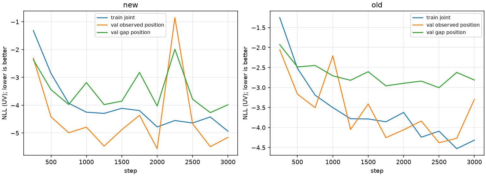

# run20 CPU精度診断

bucketはepoch9 top-1誤差≤8 / (8,20] / >20 source px。新旧とも同じframe。

| source | bucket | n | 新refiner誤差 p50/p90/p95 | 旧refiner誤差 p50/p90/p95 | 新refiner→e9距離 p50/p90/p95 |
|---|---|---:|---|---|---|
| tracknet | within8 | 1415 | 16.20 / 23.75 / 26.68 | 10.98 / 16.33 / 18.44 | 16.87 / 24.74 / 27.42 |
| tracknet | 8to20 | 98 | 18.62 / 34.07 / 46.60 | 12.04 / 27.39 / 45.81 | 18.95 / 33.07 / 42.29 |
| tracknet | wrong | 25 | 41.40 / 101.22 / 106.25 | 31.94 / 73.73 / 169.72 | 43.72 / 341.43 / 355.95 |
| tracknet | all | 1538 | 16.44 / 24.68 / 28.69 | 11.06 / 17.41 / 20.64 | 17.09 / 25.55 / 28.62 |
| meiji | within8 | 14182 | 19.74 / 32.61 / 37.47 | 20.01 / 217.16 / 335.99 | 19.60 / 32.72 / 37.79 |
| meiji | 8to20 | 3872 | 23.49 / 42.99 / 62.02 | 46.11 / 312.07 / 417.56 | 23.63 / 40.40 / 60.81 |
| meiji | wrong | 4953 | 142.97 / 483.52 / 636.69 | 154.75 / 530.82 / 622.97 | 37.19 / 197.71 / 286.75 |
| meiji | all | 23007 | 23.66 / 175.22 / 295.24 | 33.38 / 331.76 / 478.73 | 22.23 / 54.46 / 120.62 |
| chat_annotation | within8 | 3948 | 26.38 / 42.70 / 53.83 | 17.94 / 30.48 / 48.88 | 26.16 / 42.08 / 53.87 |
| chat_annotation | 8to20 | 1609 | 31.66 / 82.02 / 167.25 | 22.02 / 114.73 / 307.90 | 31.13 / 82.50 / 173.21 |
| chat_annotation | wrong | 1065 | 168.34 / 570.97 / 682.94 | 175.51 / 641.62 / 756.78 | 111.53 / 520.79 / 701.43 |
| chat_annotation | all | 6622 | 29.81 / 170.33 / 315.27 | 20.20 / 207.01 / 374.54 | 29.15 / 134.03 / 279.73 |

sigmaは最大weight成分のsource px共分散の長軸1σ。z=√(誤差ᵀΣ⁻¹誤差)、2次元正規の期待p50/p90/p95は1.177/2.146/2.448。
成分ellipse coverageはGMM HDR coverageではない。

| source | model | sigma p50/p90/p95 px | z p50/p90/p95 | 成分50/90/95% coverage | 最近候補距離 p50/p90/p95 | ≤2px比率 |
|---|---|---|---|---|---|---:|
| tracknet | new | 11.32 / 13.90 / 17.05 | 1.48 / 2.14 / 2.33 | 0.267 / 0.901 / 0.965 | 17.08 / 25.51 / 28.59 | 0.003 |
| tracknet | old | 12.54 / 15.51 / 17.44 | 1.12 / 1.77 / 2.01 | 0.546 / 0.967 / 0.984 | 10.91 / 15.79 / 18.25 | 0.002 |
| meiji | new | 17.81 / 27.11 / 31.08 | 1.42 / 7.34 / 13.65 | 0.379 / 0.764 / 0.803 | 21.94 / 43.72 / 65.24 | 0.007 |
| meiji | old | 25.65 / 84.67 / 124.43 | 1.27 / 10.02 / 17.11 | 0.448 / 0.712 / 0.735 | 18.53 / 122.06 / 181.42 | 0.006 |
| chat_annotation | new | 18.99 / 51.46 / 286.82 | 1.58 / 2.63 / 3.72 | 0.280 / 0.795 / 0.873 | 28.69 / 76.11 / 128.83 | 0.003 |
| chat_annotation | old | 21.23 / 74.46 / 210.89 | 1.23 / 2.65 / 5.75 | 0.463 / 0.862 / 0.889 | 17.04 / 72.36 / 149.26 | 0.003 |

| model | step | train joint NLL uv | val observed位置NLL uv | val gap位置NLL uv | 選択NLL uv |
|---|---:|---:|---:|---:|---:|
| new | 250 | -1.3141 | -2.3039 | -2.3627 | -2.3333 |
| new | 500 | -2.8566 | -4.4175 | -3.4404 | -3.9290 |
| new | 750 | -3.9294 | -4.9892 | -3.9727 | -4.4809 |
| new | 1000 | -4.2496 | -4.7876 | -3.1850 | -3.9863 |
| new | 1250 | -4.2937 | -5.4699 | -3.9767 | -4.7233 |
| new | 1500 | -4.1109 | -4.8798 | -3.8518 | -4.3658 |
| new | 1750 | -4.1919 | -4.3624 | -2.8213 | -3.5919 |
| new | 2000 | -4.7800 | -5.5615 | -4.0292 | -4.7953 |
| new | 2250 | -4.5492 | -0.8497 | -1.9874 | -1.4185 |
| new | 2500 | -4.6384 | -4.6665 | -3.7830 | -4.2248 |
| new | 2750 | -4.4212 | -5.4889 | -4.2659 | -4.8774 |
| new | 3000 | -4.9343 | -5.1540 | -3.9814 | -4.5677 |
| old | 250 | -1.2515 | -2.0553 | -1.9273 | -1.9913 |
| old | 500 | -2.5179 | -3.1636 | -2.4846 | -2.8241 |
| old | 750 | -3.1904 | -3.5035 | -2.4473 | -2.9754 |
| old | 1000 | -3.5018 | -2.2056 | -2.7063 | -2.4560 |
| old | 1250 | -3.7795 | -4.0483 | -2.8185 | -3.4334 |
| old | 1500 | -3.7856 | -3.4112 | -2.6039 | -3.0076 |
| old | 1750 | -3.8561 | -4.2532 | -2.9581 | -3.6057 |
| old | 2000 | -3.6215 | -4.0568 | -2.8928 | -3.4748 |
| old | 2250 | -4.2415 | -3.8361 | -2.8389 | -3.3375 |
| old | 2500 | -4.0909 | -4.3801 | -3.0031 | -3.6916 |
| old | 2750 | -4.5283 | -4.2687 | -2.6221 | -3.4454 |
| old | 3000 | -4.3144 | -3.2951 | -2.8124 | -3.0537 |

trainはdropout/人工gapありのepoch平均joint NLL、valはepoch末evalの条件付き位置NLL。train位置項単独は元ログにないので正確な汎化gapには読み替えない。

保存済みbest更新epochのMeiji選択側。各モデル自身のdetector誤差≤8pxに限定。epochで偏りの向きが変わる。

| model | epoch (0-based) | n | x偏り中央値 px | y偏り中央値 px | 誤差中央値 px |
|---|---:|---:|---:|---:|---:|
| new | 0 | 7221 | 62.83 | -43.72 | 130.04 |
| new | 1 | 7221 | -31.11 | -9.42 | 39.14 |
| new | 2 | 7221 | -17.64 | 5.29 | 21.46 |
| new | 4 | 7221 | -14.15 | -2.05 | 17.35 |
| new | 7 | 7221 | -17.16 | -1.34 | 18.12 |
| new | 10 | 7221 | 18.30 | 0.63 | 19.59 |
| old | 0 | 4986 | 12.90 | -1.71 | 142.01 |
| old | 1 | 4986 | 3.23 | 21.98 | 34.52 |
| old | 2 | 4986 | 35.25 | -5.14 | 37.50 |
| old | 4 | 4986 | 1.76 | 7.45 | 14.23 |
| old | 6 | 4986 | 0.97 | 3.77 | 9.52 |
| old | 9 | 4986 | 8.81 | 8.83 | 16.63 |