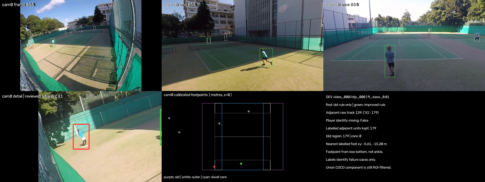
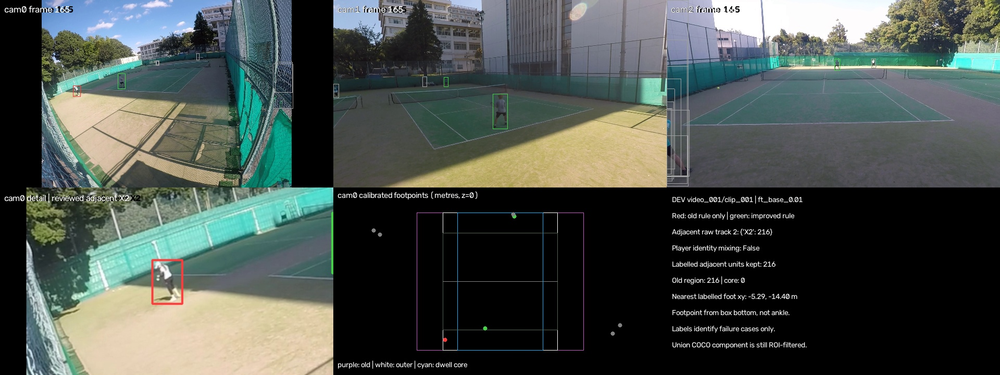

# 隣コート混入の原因と断片連結後の選別（run 5）

固定4 dev clip / 12 camera-clip / 10,491 frame。run 4のtrack・box・CLIPをCPUで再利用した。予約未見の映像/ラベルは読まず、pipeline既定・#937重み/閾値は変更しない。

## 原因分離

旧選別で残った隣コートunitを、選択済み予測とCOCO由来の参照boxの1対1 IoU>=0.3で対応付けた。同じframeの非選択duplicateが単位を奪わないようにした。以下のtrackの確認可能なラベルは隣コート人物だけで、選手labelとのidentity mixingは無い。未ラベル区間の混在は未確認。

|source|clip / camera / raw ID|構成|残存unit|旧領域内|ダブルス横幅内|dwell core内|x範囲 m|
|---|---|---|---:|---:|---:|---:|---|
|ft_base_0.01|video_000/clip_000 / cam0 / 139|{'X1': 179}|179|179|0|0|-6.145–-5.555|
|union_0.30|video_000/clip_000 / cam0 / 296|{'X1': 173}|173|173|0|0|-6.461–-5.555|
|ft_base_0.01|video_001/clip_001 / cam0 / 2|{'X2': 216}|216|216|97|0|-6.314–-4.995|
|union_0.30|video_001/clip_001 / cam0 / 32|{'X2': 216}|216|216|97|0|-6.314–-4.995|

旧sideline +2.5mが全ての誤採用unitを含んでいた。横余白0でも97 unitはダブルス横幅内に入る。したがって「人物混在の修正」だけでも「余白を0」だけでも説明・対処として足りない。コート足元は検出box下端の推定で、校正誤差・ラケットを含むboxの影響を切り分けていない。

## 改善ルールと適用範囲

定義の正本は[`court_linking.py`](../../../src/tasks/person_tracking/court_linking.py)。既存校正のside解決済みcameraからz=0へ逆投影する。court modelのシングルス横幅を滞在core、ダブルス横幅を受理する外側境界にし、両者にbaseline後方5mを残す。**横方向の正の余白を使わないので、主コートのsideline外にある隣コートを領域に含めない。** coreを使うことで横境界に停留する人物は選手の滞在を得ない。校正/box下端が誤った内側座標を出す場合まで幾何的に保証するルールではなく、今回の4 singles dev clipでの保守的な選別である。横に大きく走り出た選手の観測も除外する制約がある。

断片は既存windowed jump検査と1秒を超える観測gapで分割する。実観測端点0.1秒の中央値、位置連続性、保存済みCLIPが双方にあればcosine>=0.8で結ぶ。gap<=1秒、重複handoff<=0.2秒、mutual-bestとrunner-up差0.2。incoming/outgoingの曖昧さを別に扱い、長い断片の反対端にある確定リンクを妨げない。1秒未満の曖昧断片は除外する。distinctなcore観測frameをgroupで合算しclipの25%以上を選び、その後group上限6。handoffの同一frameは早いraw IDのboxを1つ採用し、scoreを使わない。補間や欠損frameを滞在に数えない。

保存済みCLIPのない断片はmissingを明記する。全人物Re-ID特徴の新規生成は行わず、次の比較で残る欠測として扱う。カメラ間対応を今回は再実行せず、CLIP既定on、person_identities v3、<1秒曖昧区間除外、<=0.2秒handoffの既存安全策は不変。

|source|連結edge|CLIPありedge|外観あり断片 / 全断片|除外した短い曖昧断片|cameraあたり候補group|cap除外|
|---|---:|---:|---:|---:|---|---:|
|ft_base_0.01|37|4|35/907|176|[2, 3, 4]|0|
|old_pipeline|7|3|29/69|0|[2, 3]|0|
|union_0.30|10|3|28/122|0|[2, 3]|0|

## run 4と同じ人物unit・identity表

unit=人物×camera×frame、同人物の旧重複boxを統合。選手identity保持はラベルunitの50%以上、非選手ID完全除外は残存0。非選手のcamera間同一性は未確認。旧COCO/旧tracker由来の部分参照なのでCOCO/旧経路に有利であり、**検出recallではない**。未ラベル予測をFPとしない。以下はIoU .3、.5もCSVに保存。old_ruleを同じ入力で再計算してrun 4と一致を確認した。

|source|段|選手ID保持|選手unit保持|非選手ID全除外|非選手unit除外|追跡hit非選手の選別除外|隣コート除外|コート外除外|
|---|---|---:|---:|---:|---:|---:|---:|---:|
|ft_base_0.01|old_rule|8/8|17948/20558 (87.30%)|4/8|3494/4454 (78.45%)|1897/2857|0/395|1915/2480|
|ft_base_0.01|region_only|7/8|17098/20558 (83.17%)|7/8|4134/4454 (92.82%)|2537/2857|395/395|2160/2480|
|ft_base_0.01|linked_dwell|8/8|18116/20558 (88.12%)|7/8|3839/4454 (86.19%)|2242/2857|395/395|1865/2480|
|union_0.30|old_rule|8/8|19366/20558 (94.20%)|4/8|3833/4454 (86.06%)|3828/4449|6/395|2248/2480|
|union_0.30|region_only|8/8|18498/20558 (89.98%)|7/8|4446/4454 (99.82%)|4441/4449|395/395|2472/2480|
|union_0.30|linked_dwell|8/8|19320/20558 (93.98%)|7/8|4446/4454 (99.82%)|4441/4449|395/395|2472/2480|
|old_pipeline|old_rule|8/8|20193/20558 (98.22%)|6/8|4055/4454 (91.04%)|4055/4454|395/395|2081/2480|
|old_pipeline|region_only|8/8|19221/20558 (93.50%)|8/8|4454/4454 (100.00%)|4454/4454|395/395|2480/2480|
|old_pipeline|linked_dwell|8/8|19444/20558 (94.58%)|8/8|4454/4454 (100.00%)|4454/4454|395/395|2480/2480|

old_rule=run 4、region_only=新領域/分割だけで連結なし、linked_dwell=改善版。FTの全選手保持は+168 unit、cam0 farは+662。一方cam1 farは−205、cam2 farは−59。unionの全選手保持は−46、保存旧経路は−749であり、隣コート除外とのトレードオフを残す。FTのコート外unit除外は1915→1865で50悪化し、region_onlyから連結するとコート外も戻る。コート内座標に投影される非選手を滞在だけで除けないことが残課題。既定へ採用せず、camera間の第2確認も次段階で検証する。

|source|段|cam0 far / 3270|cam1 far / 3430|cam2 far / 3367|
|---|---|---:|---:|---:|
|ft_base_0.01|old_rule|1859|2823|3285|
|ft_base_0.01|region_only|1669|2452|3226|
|ft_base_0.01|linked_dwell|2521|2618|3226|
|union_0.30|old_rule|2832|2934|3295|
|union_0.30|region_only|2799|2392|3236|
|union_0.30|linked_dwell|3072|2758|3236|
|old_pipeline|old_rule|3107|3430|3362|
|old_pipeline|region_only|2985|2981|2984|
|old_pipeline|linked_dwell|2985|3204|2984|

## camera×近遠（改善版）

|source|camera|side|選手保持 / 参照|追跡hit非選手の除外 / hit|隣コート除外 / 参照|
|---|---|---|---:|---:|---:|
|ft_base_0.01|cam0|all|5897/6767|706/1321|395/395|
|ft_base_0.01|cam0|near|3149/3270|561/561|381/381|
|ft_base_0.01|cam0|far|2521/3270|87/684|0/0|
|ft_base_0.01|cam0|unknown|227/227|58/76|14/14|
|ft_base_0.01|cam1|all|6112/6927|853/853|0/0|
|ft_base_0.01|cam1|near|3427/3430|78/78|0/0|
|ft_base_0.01|cam1|far|2618/3430|762/762|0/0|
|ft_base_0.01|cam1|unknown|67/67|13/13|0/0|
|ft_base_0.01|cam2|all|6107/6864|683/683|0/0|
|ft_base_0.01|cam2|near|2752/3367|0/0|0/0|
|ft_base_0.01|cam2|far|3226/3367|652/652|0/0|
|ft_base_0.01|cam2|unknown|129/130|31/31|0/0|
|union_0.30|cam0|all|6569/6767|1533/1533|395/395|
|union_0.30|cam0|near|3270/3270|561/561|381/381|
|union_0.30|cam0|far|3072/3270|896/896|0/0|
|union_0.30|cam0|unknown|227/227|76/76|14/14|
|union_0.30|cam1|all|6255/6927|1225/1233|0/0|
|union_0.30|cam1|near|3430/3430|78/78|0/0|
|union_0.30|cam1|far|2758/3430|1137/1142|0/0|
|union_0.30|cam1|unknown|67/67|10/13|0/0|
|union_0.30|cam2|all|6496/6864|1683/1683|0/0|
|union_0.30|cam2|near|3130/3367|0/0|0/0|
|union_0.30|cam2|far|3236/3367|1553/1553|0/0|
|union_0.30|cam2|unknown|130/130|130/130|0/0|
|old_pipeline|cam0|all|6482/6767|1534/1534|395/395|
|old_pipeline|cam0|near|3270/3270|561/561|381/381|
|old_pipeline|cam0|far|2985/3270|897/897|0/0|
|old_pipeline|cam0|unknown|227/227|76/76|14/14|
|old_pipeline|cam1|all|6701/6927|1237/1237|0/0|
|old_pipeline|cam1|near|3430/3430|78/78|0/0|
|old_pipeline|cam1|far|3204/3430|1146/1146|0/0|
|old_pipeline|cam1|unknown|67/67|13/13|0/0|
|old_pipeline|cam2|all|6261/6864|1683/1683|0/0|
|old_pipeline|cam2|near|3147/3367|0/0|0/0|
|old_pipeline|cam2|far|2984/3367|1553/1553|0/0|
|old_pipeline|cam2|unknown|130/130|130/130|0/0|

[camera.csv](camera.csv)は全3段×近遠、[identity.csv](identity.csv)は人物別、[clip.csv](clip.csv)はclip別、[selection_units.jsonl.gz](selection_units.jsonl.gz)は再集計可能な各unit。

## ソース公平性・GPU job

FTはROI前の全画面、保存unionはFT＋ROI後COCO、old_pipelineもROI後で、**今回もソース間の公平な最終比較ではない**。入力box/score/追跡はrun 4から変更していないためソース人数・旧box一致表は[run 4 sources.csv](../run-i964-court-selection-cpu-r4-20260929/sources.csv)を参照する。COCO全画面0.01のjob `1790686649923407965_657085_i964-coco-fullframe-r5-20260929` を#935の後へ登録した。旧重み、800/1333、12 camera-clip / 10,491 frame、ROIなし。60–80分、4–6GB VRAM、0.3GB出力を見積り、全job90分timeout・torch allocator6GiBを設定した。推論結果と公平な最終3ソース比較は次runに回収する。[投入前申告](https://github.com/Motoki0705/tennis-lab/issues/964#issuecomment-5890760583) / [queue.json](queue.json) / [固定入力plan](coco_plan.json)。

## 開発中に不採用にした試行

初回はフレーム間距離で分割したため投影ノイズで過分割になり、FT保持15,194/20,558、cam0 far722/3270に悪化した（[初回表](initial_selection.csv)、code `69b0719d`）。時間窓へ修正した0.5秒版でもFT保持17,465、cam0 far1746で、8ID中7しか保持できなかった（[0.5秒版](windowed_selection.csv)、code `6b31823c`）。
同じdevのcam0でgap 0.5/1/2秒とambiguity margin 0.2/0.05を比較した（[全試行log](linking_probe.txt)、[実行script](linking_probe.py)、code `6b31823c`）。1秒は0.5秒を超えるfar断片の空白をつなぎ、2秒は対抗候補を増やす。margin 0.05ではコート外人物も戻るため0.2を保った。最終版は1秒＋direction別ambiguity (`b9fec834`)。これは同じ4 devに基づく調整で、未見性能の主張ではない。

## 動画・検証

動画は `adjacent_failure_3cam.mp4`。2clip×FT/union各4秒=16秒、1920×720、20fps。3camera同期映像、cam0拡大、校正足元と旧/新領域、ラベル構成を示す。灰=その他track、赤=旧選択のみ、緑=改善版選択。ラベルは失敗例の事後指定にだけ使う。path/hash/readbackと代表frameは[video.json](video.json)。

関連28 tests成功後、連結gap/ambiguity修正と追加2caseをfocused 12 testsで検証。ruff/mypy/hooks成功。検出row・低score/ROI外保存、観測のみのdwell、重複handoffの二重計数防止、CLIP veto、曖昧短区間、足元ノイズ、隣コートの排除、診断の人物混在検知を確認。validatorは未指定のため0回。GPU全画面出力、最終追跡方式/encoder比較、v3への今回group接続、camera間対応再評価、全pipeline完走、未見一回評価は未完了。

動画path: `/home/kamimura/projects/tennis-lab/outputs/person_tracking/evaluate/court_selection/i964-cpu-r5-final-20260929/adjacent_failure_3cam.mp4`

SHA-256 `25e98ae199c92b5fb2112524ea8d3826ecafb5c2b40ea3ddf9a8c0dd4a5dd97a`。320/320 frame読戻し済み。代表frame 1/3を目視し、2つの隣人物が赤（旧選択のみ）になること、座標図とラベル構成が一致することを確認した。

