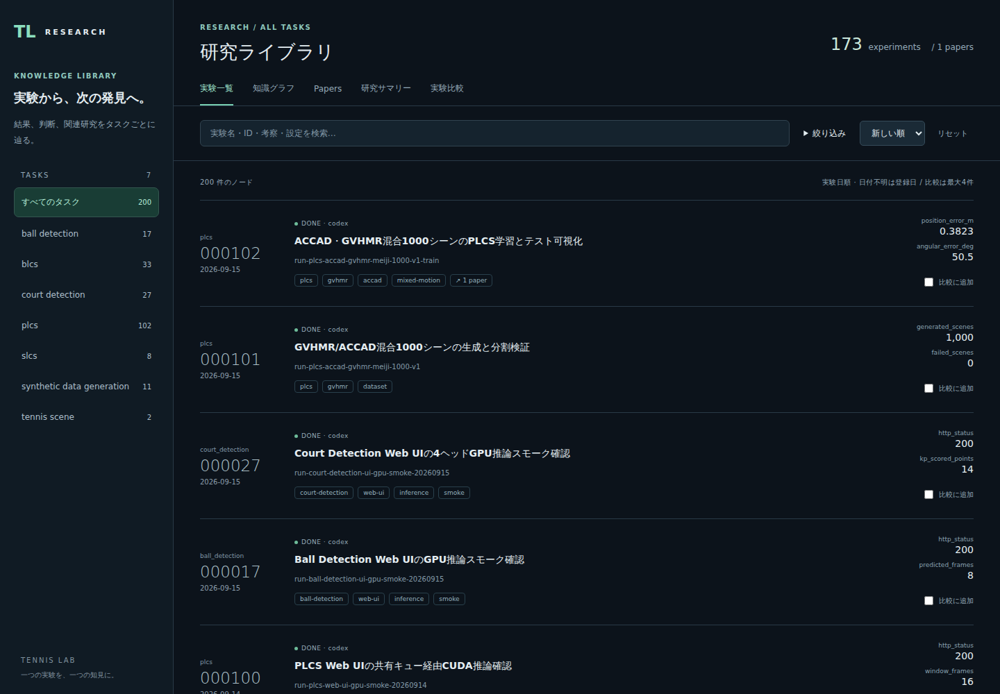

# Research Library — Web UI

タスクごとの実験・知識グラフ・関連論文・横断summaryを閲覧するNext.js / React Flow UI。
保存形式は [knowledge/README.md](../README.md) が正本。



```bash
cd knowledge/webui
npm ci
npm run dev                     # localhost:3000
npm run build && npm start      # production
```

- タスクはノードと論文metadataから自動発見。新しいトピックにも対応。
- 実験一覧: 実験日順、6桁連番、全文/設定検索、status/provider/tag/issue/論文の絞り込み、30件ずつのページ表示。
- グラフ: 前提から後続への有向線、グループの囲み、任意の関連線、zoom/minimap。
- 詳細: 考察、実測metrics、config、曲線、再現bundleのパス、前提・後続・関連実験、論文参照。Escapeで閉じる。
- 実験比較: 最大4件の条件・metricsを並置しCSV出力。異なる評価条件に自動の優劣を付けない。
- Papers: 論文情報・読解ノート・ローカルPDF閲覧・参照実験への逆引き。
- 研究サマリー: `summary.md` を表示し、根拠ノードへ遷移。
- URLにタスク・検索・フィルタ・表示・選択ノードを保持。`/?node=<id>`、`/?paper=<id>` で直接開ける。
- モバイル対応、キーボード操作、MarkdownのHTMLサニタイズ。

`KNOWLEDGE_DIR` でknowledge rootを変更可能（既定はアプリの親）。既存の
`KNOWLEDGE_NODES_DIR` / `KNOWLEDGE_RUNS_DIR` もサブディレクトリ指定に使える。
リクエストごとに正本Markdownを読むため、編集後の再読み込みで反映される。
読み込み失敗や不正なID・連番を空のライブラリに置き換えず、エラーとして表示する。
PDFバイナリは一覧に含めず個別routeから配信する。

## 検証・コードの入口

```bash
npm run lint
npm run test
npm run build
npx playwright install chromium  # 初回のみ
npm run test:e2e                 # 専用dev serverを起動
```

- `src/lib/{content,nodes}.ts`: Markdown/Papers/summary読込とリンク解決。
- `src/lib/explorer.ts`: 絞り込み・並び順・CSV。
- `src/components/ResearchExplorer.tsx`: ライブラリの状態と各ビュー。
- `src/components/{GraphView,DetailPanel}.tsx`: グラフとノード詳細。
- `src/app/api/{curves,papers}/[id]/route.ts`: 曲線・PDF。

一覧のDOMはページ単位、グラフは可視範囲だけを描画する。現在の200ノード規模では
サーバがMarkdownを読み、検索用本文もclientへ渡す。数千〜数万ノードに拡大する際は
本文取得と検索をサーバ側に分離する必要がある。別途生成したindexを正本として維持しない。
