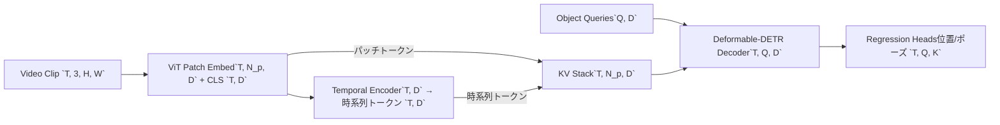

# プロジェクト

## プロジェクト概要
### 目的
- テニスの試合を解析するためのシステム全体を構築し、高精度で再現性の高い分析結果を安定的に提供する。
- 単眼カメラから3Dシーンを復元し、ボール・プレーヤーの位置やポーズをマルチモーダルに推論できるモデル群を開発する。
- 推論結果をもとにイベント検知と統計解析を実現し、LLMでユーザーに理解しやすいレポートへ変換する。

### 主要要素
- **モデル開発**: シーン検知モデルとイベント検知モデルを中心とした認識パイプラインを構築。
- **データ戦略**: 既存データセットと自作データセットを組み合わせ、高品質で大量なデータを柔軟に確保。
- **システム統合**: マルチカメラによる精度向上と、LLMによる考察生成を含むエンドツーエンドな解析体験を提供。

### データとLLM活用の方針
- マルチカメラ環境で取得したデータに加え、自作データセットを継続的に拡充してモデル精度を底上げする。
- 統計量の生成方法を事前に定義したうえでRAGを構成し、必要であればLLMをファインチューニングして示唆に富む解説を生成する。

## モデル構想
### 1. シーン検知モデル
#### 目的
- 単眼カメラの連続画像からボール・プレーヤーの3D位置とポーズを復元し、コートに対する相対位置を推論する（視覚特徴のみを利用）。

#### 入出力
- **入力**: 単眼カメラで取得したシーケンシャルな画像列。
- **出力**: ボールとプレーヤーの位置・ポーズをコート座標系で表現した相対情報。

#### アーキテクチャ案
- ViTで抽出したクラストークンをシーケンシャルエンコーダに入力し、時系列特徴へ圧縮して「時系列トークン」を生成。
- 「時系列トークン」とパッチトークンを結合し、Deformable-DETR風デコーダへKVとして入力。
- オブジェクトクエリがフレームごとのターゲットを直接探索し、位置・ポーズを回帰する構成を想定。



#### 実験ロードマップ
- 新規アーキテクチャの挙動が未確定なため、まずは単一モーダルの小規模データセットで動作検証を行う。
- 精度・安定性が確認でき次第、マルチモーダル入力と大規模データへ段階的に拡張する。

### 2. イベント検知モデル
#### 目的
- シーン検知結果を基に、事前定義したイベントの発生確率をフレーム単位で推定する。

#### 入出力
- **入力**: シーン検知モデルが生成した時系列特徴（クラストークン、プレーヤー・ボールの位置とポーズ）、音声埋め込み。
- **出力**: 各イベントの確率分布（フレームごとの発生確率）。

#### アーキテクチャ案
- シーン検知で得た特徴量を時系列モデルに入力し、各イベントの確率分布を出力する構成。
- ViTクラストークンと位置・ポーズ、音声埋め込みを統合して、イベントに敏感な潜在表現を形成する。

```mermaid
flowchart LR
    SC[Scene Tokens\n`(T, D_scene)`] --> FUSE[Feature Fusion]
    AU[Encodec Audio\n`(T, D_audio)`] --> FUSE
    META[Score / Context\n`(T, D_meta)`] --> FUSE
    FUSE --> CAT[Concat + Linear\n`(T, D_total)`]
    CAT --> TEMP[Temporal Encoder\n`(T, D_hidden)`]
    TEMP --> HEAD[Event Heads\n`(T, E)` ガウス状確率]
```

#### データと学習
- ビデオにイベントのタイムスタンプが付与された既存データセットを活用。
- 事前にシーン検知モデルで全データをエンコードして保存し、学習環境から即座に利用可能にする。
- 音声特徴（審判コール、インパクト音、観客リアクション等）はイベント検知モデルの入力として取り込み、映像ベースのシーン検知結果と同期させて利用する。
- 音声埋め込みは `AutoProcessor.from_pretrained("facebook/encodec_24khz")` と `EncodecModel.from_pretrained("facebook/encodec_24khz")` を用いて算出し、時間窓ごとの潜在ベクトルをイベント検知モデルへ供給する。

#### 検知対象イベント
イベント検知モデルは「瞬間」を確率ピークとして出力し、周辺フレームでガウス状に滑らかに遷移する時系列信号を生成する。主に以下の瞬間イベントを検知する。

- **サーブ関連**: トス開始、インパクト（1st/2nd区別）、サーブミス（ネット/アウト）、ダブルフォルト確定、サーブ直後のS+1ショット。
- **リターン関連**: リターン準備モーション（スプリットステップ）、リターンインパクト、リターンミス（ネット/アウト）、R+1ショット。
- **ラリー中ショット**: グラウンドストローク、ボレー、スマッシュ、ドロップ、ロブなど各ショットのインパクト瞬間。
- **ボール接触**: 各バウンド（コート接触）、ネットタッチ、ポール/選手への接触、インプレー終了を示すデッドボール。
- **ポジショニング**: プレーヤーの大きなフットワークイベント（スプリットステップ、ディレクションチェンジ、ネットアプローチ開始）、ネットへの侵入開始、後退開始。
- **クラッチ/スコア更新**: ポイント開始（サーブ前ルーチン完了）、ポイント終了（審判コール）、ブレークポイント/セットポイント/マッチポイント突入、といったスコア状態の変化瞬間。
- **フィジカル兆候**: ジャンプ発生、スライディング、急停止など、疲労やテンポ分析に使う動作瞬間。
- **音声トリガ**: インパクト音のピーク、審判コール、観客のリアクションなど、映像では検知しづらい瞬間を補強する音声イベント。
- **メタタグイベント**: サーバー交代、チェンジエンド開始/終了、サーフェス情報や屋内外タグの付与タイミング（試合ごとの初期イベントとして記録）。

### 3. LLM活用
#### 方針
- RAGを構築して統計データの表現テンプレートを定義し、モデル出力を観察しながら必要に応じてファインチューニングを実施する。

#### モデル選定
- 高度な考察力と要約力を重視し、テニスの戦術的示唆を説明できるモデルを選択する。

## システム全体像
1. シーン検知を動画に適用し、推論結果とエンコーダ特徴を保存する。
2. 保存済みのシーン検知結果と特徴量を入力としてイベント検知モデルを実行し、イベント推論結果を保存する。
3. シーン検知・イベント検知の両結果を統合して統計データを生成し、LLMでユーザー向けレポートに整形する。
