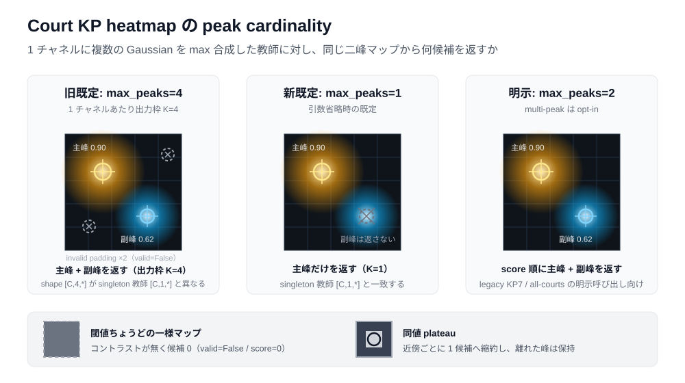

# Court Detection

テニス映像から `kp / seg / line / semantic_line` を推定します。データsourceとtarget集合は独立に選択し、単一の `CourtDetectionDataset` / `CourtDetectionDataModule` が任意の非空target subsetを処理します。

## Data composition

- `data/source=tennis_court_detector`: yastrebksv/TennisCourtDetector由来の実画像とordered KP14。
- `data/source=synthetic_court`: `schema: v3`を明示したcurrent synthetic source。manifestが明示したRGB配列とlabelsをstrictに読みます。保存codecは下記のSynthetic Court契約に従います。
- `data/source=synthetic_court_v2`: `schema: v2`を明示したlegacy synthetic source。
- `data/source=synthetic_court_v1`: `schema: v1`を明示したcanonical v1回帰source。physical pointを7 semantic multi-peak channelへまとめます。
- `data/processing=kp|seg|line|semantic_line|kp_seg|kp_line|seg_line|all`: 選択したtargetを同じ幾何変換で生成します。`all`が4-head構成です。

Synthetic schema v2/v3では`data.source.court_scope=target_court`を既定とし、sampleの`target_court.binding.court_instance_id`とexact matchする1面だけを4つのdense教師で共有します。`all_courts`を明示するとKP channelとcourt instance inventoryの両方が全accepted courtを保持しますが、現行のsingle-court dense schemaではmaterializationを拒否します。scopeはderived target pathとsource geometry digestにも含まれるため、旧all-court maskをsingle-court教師として再利用しません。target bindingを持たないv1で`target_court`を指定した場合はtyped configuration validationで拒否されます。

source固有のmanifest・annotation・path解決は `data/inputs/`、target固有の構築は `data/processing/targets.py` が所有します。`data/processing/geometry.py` はRGBと全targetに適用する幾何変換をsampleごとに一度だけ決定します。seg/line/semantic_lineはDataset内で生成せず、`data/target_generation/` で事前生成します。

TennisCourtDetector presetは、14点中8点しか一意でなくcourt planeを構成できない`QszoUKyCOHo_600`を`excluded_sample_ids`で明示的にquarantineします。設定したIDがannotation内のちょうど1件に一致しなければsource初期化時に停止するため、データ更新後も古い除外を静かに引き継ぎません。

```bash
# categorical/binaryのdense targetをsource外のderived storeへ生成
python -m src.tasks.court_detection.scripts.materialize_targets \
  data/source=tennis_court_detector data/processing=all

# synthetic sourceの4-head学習
python -m src.tasks.court_detection.scripts.train \
  data/source=synthetic_court data/processing=all \
  run.test_after_fit=true

# synthetic v3でcameraの対象コート1面だけを全モダリティの教師にする
python -m src.tasks.court_detection.scripts.train \
  data/source=synthetic_court data.source.court_scope=target_court \
  data/processing=kp

# legacy synthetic v2のdense targetを学習前にsource外へ事前生成
python -m src.tasks.court_detection.scripts.materialize_targets \
  data/source=synthetic_court_v2 data/processing=seg_line

# KP-only DINOv3 + DPT + LoRA
python -m src.tasks.court_detection.scripts.train \
  data/source=synthetic_court data/processing=kp \
  model/encoder=dinov3 model/decoder=dpt training=lora
```

`synthetic_court`の`dataset.json`やsample fileはmaterializationで変更しません。生成物はsource root外の `data.processing.derived_target_root` 以下へ、source kind・sample key・target schemaを含む安定pathで保存します。Dataset/DataModuleはmaskを生成せず、requested dense targetのPNG・provenance metadata・digestが欠落またはstaleならDataLoader worker起動前に停止します。

Synthetic schema v1/v2/v3の生成・publication・semantic contractの正本は [`src/synthetic_data_generation/dataset/court/README.md`](../../synthetic_data_generation/dataset/court/README.md) です。このREADMEではconsumer設定、事前生成、学習手順だけを管理します。

## Model and runtime

- `models/hierarchical_model.py`: shared encoder/decoder trunkと、`CourtTargetBundleSpec`から導出したhead群。
- `model_io/`: bundle全体の入力、loss、typed prediction契約。KP predictionは `[channel, peak, xy]`、score、validityを明示します。
- `training/`: targetごとのloss/metricを一つのbundleとして集約します。
- `inference/`: single-head predictorはmulti-head checkpointから対象headを明示選択します。
- `geometry/hybrid_homography.py` / `line_evidence.py`: KP候補を双方向LINE距離で比較し、再投影・LINE支持の硬いゲートと最大8点の制限でKPを選び、点と線を共同最適化します。採用点・除外理由・候補比較はpaperの証拠に保存します。
- `geometry/confidence_homography.py`: KP座標・スコアから信頼度順PROSACとインライア再推定を行うAPI。推定H、採用点、残差、失敗理由を返します。呼び出し側が原画像pixelの再投影閾値を明示します。
- `visualization/`: bundle-awareなprediction/rendering surface。

### KP heatmapのピークcardinality

KP教師は`schema`ごとに`points_xy=[C,P,2]`のP個のGaussianをmax reductionするため、教師契約自体は1 ch→1点に固定しません。一方、現行の主経路（single target court、ordered KP14、camera pose）は`C=14, P=1`で、1つの意味チャネルが1つの物理点を持ちます。inferenceもこの契約に合わせ、既定では各チャネル最大1候補だけを返します。multi-peakは`max_peaks>1`を明示したときだけ有効になります。このpeak抽出契約の正本は `model_io/keypoint_decoder.py` で、predictorとdense test payloadは同じconfigを共有します。

| 状況 | 1 ch→1点（既定） | 理由 |
|---|---|---|
| single target court / ordered KP14 (`P=1`) | 適切 | 意味チャネルと物理点が1対1で、主峰がその点 |
| camera pose / homography / KP–pose consistency | 適切 | 一意なKP14対応が必要 |
| legacy symmetric KP7 (`P=2`) と all-courts | 不適切 | 1チャネルが複数の物理点を持ち、multi-peak抽出が必須 |
| 複数court instance | 不適切 | peak抽出だけではinstance帰属を決められず、instance-aware matchingやquery headが別途必要 |



設定は `configs/data/default.yaml` をcomposition rootとし、`configs/data/source/` と `configs/data/processing/` を直交してoverrideします。syntheticの`schema=v1|v2|v3`はtyped configで必須で、directory内容から自動推測しません。v2/v3の`train / validation / test`は学習側`train / val / test`へ一意に変換し、空splitやtrajectory group leakageを拒否します。TennisCourtDetectorにtest splitがない既定設定は`data.source.split_mapping.test: null`であり、validationをtestとして代用しません。

Model compositionは `model/hierarchical.yaml` をrootとし、encoder、transformer encoder、decoder、dense headを独立したHydra groupとして選択します。既定構成はDINOv3 ViT-B/16、8層のMHA + 2-D RoPE + SwiGLUによるtransformer encoder、DPT decoderです。DPT decoderの出力channelsは512です。

既定のdense headは、DPTのnative-resolution feature上でタスクごとに独立して動くresidual adapterです。各branchは `1x1 projection -> depthwise/pointwise residual block -> 1x1 output` であり、既定は4 headともhidden channels 256、residual depth 2です。小チャネルのlogitsだけを最後に入力解像度へbilinear補間します。`model/dense_head=linear` は既存の1x1 Conv checkpointを明示的に再構築する場合だけに使用します。

Loss presetは `configs/loss/` で管理し、KP、court-cell SEG、binary LINE、semantic LINEのdense項、camera poseのtranslation/rotation/focal項、任意のKP–pose consistency項と各weightを同時に記述します。semantic LINEはcategorical CE + multiclass Diceです。`default`はdense-only、`pose`はdense lossを維持しながら3種のpose lossを各weight 1.0で有効化します。

pose-only objectiveは専用loss presetを持ちません。`loss=pose`をcomposeし、明示的なoverrideで4つのhead weightを0にします。V3 target-court KP14のgeometry・data・head contractは保持されるためdense branchはforwardされますが、dense headにはdense loss由来のgradientは流れません。通常のdense-only設定では0 weightを許可しません。

```bash
# DINOv3 + DPT + LoRA
python -m src.tasks.court_detection.scripts.train \
  data/source=synthetic_court data/processing=kp \
  model/encoder=dinov3 model/decoder=dpt training=lora

# DINOv3 patch gridにtransformer refinementを有効化
python -m src.tasks.court_detection.scripts.train \
  data/source=synthetic_court data/processing=all \
  model/encoder=dinov3 model/transformer_encoder=default model/decoder=dpt

# KP14 contractを保持するpose-only objective
python -m src.tasks.court_detection.scripts.train \
  data/source=synthetic_court \
  data.source.court_scope=target_court \
  data/processing=kp data/augmentation=pose_safe \
  model/encoder=dinov3 model/transformer_encoder=default model/decoder=dpt \
  loss=pose \
  loss.kp.weight=0.0 loss.seg.weight=0.0 loss.line.weight=0.0 \
  loss.semantic_line.weight=0.0 \
  loss.consistency.enabled=false
```

Synthetic V3の座標・camera authority・KP semanticの定義は、このconsumer READMEでは再定義しません。正本は上記のSynthetic Court READMEです。

## Utilities and scripts

- `src/utils/data/heatmaps.py`: single-peakとall-court multi-peakを共通に扱うdomain-neutral Gaussian heatmap utility。
- `scripts/materialize_targets.py`: source-neutralなseg/line/semantic-line offline materialization。
- `scripts/preview_heatmaps.py`: configured sourceのKP channel/visibilityを使うheatmap preview。
- `scripts/preview_augmentation.py`: 選択target全部を共有geometry上で確認するaugmentation preview。
- `scripts/train.py`: Hydra学習entry point。
- `scripts/visualize.py`: checkpointに保存されたtarget bundleを使うprediction visualization。

## Target inspection before training

`preview_augmentation.py` はRGB、実際のKP heatmap、7-class court-cell SEG、binary LINE、12-class semantic LINEを別panelへ描画します。各sampleのJSONにはlossへ渡るtensor shape、可視KP数、Gaussianのpixel sigma / FWHM、各categorical classの画素数、LINE foreground比率を保存します。

```bash
# mixed学習のSynthetic側を、augmentation drawも含めて確認
python -m src.tasks.court_detection.scripts.preview_augmentation \
  data/source=synthetic_court \
  data.source.court_scope=target_court \
  data/processing=all data/augmentation=pose_safe \
  preview.require_pose=true preview.split=val preview.max_samples=4

# TennisCourtDetector側を確認
python -m src.tasks.court_detection.scripts.preview_augmentation \
  data/source=tennis_court_detector data/processing=all \
  preview.split=train preview.max_samples=4
```

KP Gaussianの `sigma_ratio` は画像対角長に対するsigmaで、学習値は `data.processing.targets` のKP entryが所有します。既定 `0.01` は256x256でsigma約3.62 px、FWHM直径約8.53 pxです。現行single-court LINE schema `court_line_binary_75mm_150mm_single_court_v3` は通常線7.5 cm、baseline 15 cmです。semantic schemaは同じ物理幅を使い、`background / far・near baseline / left・right doubles sideline / left・right singles sideline / far・near service line / center service line / far・near center mark`のcamera-view 12クラスです。交点は生成順で一意に上書きし、水平反転時は左右sideline classだけを交換します。旧all-court schema `court_line_binary_75mm_150mm_v2` と旧5 cm / 10 cm schema `court_line_binary_v1` は別schemaとしてのみ読み取り可能で、現行教師とderived target pathを共有しません。SEGも現行`court_cell_segmentation_single_court_v2`と旧all-court `court_cell_segmentation_v1`を区別します。

KP metricは教師のpoint capacityが1なら各channelの有効画像領域に対してglobal argmaxを1点だけ抽出します。旧all-court形式の`P>1`教師だけがmulti-peak NMSを使用し、この選択はpose lossやLoRAの有無には依存しません。

`prepare_youtube_dataset.py` の `workflow.target_preview` は、完成済みYouTube annotationのground KP14からsigmaと物理線幅の候補を比較します。既存annotationだけを読む場合は `enabled=true only=true` を指定します。このYouTube annotation storeは現在のCourt DataModuleへ接続されていないため、このpreviewはtarget候補のauditであり、データを学習へ暗黙に追加しません。

```bash
python -m src.tasks.court_detection.scripts.prepare_youtube_dataset \
  workflow.target_preview.enabled=true \
  workflow.target_preview.only=true \
  workflow.target_preview.sigma_ratios=[0.005,0.01,0.02] \
  workflow.target_preview.line_width_metres=[0.025,0.05,0.075]
```

YouTube annotation UIは20点を収集しますが、TennisCourtDetector学習契約はordered KP14です。20点annotationからKP14への変換は別の明示的なデータ準備工程を必要とします。

## Mixed-source training

`train_mixed`はSynthetic Court V3とTennisCourtDetectorを各train batchへ固定比率で入れます。既定は`synthetic_court=4`、`tennis_court_detector=4`です。KP14は両sourceとも`COURT_KP_NAMES[:14]`へ明示的に正規化され、Synthetic側は全モダリティで1面だけを教師にする`court_scope=target_court`を必須とします。source固有schemaの組合せ、semantic channel名、flip permutationのいずれかが変わった場合はmodel構築前に停止します。

```bash
# 両sourceの4 dense headだけを学習
python -m src.tasks.court_detection.scripts.train_mixed \
  data/processing=all data/augmentation=pose_safe \
  loss=default \
  run.output_dir=court_detection/mixed-source/dense-only \
  run.test_after_fit=true

# dense lossは全sample、pose lossはSynthetic Court V3 sampleだけで学習
python -m src.tasks.court_detection.scripts.train_mixed \
  data/processing=all data/augmentation=pose_safe \
  loss=pose \
  run.output_dir=court_detection/mixed-source/dense-pose \
  run.test_after_fit=true
```

pose有効時はcollateが必須の`pose_supervision_mask`を生成します。Synthetic Court V3だけが`true`となり、TennisCourtDetector sampleはpose lossとpose metricの双方から除外されます。mask欠落時に全sampleをpose教師として扱うfallbackはありません。TennisCourtDetectorにはtest splitがないため、`test_after_fit`はSynthetic Court V3の明示的test splitだけを評価します。

`run.output_dir`はvariantごとに明示が必須です。config、非queue実行時のtest prediction、その他のrun artifactを異なる学習条件間で上書きしないため、同じ出力先を再利用しないでください。

## Dataset review / inference UI

画像座標系のWeb UIで、このタスクのdataset GTとcheckpoint predictionを重ねて確認します。
起動コマンドと操作手順は[Web UI利用ガイド](visualization/README.md)、HTTP APIは
[共有detection基盤](../base/visualization/detection/README.md)を参照してください。この節はCourt固有の
source契約とcheckpoint互換契約だけを管理します。

### source契約

左のdataset一覧は、ディレクトリ名から推測せず、次のcanonical input契約で解決します。

- `tennis_court_detector`: `configs/data/source/tennis_court_detector.yaml`を正本とし、
  `excluded_sample_ids`（既定は`QszoUKyCOHo_600`）を適用した`train`/`val`を列挙します。
- `synthetic_court`: `data/synthetic_data_generation/scenes/<scene>/datasets/court/dataset.json`が
  明示した`schema`からtyped config（v1=`all_courts`、v2/v3=`target_court`）を選び、scene×splitを
  列挙します。schema欠落・未知schema・`status!=completed`のsceneはそのsceneだけを理由付きで
  無効化します。Synthetic側の座標・semantic契約の正本は
  [`src/synthetic_data_generation/dataset/court/README.md`](../../synthetic_data_generation/dataset/court/README.md)です。

各行は`build_court_input`の`CourtSampleRecord`をそのまま使い、scene IDはサーバ側で
`<dataset>::<sample_id>`に解決します。1 sample = 1 still imageなので、UIは`count=1`・
`start=0`だけを受理します（frame再生はBall側の機能です）。

### GT表示とlayerの扱い

GTは`kp`/`seg`/`line`/`semantic_line`をoriginal image pixelの座標・解像度で返します。
dense layerは`data/court_detection/derived_targets/`の事前生成物をcanonical builder経由で
読み、provenance metadataとdigestを検証します。欠落・stale・別sourceのmaskはそのlayerだけを
理由付きでwarningにし、KP/RGBのreviewは継続します。検証に失敗したmaskを代替表示することは
ありません。2Dラベルから未観測の3Dコートやcamera poseを構成しません。

### checkpoint互換契約

候補は`outputs/court_detection/**/*.ckpt`と`ckpt/court_detection/**/*.ckpt`を再帰scanし、
checkpoint本体（`hyper_parameters.config`と`target_bundle_state`）だけを正本として判定します。
`hparams.yaml`は本体との一致確認にのみ使い、本文が読めないcheckpointは常にunusableです。

- `target_bundle_state`を持たないlegacy single-head checkpoint（`ckpt/court_detection/kp`・`line`）は、
  現行bundleへ移行せずunsupportedと理由を表示します。
- 現行contractを満たさない保存config（例: `run.artifact_store`以前のrun）もunsupportedです。
- 互換datasetは、bundleが宣言したKP channel semanticsとdense target schemaが一致するものだけです。
  schemaが違うlayerは同じ教師として比較せず、dataset側を明示的に除外します。
- synthetic v1（`all_courts`、7-channel semantic KP）は14-channel bundleとsemanticが違うため、
  checkpoint比較の対象外です。互換と判定した場合も、直前のrequestでcanonical inputのchannel順を
  bundleと再照合し、食い違えば停止します。
- checkpoint選択後は、そのrunが学習したheadに対応するlayerだけを評価対象にします。

### 推論

1回のforwardで選択checkpointの全headをdecodeし、viewerはそれを
original pixel・original解像度で重ねます。metricsは教師schemaが一致したlayerだけを対象とし、
予測gridがGT gridと異なる場合はnearest/bilinearでGT側へ再標本化したことをwarningに残します。

### テスト

```bash
.venv/bin/python -m pytest -n0 tests/unit/tasks/court_detection/visualization
```

fixtureでcanonical source契約（syntheticのschema解決、除外sample、derived provenanceの
missing/stale、traversal拒否）、checkpoint互換（bundle無し・不正bundle・古いconfig・stale
sidecar・root外symlink拒否）、original pixel/mask size、mock inferenceの応答契約を検証します。
`local_data`マークの2件は実データ（TennisCourtDetectorとSynthetic B00）のGT smokeです。
